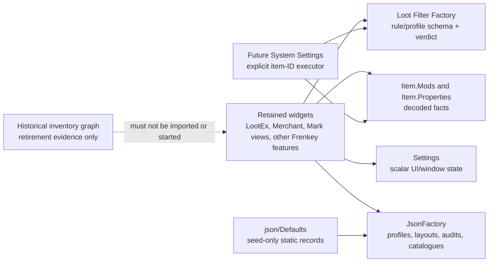

# FrenkeyLib Complete Reforged Cutover Plan

Status: historical rejected migration plan; superseded by
`frenkeylib-migration-failure-and-rollback-record.md`
Scope: complete the retained FrenkeyLib, LootEx, Mark, and Merchant consumer
cutover without reviving the deprecated automatic-inventory graph
Authority: current Reforged source, `Settings`, `JsonFactory`, `Item.Mods`, Loot
Filter Factory, WidgetManager, and the current active widget roots. Legacy is
conversion/parity evidence only.

## Decision summary

This is an ownership migration. Reforged owns facts, rule definitions,
matching, persistence, and injected-runtime conventions. FrenkeyLib owns only
retained feature workflow and presentation over those answers. It cannot regain
inventory discovery, item execution, raw-modifier decoding, a JSON catalogue,
or a rule matcher.

## Migration ledger and non-goals

The repository contains both the retained Reforged-facing surfaces and a much
larger historical Frenkey graph. They are not interchangeable. The following
ledger is the operational scope for this migration; a historical module is not
made runnable, imported, or repaired merely because it is present in source.

| Surface | Active entry point / status | Allowed responsibility after cutover | Explicitly excluded |
|---|---|---|---|
| LootEx | `Widgets/Guild Wars/Items & Loot/LootEx.py` (`main`) | Select a Factory profile, preview a Factory verdict, show `Item.Mods` facts, and display jailed catalogue records. | Bag scanning, item identification, salvage, storage, merchant actions, auto-handler startup, local rules, raw catalogue reads. |
| Merchant Rules | `Widgets/Guild Wars/Items & Loot/MerchantRules.py` (`main`) | Merchant workflow and presentation using Factory references, typed facts, and its approved profiles/catalogues. | Legacy weapon-mod matching or a second Factory/profile schema. |
| Mark modifier facade | `Sources/marks_sources/mods_parser.py`; no active retained importer was found in this audit. | Thin display-oriented `Item.Mods` reads only. | Raw modifier parser, copied upgrade catalogue, or matching API. |
| Party Quest Log | `Widgets/Guild Wars/PartyQuestLog.py` (`main`, `configure`). | Account-local UI state and quest presentation. | A second ImGui persistence file or global personal geometry. |
| Sulfurous Runner | `Widgets/Automation/Bots/Runners/Sulfurous Runner.py` (`main`) | Runner UI/state with account-local settings. | Inventory-policy ownership. |
| Polymock | `Widgets/Automation/Bots/Miscellaneous/Polymock.py` (`main`) | Bot UI/state with account-local settings. | Shared/global personal geometry by accident. |
| Team Inventory Viewer | `Widgets/Guild Wars/Items & Loot/TeamInventoryViewer.py` (`main`/`draw_widget`) | Global shared inventory record plus account-local window geometry. | Feature-local file I/O or global geometry. |
| Inventory+ / Xunlai sorter | `InventoryPlus.py` submits manual identify/salvage IDs to System Settings, but its visible storage-sort button dynamically loads `Xunlaimanager.py`. | Explicit-ID requests already owned by System Settings. | The dynamic storage executor is not a Frenkey consumer and must be retired or re-homed only in the separately authorized Inventory+/System Settings program. |
| Historical LootEx / ItemHandling | No retained active root. | Parity and one-time conversion evidence only. | Imports from an active widget, automatic inventory execution, raw JSON/catalogue ownership, handler startup. |

The migration does **not** include a replacement automatic inventory system.
`AutoInventoryHandler`, `LootExAutoInventoryHandler`, the old
`InventoryHandler`, merchant/Xunlai handlers, automatic identify/salvage/
deposit polling, and build-specific imports are outside the retained runtime
graph. Their successor, if any, is a separate System Settings program that
accepts explicit item IDs. It will consume Reforged facts and Factory verdicts;
it will not reuse Frenkey's autonomous execution loop.

## Detailed staged execution plan

Each stage has a single owner, a bounded conversion, and a gate. Stages are
ordered deliberately: persistence and rule ownership must settle before we
polish windows, because otherwise the UI merely gives a friendly face to two
competing data models.

### Stage A - establish the active boundary

1. Maintain a machine-readable reachability ledger for every retained entry
   point: direct imports, dynamic imports, persistence documents, window IDs,
   rule/fact calls, and historical edges. The ledger must include LootEx,
   Merchant Rules, Team Inventory, Party Quest Log, Sulfurous Runner, and
   Polymock.
2. Classify every Frenkey file as `consumer`, `conversion evidence`,
   `seed source`, or `retire later`. `Sources/frenkeyLib/LootEx/gui.py` and
   `inventory_handling.py` remain historical even if they can compile.
3. Expand the boundary verifier to reject active imports of ItemHandling,
   AutoInventoryHandler, historical LootEx execution modules, raw JSON/file
   APIs, source-tree catalogue files, and local modifier parsers. Exceptions
   must be named, temporary, and tested rather than inferred from folder names.

Gate: importing or opening any active retained widget cannot instantiate an
inventory/action handler, access a source JSON fallback, or obtain a local
verdict.

### Stage B - finish Reforged persistence as the only storage authority

1. Treat scalar state and structured state as different contracts:
   `Settings` for booleans, numbers, selected tabs, and geometry; `JsonFactory`
   for profiles, collections, mappings, conversion audits, layouts, and static
   records. No feature wrapper may reopen a path or maintain a shadow copy.
2. Finish the native `Settings` acceptance work. The global operation journal,
   named mutex, reload/replay, and atomic write are implemented and build
   verified. Prove them live with two injected clients: distinct keys survive
   concurrent saves; same-key writes have documented last-writer-wins behavior.
3. Audit every retained document name and scope. Account is the default for
   personal behavior and geometry. Global needs a written shared-machine or
   multibox reason. Where legacy-global values were personal, import them once
   into the account document without overwriting an already-account-local value
   and record a migration marker.
4. Put a schema envelope on every retained structured document:
   `schema_version`, validated root type, known-default normalization, and a
   conversion audit with source fingerprint plus accepted/rejected outcome.
   A deferred account bind must not write or erase source data.
5. Keep `json/Defaults/<document>` strictly as first-create seed input for a
   fixed, named global JsonFactory document. Validate the seeded envelope and
   surface malformed/missing status. Runtime code may not fall back to a source
   file after the jail is bound.
6. Test the owner contracts—not ad-hoc feature files—for fresh, existing,
   unbound-account, malformed, repeated-conversion, delayed-bind, and peer
   writer cases. Then add focused feature tests only where a feature transforms
   its own schema.

Gate: every persisted value has one document owner, one scope decision, and a
safe behavior before account binding; two clients cannot silently discard
unrelated global changes.

#### Executed persistence correction (2026-08-12)

The global Loot Filter Factory document now establishes `schema_version: 1`
on its first managed write and refuses to read or write a newer schema. This
prevents an older client from interpreting an incompatible profile/rule root as
an empty Factory and then replacing it. `ProfileStore` also now distinguishes a
bound-but-empty Factory from an unbound Factory: it preserves the account's
selected profile and character assignments in both cases, pruning stale
references only after actual Factory profile definitions are available. A
non-object or malformed account selection root remains unchanged and surfaces
an explicit diagnostic rather than being rewritten as an empty selection.

`tools/verify_loot_filter_factory_migration_store.py` covers root-schema and
unbound-write rejection. `tools/verify_lootex_profile_store.py` covers
unbound/global-empty preservation, later stale-reference pruning, malformed
selection preservation, legacy schema marking, and account delayed binding.
`tools/verify_lootex_migration_converter.py` additionally protects the LootEx
migration audit's own root envelope: malformed or future-schema audit roots
block conversion unchanged, while a valid unmarked audit receives its root
schema marker before a conversion result is recorded.

#### Executed MultiBoxing shared-layout correction (2026-08-12)

MultiBoxing's global stable-ID layout repository now rejects a non-object root
or an unsupported schema before `save_layout`, `load_layout`, or the legacy
name-document migration can mutate it. A genuinely empty or unmarked legacy
object remains importable and is written back with `schema_version: 1` on the
next sanctioned mutation. `tools/verify_multibox_layout_repository.py` covers
the root validator and verifies all three repository routes handle the refusal
instead of normalizing and overwriting an unsafe peer document.

#### Executed retained account-bind correction (2026-08-12)

Party Quest Log and Sulfurous Runner previously attempted their one-time
global-to-account settings import while an account `Settings` document could
still be unbound. An unbound document cannot prove that an account key is
absent, so that sequence could stage a legacy value over a later-bound account
value. Both wrappers now initialize presentation defaults only, then import
and load exactly once after `is_ready()` is true; their save paths also refuse
to stage an unbound write. Their widget callbacks refresh the displayed
geometry at that transition. Polymock and Team Inventory similarly defer
their account-window migration, state application, and state persistence until
the account Settings document has bound.

`tools/verify_frenkey_account_settings_bind.py` proves delayed bind,
non-overwriting import, and one-time state loading for the two wrappers.
`tools/verify_team_inventory_window_lifecycle.py` and
`tools/verify_polymock_window_lifecycle.py` retain the corresponding
always-bound window/lifecycle proof. Live account-bind acceptance remains
required.

### Stage C - complete rule and profile ownership

1. Inventory each LootEx and Merchant persisted predicate. Map it to one
   Loot Filter Factory criterion/reference, a supported selector, or a visible
   rejected conversion record. Never translate ambiguous legacy semantics into
   a wider match.
2. Preserve the established grammar: no lambdas in saved input, no exact-mode
   or upper-range rule vocabulary. Requirement thresholds are N-or-lower;
   effects/upgrades are N-or-better. The Factory and `Item.Mods` remain the
   only layers that interpret those directions.
3. Run the Merchant conversion on every authoritative route: initial load,
   normal save, backup restore, shared-to-account copy, and cross-account
   profile import. If the Factory store is unavailable, retain the source for
   retry, disable the destructive rule in memory, and show why.
4. Keep Merchant's live protection and salvage verdict paths Factory-only.
   `Item.Mods` is permitted afterwards for a human explanation, slot label, or
   salvage presentation; it is never a fallback matcher.
5. Keep legacy upgrade fields read-only only while they are conversion
   evidence. Once all supported data is saved as Factory references, remove
   their serialization and editor schema in its own reviewable cleanup. An
   unsupported field remains an unresolved migration record, never a revived
   control.
6. Keep `Sources/marks_sources/mods_parser.py` a thin facade over `Item.Mods`.
   Before adding a helper, prove a missing public typed fact; do not rehydrate
   its former decoder or `mods_data` JSON as a second catalogue.

Gate: a profile has stable Factory references after load, save, restore, and
account transfer. No missing/deferred/rejected conversion can authorize sell,
salvage, or other destructive action.

#### Executed Merchant serialization correction (2026-08-12)

Merchant's sell-rule serializer now retains a non-empty historical predicate
only long enough for the authoritative Factory converter to consume it. Once
conversion produces Factory rule IDs, it omits empty historical weapon/rune
predicate fields rather than recreating them through dataclass serialization.
The old fields therefore no longer return on ordinary profile save after a
successful conversion. `tools/verify_merchant_legacy_predicate_guard.py`
protects both halves of the boundary: live verdict methods cannot read legacy
fields, and the sell serializer enumerates and removes their empty forms.

#### Executed Merchant named-profile conversion correction (2026-08-12)

The live-config route already converted old upgrade predicates, but the named
account/shared profile wrapper writer could normalize and re-save a legacy
payload without asking the Factory. That left a parallel source record that
would be converted only after a later live load. `_persist_profile_wrapper`
now migrates its embedded payload before any named-profile save or copy, and
an explicit selected-profile load rewrites its source wrapper when conversion
changed it before it writes the account's live configuration. A deferred
Factory jail rejects those writes; it does not preserve the old predicate as
an editable, authoritative saved rule.

`tools/verify_merchant_legacy_predicate_guard.py` now guards the named-profile
writer and selected-profile load route in addition to the live verdict and
serializer boundaries. `tools/verify_merchant_profile_factory_migration.py`
continues to prove converted, rejected, and deferred Factory payload results.

#### Executed Factory directional-grammar correction (2026-08-12)

The Factory rule model now rejects two-sided `min_value`/`max_value` input and
rejects a whole persisted rule when any nested effect or upgrade criterion uses
retired `min`, `max`, `exact`, `range`, or comparison-mode vocabulary. Earlier
deserialization could discard only that invalid nested criterion; in an `ALL`
rule this silently broadened the remaining verdict. A rejected rule is absent
from the active Factory list, which is fail-closed. `tools/verify_loot_filter_factory_directional_grammar.py`
proves valid one-threshold criteria still load while exact/range forms and
non-list nested containers are refused. No lambda or consumer-owned comparison
form is introduced.

#### Executed Factory rejected-rule diagnostic correction (2026-08-12)

The Factory Store now retains an owner-level diagnostic for every persisted
filter record it rejects: a non-object entry and a `Rule.from_dict` failure
remain in the jailed document but are excluded from the active rule list. The
Factory editor renders those diagnostics, and LootEx tells the user to repair
the Factory record instead of trying to deserialize, broaden, or otherwise
recover it locally. Merchant shows the same Factory-owned diagnostic beside
its rule selector and when a selected protection reference is unavailable.
`tools/verify_loot_filter_factory_migration_store.py` proves that invalid
records cannot activate while their rejection remains visible;
`tools/verify_lootex_widget_lifecycle.py` and
`tools/verify_merchant_legacy_predicate_guard.py` cover the active consumer
surfaces.

#### Executed Item.Mods directional-input correction (2026-08-12)

`Item.Mods.HasMod` now accepts at most one numeric directional threshold.
Selecting a particular component from a multi-value fact, such as the high
damage component, requires the explicit public `EffectCriterion(value_index)`
form. This removes the ambiguous two-number shorthand without adding an exact,
range, lambda, or consumer-owned comparison mode. The public API record now
describes that contract and names the current Item Mods Playground and Mod
Parity Scan validators. `tools/verify_item_mods_directional_input.py` proves
the owner rejection and scans production callers for the retired form;
`pyright.cmd Py4GWCoreLib\\Item.py` reports zero diagnostics.

### Stage D - move data and catalogue consumers without creating side stores

1. LootEx profiles, selected Factory profile, account mappings, and migration
   audit stay in their fixed account JsonFactory documents. LootEx's `.ini`
   contains only its UI scalar state.
2. LootEx and Merchant catalogues use their named global JsonFactory documents
   seeded from `json/Defaults`. Validate their status before presentation; an
   unavailable catalogue is a visible unavailable state, not a raw-file read.
3. Team Inventory's shared account/inventory record remains global JsonFactory
   because it is deliberately cross-client. Its window rectangle, collapse,
   and selected display state remain account Settings.
4. MultiBoxing's shared stable-ID layout remains global only after the live
   peer merge/reload test passes. Display names cannot form document paths or
   merge keys.
5. Delete neither old source JSON nor historical profiles in this migration.
   Retain them as conversion evidence until the conversion audit shows no
   active consumer and the later retirement task explicitly approves removal.

Gate: first run seeds correctly, a second run reads only the jail, malformed
data fails visibly, and repeated conversion is a no-op.

#### Executed Native JsonFactory seed-policy correction (2026-08-12)

Native JsonFactory formerly treated every failed load as a first-create event
and could fall back from a missing named default to `default_template.json`.
That would let an account document receive static data and could replace a
malformed existing jailed document on a later autosave. The owner now seeds
only when the target document is missing, the scope is global, and the exact
`json/Defaults/<document name>.json` seed exists with an object root. Account
documents, unreadable/malformed existing documents, non-object seeds, and
missing named seeds are not marked dirty for a bind-time replacement write.
There is no generic default-template fallback.

The seed is now materialized atomically while holding the existing
cross-process document lock, rather than merely assigned to the in-memory root
and marked dirty. That distinction matters: global saves replay only the
operation journal, so a dirty-but-unjournaled seed could otherwise be replaced
by the pre-existing empty disk document. A peer's valid newly created document
is adopted after the lock re-check; an invalid peer document is left untouched.
Later staged operations are journaled normally and merge onto the materialized
seed.

The global merge owner also re-checks the target under that lock and refuses a
write when an existing document is unreadable, malformed, or has a non-object
root. Bind-time seed refusal alone was insufficient: a deferred staged write
could otherwise turn the same invalid document into an empty merge root and
overwrite it. The pending operation remains dirty for a later deliberate
recovery; JsonFactory does not invent one by destroying the evidence.

`tools/verify_native_json_factory_seeding.py` guards that source contract;
the Native `Py4GW` RelWithDebInfo DLL rebuilt successfully after the change.
Live proof still requires one fresh global catalogue seed/readback and one
malformed-existing-file read in an injected client.

#### Executed LootEx catalogue-envelope correction (2026-08-12)

LootEx's jailed catalogue reader now treats a non-object, boolean, non-integer,
or unsupported `schema_version` as unavailable data rather than coercing it or
raising during presentation. The widget receives the established empty
read-only result and an invalid catalogue status; it never opens a legacy
source file as a fallback. `tools/verify_lootex_catalogue_store.py` covers a
valid sealed catalogue and a malformed-version envelope.

#### Executed LootEx catalogue diagnostic correction (2026-08-12)

LootEx catalogue status now carries the validated envelope failure reason
(root type, schema version, source hash, or records container) instead of only
rendering an empty catalogue. The active configuration page shows that reason
beside the unavailable jailed seed. This is read-only diagnostic state: an
invalid document still yields no records and no source-tree fallback.
`tools/verify_lootex_catalogue_store.py` asserts the surfaced schema failure.

#### Executed Merchant catalogue diagnostic correction (2026-08-12)

Merchant Rules' two named global JsonFactory catalogues now expose the same
sealed-envelope failure reason to the existing catalogue-load error surface.
An unavailable curated or drop-data document remains a fail-closed `None`;
the error now identifies the root, schema, source-hash, or records-container
failure rather than misleading the user with a generic missing-seed message.
`tools/verify_merchant_rules_catalogue.py` covers a valid sealed catalogue and
an unsupported-schema refusal. No Merchant rule, matcher, or inventory action
owner changed.

#### Executed Team Inventory envelope correction (2026-08-12)

Team Inventory's `model_ids.json`, `model_file_ids.json`, and
`team_inventory.json` remain global JsonFactory documents, but Reforged writes
now use a `schema_version: 1` envelope. Model records live below `entries` and
inventory records below `accounts/<email>`. A direct-root legacy value is read
only as jailed conversion evidence. Before an active account mutates an old
inventory record, its complete subtree is copied into `accounts/<email>` and
the direct legacy subtree is removed; the mutation therefore cannot discard
unrelated legacy bags or storage. Unsupported/future schema roots and malformed
containers are refused unchanged. `tools/verify_team_inventory_window_lifecycle.py`
covers legacy readback, first-write preservation, canonical writes, and the
future-schema refusal. Its JsonFactory fake now has the same per-document
identity and slash-path behavior as the public facade, and proves a canonical
account plus a legacy-root peer are both visible during the transition,
alongside the existing ImGui lifecycle cases. An incompatible shared root is
also surfaced in the viewer as a document-specific unavailable-data diagnostic;
it is never silently presented as an empty shared inventory.

#### Executed Team Inventory modifier-display correction (2026-08-12)

The viewer no longer carries its own weapon-prefix, suffix, rune, insignia, or
attribute catalogue merely to derive a base model name from a rendered game
name. `clean_gw_item_name(item_id, item_name)` asks
`Item.Mods.Inspect(item_id)` for installed public upgrade facts, then removes
only a leading or trailing name fragment that those facts and their physical
slots prove. Prefix, insignia, and inherent facts may prove a leading fragment;
suffix and rune facts may prove a trailing fragment. A decoder failure or an
unmatched display name preserves the rendered name unchanged rather than
guessing from a feature-local vocabulary.

`tools/verify_team_inventory_window_lifecycle.py` covers prefix/suffix, a
possessive insignia, a rune `of ...` suffix, and decoder-unavailable behavior.
It also rejects reintroduction of the former copied catalogue. This is
presentation cleanup only; it does not create a rule verdict or alter Factory
ownership.

### Stage E - standardize retained window lifecycle

1. Give each retained top-level/configuration window one visibility owner
   (WidgetManager session, feature icon, or explicit widget enablement), a
   stable ImGui ID, and a named Settings section. Saved `open` is not allowed
   to become a second competing launcher.
2. Apply geometry/collapse once after an account Settings document is ready;
   use `NoSavedSettings`; persist the actual post-`begin` geometry only after
   a successful begin. Persist a selected tab/page only if the feature truly
   owns it.
3. Convert every begin/end pair, child, table, tab, popup, and style scope to
   an exception-safe balanced form. Reuse `modular.ui_scope` where it fits.
   Merchant Rules is large enough that this must be subdivided by window/page,
   with a focused regression per conversion, not one reckless formatting pass.
4. Complete in this order: LootEx main/configuration, Merchant main and
   configuration pages, Team Inventory nested children/tabs, MultiBoxing
   configure/overview, Party Quest Log main/configuration, Sulfurous Runner
   configuration, and Polymock's remaining nested surfaces.

Gate per window: fresh, restored, move/resize, collapse, close/reopen,
unbound account, and a body exception leave the ImGui stack balanced and one
authoritative saved result.

#### Executed Party Quest Log configuration-session correction (2026-08-12)

Party Quest Log's configuration callback previously called `UI.open_configure`
on every WidgetManager callback. A user could close the ImGui configuration
window, only for the following frame to reopen it while WidgetManager still
reported the same configuration session. The widget now opens that feature
window once when the session begins and, when its close button changes
`UI.ConfigOpen` to false, closes the corresponding WidgetManager session.
Window visibility therefore has one session owner, while account `Settings`
continues to own only geometry and retained scalar state.

`tools/verify_party_quest_log_ui_scopes.py` guards the one-time opening and
WidgetManager close handoff alongside the existing exception-safe ImGui scope
checks.

#### Executed MultiBoxing window-scope correction (2026-08-12)

MultiBoxing's layout repository, account ordering, and multibox policy remain
global because they deliberately coordinate local clients. Its Configure
window rectangle and collapsed state were not shared policy, however: they
were written beside those values in the global INI merely because the original
wrapper had one settings object. The ConfigureWindow section now belongs to
the account-scoped view of that same jailed Settings document. On the first
ready account bind it imports each missing legacy global key without replacing
an existing account value, records its migration marker, and thereafter
persists only through the account document. An unbound account writes neither
the import nor a replacement window rectangle.

`tools/verify_multibox_window_settings_bind.py` covers delayed bind,
non-overwriting import, account persistence, and the absence of global-window
writes during ordinary shared-policy saves. `tools/verify_multibox_layout_repository.py`
continues to guard the deliberately global layout owner.

#### Executed LootEx profile-selector scope correction (2026-08-12)

`Py4GWCoreLib.modular.ui_scope` now owns `combo_scope`, which closes only a
successfully opened combo and closes it in a `finally` path. Active LootEx uses
that scope for its Factory-profile selector instead of a feature-local raw
`begin_combo` / `end_combo` pair. The focused widget verifier injects a failure
from profile selection and proves the combo closes; the shared scope verifier
also covers hidden and exceptional combo bodies. This changes no Factory rule,
profile, or persistence behavior.

#### Executed LootEx visibility-owner correction (2026-08-12)

LootEx no longer writes or restores a `window.open` setting. WidgetManager (or
the direct-script session) is the sole launcher/visibility owner; the close
button ends the current configuration session through that owner. Account
Settings retains only geometry, collapse, and the selected page. The focused
LootEx lifecycle verifier now rejects reintroduction of a persisted `open`
field, alongside its begin/end and profile-selector cleanup checks.

#### Executed Party Quest Log child-scope correction (2026-08-12)

The Party Quest Log's `QuestLogChild` no longer manages a raw `begin_child` /
`end_child` pair. It enters the established Reforged `child_scope`, closes it
before the details child on the normal path, and releases it from the enclosing
window cleanup path if rendering raises. This leaves the existing top-level
window and per-row/table/style scopes as their correct owners.
`tools/verify_party_quest_log_ui_scopes.py` now verifies the absence of the
raw quest-list pair, use of `child_scope`, exception cleanup, and the existing
tree/style invariants. Team Inventory's nested scroll/tab/account-child tree
is now converted as one balanced stack rather than piecemeal. The widget
registers each Reforged child/tab scope while it is active, releases it on the
normal path, and its existing failed-frame decorator unwinds any remaining
scopes in reverse before ending the top-level window.
`tools/verify_team_inventory_window_lifecycle.py` injects a failure from an
account's item-table path and proves the account child/tab, tab bar, scrolling
child, and top-level window each close exactly once.

#### Executed Merchant preview-child correction (2026-08-12)

Merchant's `Not Changed` preview child had two manually balanced early-return
paths and no exception cleanup around its grouped preview tables. It now uses
the established `child_scope`; empty/not-ready returns close it, and the
grouping/table path releases it in `finally`. This is deliberately one audited
child, not a claim that every Merchant configuration child is already
converted. `tools/verify_merchant_preview_child_scope.py` protects the absence
of raw child calls and the required early-return/`finally` closure contract.
The companion planned-actions preview child now uses the same scope directly,
including its hidden-child return path. Merchant's widget tooltip now uses the
shared `tooltip_scope` as well, so a tooltip body failure cannot leave a raw
tooltip open. The Multibox accounts panel now nests `table_scope` inside its
`child_scope`, so its account table closes with the panel if an account row
raises. The Travel favourites panel also uses `child_scope` while preserving
its settings-save path when the child is hidden. The same verifier rejects raw
pairing in all four audited slices.

The cleanup protection editor's keep-out list, linked sell-rule table, and
available-rule list now use `child_scope`; the linked-source table uses
`table_scope`; and its disabled Edit control uses `disabled_scope`. The
cleanup workspace's deposit-target list and its per-row width stack now use
the same scope owners. These changes keep the existing remove/link/save
behavior but ensure a row exception cannot leave a child, table, disabled, or
item-width stack open. The remaining rule-target editors remain separate
packages rather than being claimed by this correction.

#### Executed Merchant style-stack correction (2026-08-12)

The inventory-shortcut popup previously used a local three-colour row style
with a hand-written `try`/`pop_style_color` pair. The active workspace button,
destructive-confirm button, and rule-header hover paths had the same ownership
split. Each now pushes its visual values immediately before returning the
existing `style_colors_scope(count)` owner, and every caller enters that scope
for the exact rendering operation. A body exception therefore cannot leave a
colour stack behind. `tools/verify_merchant_preview_child_scope.py` now
rejects the old popup cleanup and verifies the colour count and shared-scope
owner for all four helper families. This does not claim that unrelated
Merchant pages have completed their own style-scope audit.

The regular Merchant-stock and Scroll Trader Buy editors now use the shared
child/table/item-width scopes, as does the shared after-purchase combo helper.
They preserve the original target-count, max-per-run, remove, and profile-save
paths. Consumable, material, rune, sell, destroy, and salvage target editors
remain individual lifecycle packages.

The consumable-crafter count-mode selector and its ordered target table now
use shared `child_scope`, `table_scope`, and `item_width_scope` owners. The
target edits, priority reordering, remove path, and resulting profile write
remain unchanged. Material, rune, sell, destroy, and salvage target editors
remain individual lifecycle packages.

The Buy material-target editor now uses the same shared scopes while retaining
its existing material-trader routing and after-purchase behavior. Rune, sell,
destroy, and salvage target editors remain individual lifecycle packages.

The Buy rune/insignia editor's selected-target and catalogue-result lists now
use Reforged child/table/disabled/item-width scopes. They still consume the
Reforged upgrade catalogue and identifier model; no Mark parser, raw modifier
reader, or local catalogue matching path was introduced. Sell, destroy, and
salvage target editors remain individual lifecycle packages.

The remaining shared Merchant text-colour helpers now use
`style_colors_scope` as well: protection checkboxes, secondary/coloured text,
coloured selectables, and the destroy-protection session checkbox. Their
previous manual pushes could leave a colour on the ImGui stack if the widget
body raised before the matching pop. The scope verifier now enumerates every
intentional raw colour-push helper and requires shared cleanup for each one;
new manual colour stacks cannot slip into the widget unnoticed.

The matching Sell rune/insignia selected-target and catalogue-result lists now
use the same shared scopes while preserving their keep-count behavior. The
Merchant predicate guard continues to prove that neither surface reactivates
the legacy local verdict path. Destroy and salvage target editors remain
individual lifecycle packages.

The Sell weapon-requirement editor now uses shared scopes for its global
N-or-lower input and per-model requirement table. It retains the existing
ceiling normalization, perfect-stat flag, and model-specific precedence; this
was lifecycle-only work, not a rule-semantics change.

Merchant's shared selected-model, whitelist-target, and selected-identifier
helpers now use Reforged child/table/item-width scopes. These presentation
helpers serve several sell, destroy, and salvage editors; they only display and
edit explicitly supplied profile fields and do not own an item verdict.

The shared regular-item, weapon, protected-item, blacklist, cleanup-deposit,
Buy-stock, material, explicit-Sell, and Scroll Trader catalogue pickers now use
`child_scope`; the filtered-add button uses `disabled_scope`. This keeps active
selection workflows exception-safe without changing their catalogue search,
filtering, badges, or selection behavior. The final unreachable legacy
predicate-authoring chain was removed from the active Merchant class rather
than retained as a waiver; its focused scope guard now rejects any raw
child/table/disabled/item-width pair anywhere in that class.

Merchant's shared quick-action, destructive-confirmation, and live inventory
shortcut controls now use `disabled_scope`, as does the Preview Plan action
bar. The latter covers Preview, both Execute routes, deposits, comparison,
Xunlai refresh, re-preview, and drift-confirmed execution. This is strictly
scope ownership: the existing block reasons, confirmation behavior, and action
callbacks remain unchanged. `tools/verify_merchant_preview_child_scope.py`
rejects a return to manual disabled pairing in these helpers and the action
bar.

Merchant's top-level window now has a dedicated source-contract guard in
`tools/verify_merchant_window_lifecycle.py`. It verifies the account `Settings`
owner, one-time restored geometry/collapse state, post-`begin` persistence,
`NoSavedSettings`, close/hidden early-return cleanup, and failed-frame cleanup
decorator. This is source-level proof only; move/resize/collapse/close/reopen
still need injected-client acceptance.

#### Executed Merchant floating-icon persistence correction (2026-08-12)

Merchant created an account `Settings` document for its floating-icon name but
never read or wrote that document. The shared `FloatingIcon` helper therefore
left its position to ImGui's native persistence, producing a second geometry
owner. The helper now has an explicit `persist_window_state` opt-out; this
preserves native ImGui placement for existing callers. Merchant opts out,
waits for its account document to bind, restores the icon through
`reposition_to`, and persists its actual post-draw `position` under the
Merchant floating-window section. It does not import raw `imgui.ini` data:
that file is outside the jailed migration contract.

`tools/verify_merchant_window_lifecycle.py` guards the account-ready restore,
post-draw save, opt-out construction, and draw ordering. This is source proof;
move/restart acceptance remains an injected-client gate.

The Merchant Profiles workspace now also routes its selected-profile Replace,
Load, Rename, Copy, and Delete controls through `disabled_scope`. It preserves
the current account/shared profile owner and confirmation fingerprints; only
the PyImGui disabled-stack ownership changed.

Merchant's retained Buy, Sell, Destroy, and Salvage editors now route active
manual-add, quick-add, Xunlai-dependent material-storage, run-now, and
rule-order controls through `disabled_scope`. The rules, action block reasons,
Factory references, and save paths are unchanged; the scope verifier guards
these editor functions against a return to raw disabled pairing.

The remaining active restore, protected-item, identify, cleanup, and shared
add-all controls now use the same owner. A source scan now finds no raw
`PyImGui.begin_disabled` or `end_disabled` call in `MerchantRules.py`; the
shared Reforged scope owns every disabled surface in that retained widget.

Merchant's active search fields, protected/cleanup filters, deposit picker,
and salvage-option combo now use `item_width_scope`. There is no remaining
manual item-width pair in the active Merchant class.

The retained MultiBoxing widget wrapper now uses `tooltip_scope`; its active
GUI module already has no raw structural scope pair. The wrapper guard and the
global-layout repository test pass together, while the required peer-client
merge/reload and configuration-window runtime proof remain separate live gates.

The Party Quest Log widget wrapper now uses `tooltip_scope`, complementing its
existing account Settings import bridge and the inner quest-list `child_scope`.
The Party Quest Log UI-scope verifier now guards both layers; restored geometry
and close/reopen behavior remain injected-client acceptance work.

Sulfurous Runner and Polymock widget wrappers now use `tooltip_scope` as well.
Their focused checks pair the wrapper contract with their existing account
Settings import bridges and the migration-boundary guard. Polymock's lifecycle
test fake now rejects non-convertible stored float values, so that verification
path is type-clean rather than relying on an `object` conversion loophole.

The Sell legacy weapon-mod and rune/insignia controls are no longer rendered;
their conversion notice sits beside Factory upgrade-reference controls and the
focused predicate guard rejects a local verdict fallback. The Salvage legacy
targets have now crossed the same boundary: Merchant no longer
renders their local selector, search, add, remove, or threshold controls. It
shows only pending weapon/armor conversion counts and directs all authoring to
Factory rules. The predicate guard rejects legacy setters and selector helpers
from the reachable Salvage editor, in addition to rejecting local live verdicts.

The temporary disabled Sell controls were then removed as well: Sell now shows
only the conversion notice beside Factory rule references. No reachable
Merchant editor can author a legacy weapon-mod, variant, threshold, or armor
rune target; the legacy fields survive solely for load-time Factory conversion
and fail-closed audit evidence.

#### Executed shared ImGui scope correction (2026-08-12)

Reforged's `table_scope` and `tab_bar_scope` now call `end_table` /
`end_tab_bar` only when their corresponding begin call actually opened the
structure. The prior helper closed after a false begin result, which is not a
valid Dear ImGui pairing and would have propagated a bad lifecycle rule to
every migrated caller. `tools/verify_ui_scope_contract.py` proves both the
hidden and exception paths. This is an owner-layer correction, not a
feature-local workaround.

#### Executed MultiBoxing configure-window correction (2026-08-12)

MultiBoxing's retained configuration window now registers its tab bar, tab
items, layout tables, editor children, canvas container, and canvas child in
one reverse-unwind stack before the top-level window is ended. The former
partial conversion closed the outer layout table from the screen-size helper;
that ordering error is removed. The configure frame also owns its cell-padding
style variable and transient item widths through the shared Reforged cleanup
scopes, so an exception cannot leave either state on Dear ImGui's stack.
`tools/verify_multibox_region_scope.py` rejects raw structural pairing in the
module and requires the registered configure/canvas scopes;
`tools/verify_ui_scope_contract.py` covers the shared style-variable and
item-width cleanup contracts.

#### Merchant Rules remaining lifecycle packages

Merchant Rules is deliberately not one conversion unit. Its main-window guard
already closes the top-level window, but each package below must close its own
child/table/tab/popup/style state before a body failure reaches that guard:

| Order | Surface | Required conversion and acceptance focus |
|---|---|---|
| 1 | Preview and travel panels | Completed source slices: both preview children and their shared entries table, Multibox accounts, Travel favourites, and the tooltip use shared scopes. Keep their focused guard green. |
| 2 | Rule header and workspace navigation | `_draw_rule_header_row` now uses `table_scope`: it always pops an opened tree before the table closes, then restores the caller's tree state after scope exit. Its source guard rejects a raw table pair and requires that failed-row cleanup. Audit workspace navigation tabs separately. |
| 3 | Protection, cleanup, and saved-profile lists | The Protection Hub's grouped-list child/shared entries table, account/shared saved-profile list, cleanup keep-out list, cleanup linked-source table, available-rule list, and deposit-target list now use shared scopes. Convert each remaining list's outer child/nested table together, then prove a row-render exception closes both exactly once. |
| 4 | Buy, sell, salvage, and rune target editors | Regular Merchant-stock, Scroll Trader, consumable-crafter, material, Buy rune, Sell rune, sell weapon-requirement targets, and the shared selection helpers plus the shared after-purchase combo use shared scopes. Salvage legacy upgrade target fields are no longer authorable from Merchant. Convert each remaining selector/result child-table pair as one package. A failed editor may not bypass a pending profile save, re-enable a disabled Factory migration, or alter the current rule. |
| 5 | Popups, combo lists, and disabled/style scopes | Both active popup families use `popup_scope`; the salvage-option selector uses `combo_scope`; and the focused guard rejects raw popup/combo pairing in those paths. Audit remaining style paths one family at a time and add a focused failure check where a pairing can outlive the current item. |

This sequencing is a lifecycle migration only. It does not alter Merchant
action policy, profile ownership, or Factory verdict ownership.

#### Executed Merchant quick-actions popup correction (2026-08-12)

Merchant's floating-icon quick-actions menu now uses the shared
`popup_scope(QUICK_ACTIONS_POPUP_ID)` instead of directly pairing
`begin_popup` and `end_popup`. Its menu positioning, popup-visible state reset,
destructive-action confirmation, and Xunlai/preview requests are unchanged; a
rendering failure now still closes a successfully opened popup.
`tools/verify_ui_scope_contract.py` covers hidden and exceptional popup bodies,
and `tools/verify_merchant_preview_child_scope.py` rejects a raw popup pair in
this method. The inventory-shortcuts popup remains a separate lifecycle package
under row 5 of the table above.

#### Executed Merchant inventory-shortcuts popup correction (2026-08-12)

The inventory right-click shortcuts menu now also uses
`popup_scope(INVENTORY_SHORTCUTS_POPUP_ID)`. Its mouse-leave reset, selected
item/header state cleanup, live-kit actions, and its three pushed row colors
retain their prior behavior; the style colors remain in their dedicated
`finally` block while the popup itself is closed by the shared scope. A source
scan now finds no active raw Merchant `begin_popup`/`end_popup` pair, and the
focused scope guard requires both popup families to remain that way.

#### Executed Merchant salvage-option combo correction (2026-08-12)

The salvage target editor's `Upgrade to salvage` selector now uses the shared
`combo_scope` rather than its feature-local `begin_combo`/`end_combo` pair.
Its item-width scope and helper-tooltip `finally` behavior are unchanged. The
focused Merchant guard requires both shared scopes and rejects raw combo calls;
the active class now has no raw popup or combo pair. Remaining row-5 work is
limited to style scope audit and live client acceptance.

### Stage F - sever and hand off

1. Run the active-import/raw-I/O/raw-mod/handler boundary scan after every
   stage, then expand it before historical removal.
2. Mark historical automatic graph modules deprecated only after no retained
   root imports them. Do not remove them simply to make a scan green; their
   conversion evidence remains useful until System Settings has an approved
   explicit-ID replacement design.
3. Start the later System Settings work only after this migration passes:
   supplied item IDs in, Reforged facts/Factory verdicts consumed, explicit
   identify/salvage/storage request out. No bag polling, autonomous selection,
   global handler singleton, or Frenkey rule execution is permitted.

Gate: retained Frenkey consumers are independently usable with no reachable
historical executor. Only then is the migration complete; automatic-inventory
deprecation is a separate follow-on project.

The already fixed decisions are:

- `Item.Mods` owns decoded modifier and upgrade facts. Input is declarative;
  there are no lambdas, exact modes, or intervals. Requirements are N-or-lower;
  upgrades/effects are N-or-better.
- Loot Filter Factory owns rule/profile schema and verdicts. LootEx and
  Merchant consume Factory references and `Item.Mods` facts; neither may
  recreate a matcher or a profile schema.
- `Settings` owns scalar preferences and window state. `JsonFactory` owns
  structured profiles, mappings, conversion audits, layouts, and static
  reference records. Both are direct jail owners, never hidden behind a
  feature persistence wrapper.
- `json/Defaults/<document name>` is seed input for a named global
  `JsonFactory` document only. A source-tree JSON file is not a runtime
  fallback.
- WidgetManager owns discovery/configuration sessions. Each feature owns only
  its own retained window geometry and page state; Dear ImGui's saved-settings
  file must not be a second persistence owner.
- `AutoInventoryHandler`, Frenkey `ItemHandling`, historical LootEx
  inventory/trading/salvage/crafting, and automatic selection policy are
  excluded. The later System Settings program owns explicit native requests
  for supplied item IDs; it is not a Frenkey compatibility layer.
- Inventory+'s dynamic `Xunlaimanager.py` storage-sort bridge is also outside
  the retained Frenkey graph. It is an existing execution owner, not proof
  that the Frenkey migration is clean and not a candidate for an unreviewed
  disablement here. Its replacement or removal is an explicit System Settings
  / Inventory+ retirement decision.

## Target architecture

## Current evidence and disposition

| Slice | Source state | Remaining closure work |
|---|---|---|
| `Item.Mods` / Mark parser | `Sources/marks_sources/mods_parser.py` is a public `Item.Mods` presentation facade with no runtime `mods_core`, raw-triple, JSON, or parser dependency; no retained caller imports it in the current reachability audit. Merchant now also constructs its post-Factory installed-upgrade presentation query through `Item.Mods.CreateUpgradeCriterion` and `ResolveUpgradeSlot`, rather than importing the decoder owner. | Add only a source-proven missing public fact. Re-run parity only when it reports such a gap. |
| Loot Filter Factory | Rule/profile owner and matcher exist; Merchant legacy upgrade predicates are being converted to Factory IDs. | Prove all profile load/save/restore/cross-account routes convert or fail closed, then remove legacy predicate evaluation from reachable code. |
| Active LootEx widget | `Widgets/Guild Wars/Items & Loot/LootEx.py` is the only entry point; it uses Settings, JsonFactory, Factory, and jailed catalogues. | Complete live account-bind, conversion, seed/readback, and window acceptance; do not import historical `gui.py`. |
| Team Inventory Viewer | Its three global JsonFactory documents now use a `schema_version: 1` Reforged envelope (`entries` for the two shared model maps and `accounts` for inventory records); existing jailed direct-root data remains readable and an account is copied into the envelope before its first Reforged mutation. Main geometry uses account Settings after a one-time import from the prior global rectangle. Top-level, tooltip, and Advanced Clearing table/style exception paths have focused offline proof. | Live-test its full nested-table lifecycle and peer merge/reload with a legacy-root peer present. |
| MultiBoxing | Global Settings owns only deliberately shared policy/account ordering and one global stable-ID layout JsonFactory document. Account Settings owns Configure-window geometry after a one-time global-key import. The active-region delete branch now uses Reforged child/style scopes and no longer double-closes its child. | Prove peer merge/reload and configuration-window persistence in a live multibox session; complete the remaining nested scope conversion. |
| PartyQuestLog, SulfurousRunner, Polymock | Personal settings and retained window state now use account `Settings`, with a one-time import from their former global documents. Party Quest Log's log/configure windows and settings bridge, Sulfurous Runner's configure window and settings bridge, and Polymock's top-level/table/style failure paths have offline proof. Polymock's wrapper no longer force-reloads its dependency graph during import. | Run one client acceptance pass per window, including import-on-first-bind and exception-safe close paths. |
| Historical LootEx and `ItemHandling` | Contains the old inventory executor, raw data and handlers. | Keep quarantined; delete/deprecate only in the separate System Settings retirement program. |

### Merchant conversion finding: live verdict severed; schema cleanup remains

Merchant Rules now has Factory-reference fields and its two live upgrade
verdict paths (`_get_protected_hit_reason` and
`_get_salvage_rule_upgrade_target_matches`) evaluate only Factory references.
Legacy weapon predicates are detected as conversion input and pause the
affected destructive rule; they are no longer locally matched through
`Item.Mods`. The editor presents those fields as disabled, read-only conversion
evidence rather than normal authoring controls.

`Item.Mods` is allowed to provide typed context after a Factory verdict; it is
not permission for Merchant to retain its own criteria, selection semantics,
or verdict. The converter remains a temporary bridge, and Merchant is not
migration-complete until the following source-proven routes are gone from
reachable runtime code:

1. creation or editing of a new legacy upgrade predicate;
2. profile serialization that treats a legacy predicate as an authoritative
   runtime rule.

Until then, migration must either convert a saved predicate to a Factory ID or
disable the affected destructive rule with a visible reason. It must never
fall back to a local match because a Factory reference is absent.

### Persistence-owner finding: global INI merge is implemented; runtime proof remains

Source inspection on 2026-08-12 found that Native `JsonFactory` correctly
locks and journal-merges global documents, while Native `Settings` had written
a global INI as an atomic full-file replacement. Atomic replacement prevents a
torn file but does not preserve two clients' independent edits: the later
writer can replace the earlier writer's unrelated key.

The Native `Settings` owner now journals `set`, key deletion, and section
deletion operations. A global save takes a named `Py4GW_settings_*` mutex,
loads the newest disk INI (preserving peer comments/raw lines), replays only
the local journal, atomically writes it, then adopts the merged sections in
memory and clears the journal only on success. This is deliberately an owner
fix, not a MultiBoxing feature lock or a scalar-to-JSON detour.

`tools/verify_native_settings_global_merge.py` protects that source contract,
and a full Native `Py4GW` RelWithDebInfo build passed after the change. The
required runtime proof remains two injected clients changing different global
keys and both values surviving, followed by a same-key conflict with documented
last-writer-wins behavior. Until that session runs, the implementation is
build-verified but not live multibox-verified.

The native Settings owner now also distinguishes a missing INI from an existing
unreadable one at bind and at the global merge lock. Its intended generic INI
template policy is retained for a genuinely absent file, but an existing file
that cannot be read is not reseeded and a later global merge refuses to
overwrite it. This mirrors the JsonFactory jail rule where it matters: failure
to load is not permission to erase the persisted evidence. The same source
contract verifier and Native build cover the correction; live recovery
behaviour still needs an injected-client malformed-file exercise.

### Settings-scope finding: legacy-global does not establish intentional-global

The current retained scope map is mixed. LootEx and Merchant use account
documents. MultiBoxing keeps global documents only for its shared layout,
account ordering, and deliberately coordinated multibox policy; its Configure
window rectangle is account-local. PartyQuestLog,
SulfurousRunner, and Polymock have now moved their personal geometry and
behaviour state to account `Settings`; on first use they copy known values from
the former Reforged-global document, then fill any missing key from the older
`Widgets/Config` document, and mark the account migration complete. Team
Inventory's shared records remain global; its window geometry now follows the
same account-scoped import route as the other personal windows.

Before moving any of those documents, record one explicit result per feature:

1. **retain global** only when the setting deliberately controls a shared
   machine/multibox surface; then it inherits the Native global-INI merge gate;
2. **move account** for character/account-local geometry or behaviour, with a
   one-time Settings-to-Settings import that preserves existing values and an
   account migration marker; or
3. **split** genuinely shared scalar settings from account-local window state
   into two fixed document names.

This is a policy decision, not a reason to write feature-local migration files
or to bypass the Settings jail. Until the decision is recorded, do not claim
that the retained global documents are accepted multibox-safe persistence.

## Work packages and order

### 0. Freeze the migration boundary

Refresh the reachability ledger before each destructive removal. For every
active root, record entry point, imports, documents, window IDs, item-rule
calls, and whether it can reach a historical executor. Classify each item as
retain, convert, seed, retire later, or historical evidence.

Gate: every retained root has one owner for each fact, verdict, persisted
value, and window. No historical module is made runnable merely to satisfy an
import.

### 1. Prove and harden Reforged persistence infrastructure

This is the first Reforged-facing package. The current wrappers already expose
scopes, readiness, autosave, global locking/merge, and defaults; do not rewrite
them speculatively. Add or repair only a failed contract below at the owning
native/Python layer.

1. Test `Settings` and `JsonFactory` document identity, scope confinement,
   account delayed binding, staged-write replay, reload semantics, autosave,
   and global multi-client merge behaviour. The global-Settings journal/lock
   owner implementation recorded above is build-verified; certify it only
   after the two-client runtime gate.
2. Test that document names and JsonFactory access paths cannot escape their
   jails. Feature code must validate user-originated labels before a label can
   become a document name; normal runtime must use fixed document names.
3. Test native JsonFactory first-bind seeding from exactly
   `json/Defaults/<document name>`, including missing, malformed, and already
   existing documents. The runtime reader must report invalid static data; it
   must never reopen source JSON as a fallback.
4. Adopt and document one feature-level schema rule: root `schema_version`,
   validated root type, explicit defaults, and an idempotent conversion audit
   for every structured account/global document.
5. Add a focused owner test harness rather than per-widget raw file tests.
   It must work without a Guild Wars client where the native persistence
   module can be faked; final native behavior remains a client/runtime gate.
6. For every retained global Settings document, record why it is shared or
   split/move it through one Settings-to-Settings import. Legacy scope alone
   is not sufficient evidence.

Gate: Reforged persistence passes fresh, pre-existing, unbound-account,
malformed-data, repeated-conversion, and two-global-client cases. No feature
invents save loops, paths, or lock files.

### 2. Finish rule ownership before presentation expansion

1. Inventory every remaining Merchant and LootEx persisted predicate field.
   Map it to a Factory criterion, a supported selection reference, or a
   visible rejected conversion record. Do not silently widen an old rule.
2. Ensure Factory migration runs on all authoritative write routes: initial
   load, normal save, backup restore, and cross-account write. A not-ready
   Factory defers mutation; an unsupported predicate disables the affected
   destructive rule and records why.
3. Keep the source guard that rejects local verdict reads in Merchant's two
   action paths. `Item.Mods` may supply typed context after a Factory verdict,
   not a replacement decision.
4. Keep legacy controls as read-only conversion evidence until saved profiles
   have been migrated and accepted. Then remove the controls and persistence
   fields in a separately reviewable cleanup.
5. Replace Merchant's reachable legacy fallback branches with one explicit
   state: a Factory reference is evaluated by the Factory; a pending/rejected
   conversion produces an explanatory non-match and blocks the destructive
   action. A missing reference must never reactivate a legacy predicate.
6. Do not reintroduce legacy predicate creation/edit controls. Unsupported
   vocabulary remains a rejected migration record, not a new compatibility
   control.

Gate: the same saved profile has identical Factory references after load,
save, restore, and cross-account write; unsupported input cannot authorize a
sell/salvage action.

#### Executed safety correction (2026-08-12)

The initial deferral path disabled rules only when they already contained a
Factory ID. A newly converted legacy predicate has draft keys but no registered
ID while the global Factory jail is unbound, so that condition could leave its
sell-protection or salvage-target rule enabled. The Factory migration owner now
also disables any rule carrying pending draft keys. The persisted legacy source
remains unchanged for retry, while the in-memory action path fails closed.

`tools/verify_merchant_profile_factory_migration.py` covers the previously
missed case: no existing Factory references, one pending sell predicate, one
pending salvage predicate, and an unavailable Factory store. Both rules must
be disabled.

### 3. Convert retained data deliberately

| Data class | Owner and scope | Required migration behavior |
|---|---|---|
| Geometry, collapse, open state, selected retained page/tab, scalar toggles | Feature `Settings`; account by default, global only when machine/shared behavior is intentional | Apply once after account binding, persist actual post-`begin` values, never let ImGui persist the same state. |
| Factory profile selection, character mapping, conversion audit | Account `JsonFactory` | Versioned root; bind before write; source fingerprint and accepted/rejected fields; repeat conversion is a no-op. |
| Factory rule/profile definitions | Existing Factory owner and its established scope | No LootEx or Merchant duplicate schema/document. |
| Shared multibox layouts and Team Inventory records | Global `JsonFactory` | Stable IDs, no display-name-derived document paths, merge/reload proof for peer writers. |
| Approved static presentation records | Named global `JsonFactory` seeded from `json/Defaults` | Envelope validation and status surface; no source fallback. |
| Textures/binaries | Existing package asset loader | Do not force binary assets into JSON. |
| Legacy action flags, polling, kits, storage limits, automatic handling | No Frenkey destination | Retire; consider only in the later System Settings design. |

Gate: a fresh account, a migrated account, a malformed legacy record, and a
repeated conversion each have explicit, observable behavior.

### 4. Standardize every retained window

For each retained top-level window and every configuration window:

1. Name the visibility owner: WidgetManager session, a feature floating icon,
   or explicit widget enablement. Settings never owns a second visibility
   controller.
2. Give the window a stable ImGui ID and a named Settings section for position,
   size, collapse, and any retained page/tab scalar.
3. Apply saved state once only after an account-scoped document reports ready;
   use `NoSavedSettings`; write actual geometry after successful `begin`.
4. Pair every successful `begin` with exactly one `end`, including collapsed,
   closed, early-return, and exception paths. Child, table, tab, popup, and
   style scopes receive the same treatment.
5. Reuse `modular.ui_scope.window_scope` where its API fits. Do not introduce
   another generic window/persistence facade unless this audit proves the
   existing scope lacks a concrete needed primitive.

Order: active LootEx, Merchant main window, Team Inventory Viewer,
MultiBoxing configure/overview, PartyQuestLog log/config, SulfurousRunner
config, then Polymock.

Gate per window: fresh, restored, moved/resized, collapsed, closed/reopened,
unbound account, and an injected body exception preserve balanced ImGui state
and one authoritative persisted result.

### 5. Retire the historical graph only after severance

1. Add a boundary check that rejects active imports of historical LootEx
   execution, `ItemHandling`, `AutoInventoryHandler`, raw modifiers, Mark
   parser internals, raw JSON/file APIs, and source-tree catalogue paths.
2. Remove a historical module only once the ledger shows no retained importer
   and the replacement owner is accepted. Removal is not part of a UI repair.
3. Keep the old tree explicitly labelled historical until the separately
   scoped inventory deprecation lands. It remains valuable conversion evidence
   but must be unreachable from active widgets.

Gate: static import boundary is clean; an active widget cannot start, assign,
or call a legacy handler.

### 6. Hand off execution to System Settings as separate work

After this migration is accepted, define any future identify/salvage/storage
policy in System Settings around explicit supplied item IDs. It may consume
Factory verdicts and Item.Mods facts; it must not scan autonomously, resurrect
handler singletons, or import Frenkey snapshots/behavior trees. Only then can
InventoryPlus automatic policy, `AutoInventoryHandler`, and the historical
LootEx executor enter an explicit deprecation/removal plan.

#### Executed System Settings explicit-ID correction (2026-08-12)

The current System Settings inventory controller no longer exports an
`unidentified_item_ids` candidate-discovery method. Its Items configuration
page accepts a temporary comma/space-separated ID list and submits those IDs
to `request_identify`; salvage and storage retain their existing explicit
hovered/supplied-ID routes. Inventory+ keeps its temporary rarity selection at
its own UI layer before submitting IDs, and botting keeps its own candidate
selection before submitting IDs. Neither caller transfers selection policy to
the controller. `tools/verify_system_settings_explicit_item_operations.py`
guards the boundary; focused `py_compile` and Pyright pass for the controller,
configuration UI, Inventory+, and botting helper. Live native operation and
dialog-confirmation acceptance still remain required.

Gate: do not call the Frenkey migration complete because an executor was
removed; call it complete only when all retained consumers are independently
usable without it.

## Verification and rollout

| Layer | Offline proof | Live injected-client proof |
|---|---|---|
| Item/rule ownership | `py_compile`, focused Pyright, Factory/Item.Mods converter and matcher tests | Preview known item IDs and confirm Factory verdict/explanation. |
| Persistence jail | owner contract tests, schema/converter tests, catalogue envelope tests | Account bind, default seed/readback, conversion audit survives restart. |
| Windows | mocked begin/end failure tests and source stack scan | Move/resize/collapse/close/reopen each retained window. |
| Global documents | merge/reload tests | Two clients change distinct layout/shared-record paths without data loss. |
| Boundary | import/raw-I/O/raw-mod/handler regression scan | Opening each retained root starts no legacy handler. |

Run offline checks after each work package. Run client acceptance only when its
slice is source-complete; the current absence of a live `Gw`/`Gw64` client is
an unresolved runtime limitation, not evidence of success.

### Latest offline cutover evidence (2026-08-12)

Focused `py_compile` passed for the modified Factory, Mark, LootEx, Merchant,
Team Inventory, Polymock, PartyQuestLog, and MultiBoxing sources. Focused
Pyright passes with zero diagnostics for the public `Item.Mods` owner,
including its criterion-construction and slot-resolution facade. A strict
file-wide MerchantRules run still reports 532 broad pre-existing diagnostics;
the source-specific conversion verifiers below, not that baseline, prove the
Merchant ownership cutover. Merchant's active post-Factory presentation helper
now imports only `Item`, asks `Item.Mods` to build/evaluate its typed upgrade
criterion, and uses `tooltip_scope` for its in-window hover tooltip.
`tools/verify_reforged_persistence_facades.py` also passed its mocked
Python-owner contract for scope rejection, document identity, normalization,
delayed binding visibility, and the dedicated root INI accessor. The focused
suite also passed Factory criterion/migration conversion,
LootEx conversion and lifecycle, Polymock lifecycle, Team Inventory lifecycle,
the MultiBoxing active-region scope regression, jailed catalogue defaults, and
the 35-file Frenkey migration boundary guard. Merchant's legacy-predicate
guard also proves that the live protection and salvage-target methods do not
read any legacy weapon predicate field. This proves the covered source
contracts only; it does not replace Native persistence proof or injected-client
acceptance.

## Completion definition

The migration is complete only when every retained entry point is a runnable
Reforged consumer, all persisted data is jailed and schema-owned, all retained
windows have one safe state owner, no legacy execution graph is reachable, and
the verification matrix has passed for each slice. System Settings execution
deprecation follows this migration; it is not a shortcut around it.
