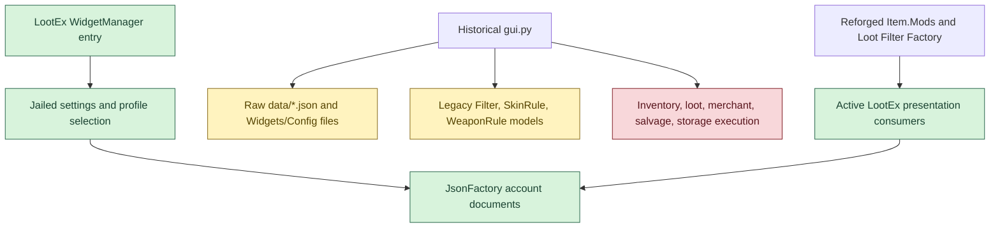
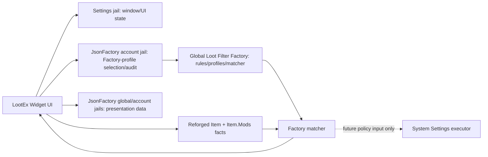
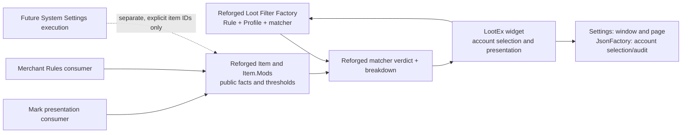
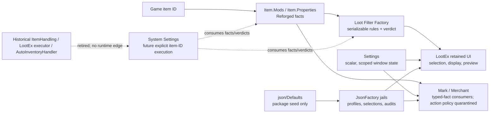

# FrenkeyLib Layered Migration Plan

Status: historical rejected migration plan; superseded by
`frenkeylib-migration-failure-and-rollback-record.md`

No later section labelled `active`, `current`, or `governing` overrides this
status. Those labels preserve the chronology of the rejected approach only.
Scope: complete migration of legacy FrenkeyLib and Mark modifier consumption
into Reforged. Deprecated inventory control, including
`AutoInventoryHandler`, is explicitly excluded.
Authority: current Reforged item source, `Item.Mods`, the Item Mods Playground,
the persistence jail owners, current widget entry points, and legacy FrenkeyLib
as behavioural reference only.

## 2026-08-12 re-baseline: what "migrated" means

The current source contains a valid **partial** cutover, not a completed
FrenkeyLib migration.  In particular, the active LootEx widget is a Reforged
consumer, while the historical `Sources/frenkeyLib/LootEx` package still
contains raw-modifier models, local profile/configuration shapes, catalogue
logic, and excluded inventory execution.  The latter must not be described as
migrated merely because its imports now compile.

A slice is complete only when all of the following are true:

1. Its active entry point and every reachable import use the Reforged owner for
   item facts and rule verdicts; a legacy matcher cannot become a fallback.
2. Every persisted value has one jailed owner: `Settings` for scalar UI state
   and `JsonFactory` for structured records.  A source-tree JSON file is never
   a runtime configuration source.  Static data is seeded in `json/Defaults`
   and then read through its named `JsonFactory` document.
3. Every active PyImGui window has a balanced lifecycle and stores its explicit
   open/geometry/collapse state through `Settings` while opting out of Dear
   ImGui's unrelated saved-settings file.
4. The feature can neither start nor reach legacy inventory/merchant/salvage/
   storage handlers.  Those paths are quarantined retirement work, not an
   alternative execution route.
5. A focused offline verification proves the conversion and the retained
   surface; a client check is run only after the implementation is ready and a
   client is available.

This gives the migration a useful finish line.  A working import is only the
doorbell, not proof that the building has stopped owning somebody else's
plumbing.

## Outcome

FrenkeyLib becomes a Reforged consumer. It never parses an item modifier,
loads a mod catalogue, applies its own modifier formula, or replaces a Reforged
match result. Mark's parser stops being a raw parser and becomes a Reforged
consumer; it remains only if its callers still need its presentation result.

```text
widget or script
    -> FrenkeyLib feature workflow and UI state
        -> Item.Mods / Item.Properties / Item public methods
            -> Reforged item implementation
                -> native item data

Settings and JsonFactory are direct persistence owners.
PyImGui and the active ImGui helper are direct rendering owners.
```

FrenkeyLib may own non-inventory feature workflow and presentation over an
already supplied item ID. It may not own the answer to a question about the
item's modifiers, upgrades, rolls, slots, or modifier-derived identity, nor
may it become the inventory scanner, item executor, or inventory lifecycle
manager.

## What materially changed from legacy

| Concern | Legacy FrenkeyLib / Mark shape | Reforged migration shape |
|---|---|---|
| Mod evidence | Raw modifier triples decoded in feature code. | `Item.Mods` answers from item ID through its public contract. |
| Names and identities | Local `runes.json` / `weapon_mods.json` catalogues and local model classes. | Reforged exposes named upgrades, slots, values, subtype, and descriptions. |
| Rule result | Parallel feature-side evaluators can override or bypass item-mod rules. | A consumer calls the existing Reforged operation for the question, then applies only feature workflow. |
| Numeric input | Legacy lower/upper or exact-shaped records can imply an independent range evaluator. | One direction-aware threshold: that value or better. Requirements are lower-is-better; other supported values are higher-is-better. |
| Persistence | Custom INI/JSON paths, loaders, save loops, and wrappers. | Direct `Settings` or `JsonFactory` documents with their existing scope and autosave behaviour. |
| UI | Historical facade/texture assumptions and retained legacy state. | Current PyImGui immediate-mode code with state in the sanctioned persistence owner. |
| Inventory authority | FrenkeyLib was shaped to scan inventory and drive identify, salvage, and storage actions. | Explicitly excluded. System Settings owns explicit native identify, salvage, and storage requests; FrenkeyLib is only a prepared consumer base for later rule-policy work. |

This is an ownership migration, not a request to invent a new rule language.
Where the platform already has the needed `Item.Mods` operation, consumers call
it. A real uncovered question is an `Item.Mods` owner gap to prove and add;
consumer-side decoding is never the answer.

## Post-migration inventory boundary

This plan deliberately prepares FrenkeyLib for the next architecture without
making it that architecture. The System Settings inventory project now owns
explicit native execution; its rule-policy layer remains separate:

```text
native System Settings inventory execution
    -> owns explicit identify, salvage, and storage requests
        -> supplies an item ID to rule/presentation consumers
            -> Item.Mods provides item-mod facts and verdicts
                -> FrenkeyLib provides reusable consumer workflow or UI only
```

The initial System Settings contract accepts item IDs, invokes native
`PyInventory` actions, and polls identify completion. It does not select rules,
auto-confirm salvage options, or run on inventory change. Rule-policy settings,
automatic selection, and the final retirement protocol remain follow-on work.
The readiness criterion remains firm: a future rule owner can use FrenkeyLib
without inheriting an inventory loop, snapshot cache, behavior-tree executor,
or a competing item-mod evaluator.

## Fixed decisions

- The legacy tree at `C:\Users\Apo\Py4GW_python_files\Sources\frenkeyLib`
  is behavioural evidence, not code to copy wholesale.
- `Py4GWCoreLib/Item.py::Item.Mods` is the sole public owner of item-mod
  decoding, identifiers, names, values, directions, slots, upgrades, max-roll
  status, and mod predicates.
- The Item Mods Playground is the reference for how a consumer composes the
  existing public item surfaces. Nearby feature modules do not become owners
  merely because they also filter items.
- Numeric modifier input means Reforged's direction-aware threshold: that value
  or better. No ranges, exact-value modes, lambdas, predicates, raw triples, or
  user-supplied executable rule input are migrated.
- `Settings` is the only INI owner and `JsonFactory` is the only structured
  JSON owner. No Frenkey persistence wrapper, raw config handler,
  `configparser`, `open`, or `json.load`/`json.dump` remains in injected feature
  code. Static non-persistence assets retain their actual current owner.
- Legacy inventory control is being deprecated. `AutoInventoryHandler`, Frenkey
  inventory scanning, item snapshots used for control flow, inventory behavior
  trees, and dependencies retained only for those paths are not migration
  targets. The current System Settings native execution owner is separate work:
  it may execute explicit identify, salvage, and storage requests, but it must
  not reuse or emulate the deprecated handler's policy.
- System Settings owns the initial explicit native identify, salvage, and
  storage requests. It is not a Frenkey compatibility layer: it accepts item
  IDs and leaves all item-rule decisions with Reforged.
- No bulk overwrite from legacy. Each cutover is additive, reviewed, and
  verified before its legacy implementation is removed.

## Authoritative ownership map

| Concern | Sole owner after migration | Consumer rule |
|---|---|---|
| Raw modifier words and identifier interpretation | `Item.Mods` over its Reforged implementation | FrenkeyLib and Mark never read or compare raw triples. |
| Modifier values, subtype, and better direction | `Item.Mods` | Consumers call `HasMod`, `HasAnyMods`, `HasAllMods`, `GetValues`, or `GetSubtype` as appropriate. |
| Named upgrades, physical slots, and max roll | `Item.Mods` | Consumers call `GetUpgrades`, slot methods, and `IsMaxed`; no rune/weapon-mod catalogue. |
| Game-style explanation | `Item.Mods.GetDescriptions` | UI may render the returned explanation but does not rebuild it from modifier data. |
| Generic item facts | Existing public `Item` and `Item.Properties` methods | Use item type, model, name, rarity, requirement, damage, value, and other facts from their current owners. |
| Non-inventory feature workflow and presentation | FrenkeyLib feature module | Act only on public Reforged answers; do not recalculate a match or own an inventory lifecycle. |
| INI preferences | `Settings` | Construct the required document directly; setters autosave. |
| Structured profiles, layouts, and snapshots | `JsonFactory` | Construct the required document directly; no persistence wrapper or raw path. |
| Ephemeral cross-account commands | established shared-memory owner | Do not use account files as IPC. |
| UI rendering and interaction | `PyImGui` plus the active helper where applicable | Rebuild each frame; do not revive `ImGui_Legacy` or abandoned facades. |

## Known legacy bypasses and their replacement

| Legacy code | What it wrongly owns | Reforged consumer replacement |
|---|---|---|
| `Sources/marks_sources/mods_parser.py` | Raw triple parser; `Rune`, `WeaponMod`, `ModDatabase`; JSON catalogue loading; roll and slot verdicts. | Refit as an item-ID Reforged consumer if callers still need its result. No raw parser or replacement catalogue. |
| `frenkeyLib/LootEx/models.py` and `data.py` | Modifier models, identifier tables, roll ranges, names, and `runes.json`/`weapon_mods.json` ownership. | Item-mod facts come from `Item.Mods`. Preserve only non-mod feature data after its own ownership audit. |
| `frenkeyLib/LootEx/utility.py` | Reads `GetModifierValues` and assigns meaning to `arg1`/`arg2`. | `Item.Properties` for item facts and `Item.Mods` for typed mod facts. |
| `frenkeyLib/ItemHandling/Rules` and `GlobalConfigs` | Parallel rule hierarchy and upgrade matching over snapshots. | Refit reusable mod questions to public Reforged calls only if a non-inventory consumer needs them; no parallel evaluator or fallback. |
| `frenkeyLib/ItemHandling/Items/item_snapshot.py` | Cached raw mods and parsed mod-derived fields for inventory control. | Do not migrate. Future native inventory ownership supplies item IDs and reads required public facts directly. |
| `frenkeyLib/Core/encoded_names.py` | Parallel encoded-string decode implementation. | Use the current owner only when a feature has a real display requirement; it must not decide mod behaviour. |

## Item.Mods consumer contract

Every legacy item-mod request maps to an existing public call before any
consumer code moves.

| Legacy request | Public Reforged call pattern |
|---|---|
| Does this item have one modifier? | `Item.Mods.HasMod`. |
| Does it satisfy all or any selected modifiers? | `Item.Mods.HasAllMods` or `Item.Mods.HasAnyMods`. |
| Is a requirement or damage value good enough? | `Item.Mods.HasMod` with the numeric threshold; direction comes from Reforged metadata. |
| What are the item's readable values or subtype? | `Item.Mods.GetValues` and `Item.Mods.GetSubtype`. |
| Which named upgrades are applied? | `Item.Mods.GetUpgrades`. |
| What occupies a physical upgrade slot? | `Item.Mods.GetUpgradeInSlot` or `HasUpgradeInSlot`. |
| Is a named applied upgrade maxed? | `Item.Mods.IsMaxed`. |
| How should the item be described in UI? | `Item.Mods.GetDescriptions`. |
| What is the item type, model, name, rarity, requirement, or damage? | The current public `Item` or `Item.Properties` owner used by the Playground. |

If a concrete legacy request cannot be expressed by one of these public calls,
the migration stops at that call and records the exact missing `Item.Mods`
contract. The change then belongs in `Item.Mods`, is proved in the Playground
and parity scan, and only then becomes available to consumers. FrenkeyLib and
Mark never receive a workaround API.

## Staged execution plan

### Stage 0: Freeze evidence and establish the cutover ledger

**Purpose:** prevent the partially migrated tree from becoming a second source
of truth.

1. Record the legacy and current relative file inventory, content differences,
   active importers, and entry points.
2. Create and maintain `frenkeylib-stage-0-cutover-ledger.md`, a call-level
   ledger for every FrenkeyLib and Mark mod-related call:
   legacy symbol, caller, question asked, public Reforged call, expected result,
   test item, migration stage, and removal condition.
3. Mark all inventory-control paths as excluded: `AutoInventoryHandler`,
   inventory scanning, snapshots, behavior-tree execution, and identify,
   salvage, or storage actions. Do not fix or test them as part of this
   migration.
4. Baseline current static diagnostics per migration slice. Existing errors are
   recorded separately from new errors.

**Exit gate:** every active consumer has a ledger owner; no implementation code
is copied from legacy merely to make an import resolve.

### Stage 1: Validate the Item.Mods owner before consumer changes

**Purpose:** prove that the authority being consumed is ready for real Frenkey
work rather than assuming the Playground covered every old path.

1. Use the Playground and Mod Parity Scan with representative items for each
   physical upgrade slot: prefix, suffix, inscription, rune, insignia, and
   inherent. Include a matching and a non-matching item for each relevant
   consumer rule.
2. For each ledger row, compare the public answer with the game's composed
   information and the legacy observed result. Record only behavioural parity,
   not legacy implementation detail.
3. Confirm threshold behaviour: requirements use lower-is-better and all other
   supported numeric facts use their Reforged direction. Normalize legacy
   lower/upper range data to this single threshold form.
4. Confirm consumers can obtain every needed answer from item ID and current
   public item surfaces. Do not add an arbitrary-raw-modifier parse path.
5. Where source reveals a genuine gap, change `Item.Mods` first, with type
   annotations, focused checks, Playground evidence, and parity evidence. No
   consumer change is allowed to compensate for a missing owner capability.
6. Execution decision recorded on 2026-08-10: treat the current decoder as the
   authority for consumer migration and add only source-proven owner gaps.
   The Playground and parity scan are diagnostic tools, not per-slice migration
   gates. Consult their output only when it reports a concrete owner gap.

**Exit gate:** every consumer request has a source-verified public call or a
focused-checked `Item.Mods` addition. There is no unreviewed raw-modifier
fallback.

### Stage 2: Remove Mark raw-parser ownership from retained consumers

**Purpose:** ensure no retained FrenkeyLib feature can adopt Mark's duplicate
decoder. This stage does not preserve the parser solely for the excluded
inventory owner.

1. Migrate retained callers to direct public `Item.Mods` reads where that is
   clearer than a compatibility result. `TeamInventoryViewer.py` completed
   this cutover on 2026-08-10 for prefix, suffix, and inherent presentation.
2. Inspect each `MerchantRules.py` parser use by responsibility. Do not create
   a compatibility parser if it belongs to bag scanning, raw-cache construction,
   rule execution, salvage, storage, or other excluded inventory policy.
3. Completed source cutover: Merchant Rules uses typed `Item.Mods.Inspect`
   facts, `GetKnownUpgradeFacts`, and `NormalizeUpgradeIdentifier`; its parser
   import, legacy `runes.json` catalogue/model load, raw triple path, and
   exact-signature helper were deleted.
4. Completed source cutover on 2026-08-11: `mods_parser.py` is now a typed
   item-ID presentation facade over `Item.Mods`; `ModDatabase`, raw
   `parse_modifiers`, `Rune`, `WeaponMod`, and JSON catalogue loading are
   gone. The dormant historical JSON files are not read by retained source and
   remain retirement data, not a runtime catalogue.

**Exit gate:** no retained consumer owns a Mark raw parser or mod catalogue;
Team Inventory Viewer and Merchant Rules render and evaluate through public
`Item.Mods` calls.

### Stage 3: Refit FrenkeyLib's item-mod consumers

**Purpose:** keep FrenkeyLib as a feature library while removing all competing
item-mod ownership.

1. Replace raw modifier reads only in retained non-inventory consumers with
   `Item.Mods`, `Item.Properties`, and public `Item` calls. The 2026-08-11
   reachability audit found `LootEx` utility, data collection, cache,
   filtering, salvaging, trading, and its UI all inside the deprecated
   inventory graph; they are retirement work, not a migration target.
2. Replace catalogue-backed rune and weapon-mod selection only for a retained
   consumer. A retained UI consumes names and descriptions returned by
   Reforged; it does not construct a second mod model.
3. Refit an `ItemHandling` rule or global-config criterion only where a
   non-inventory Frenkey consumer genuinely needs it. It may compose public
   answers, but cannot carry inventory execution, `ModifierInfo`, upgrade
   parsers, snapshot-derived mod properties, or catalogue comparison.
4. Do not migrate `BTNodes`, inventory handler, or snapshot paths. A future
   native System Settings ID owner supplies the item ID and owns identify,
   salvage, and storage; no Frenkey compatibility path may stand in for it.
5. Repoint any remaining `Core` helper that makes a modifier-derived decision.
   Display-only encoded-name work is separate and may use its current owner
   after the item-mod cutover is complete.
6. Remove legacy mod classes, hand-authored identifier tables, parser functions,
   and duplicate `runes.json`/`weapon_mods.json` data with the deprecated
   inventory graph. Do not keep or repoint them merely to satisfy this stage.

**Exit gate:** no retained FrenkeyLib consumer contains a modifier decoder,
matcher, range table, slot table, or JSON-backed mod catalogue. Every retained
mod-derived feature result is traceable to one public Reforged call. The
deprecated inventory graph is explicitly scheduled for retirement, not a
compatibility migration.

### Stage 4: Migrate persistence without a third storage system

**Purpose:** move Frenkey feature state into the required jails while retaining
account/global semantics.

1. Inventory every legacy read/write, filename, scope, schema, and caller.
   Classify it before code moves:

   | Data kind | Destination |
   |---|---|
   | Small scalar preference, window toggle, hotkey, geometry | Direct `Settings` document. |
   | Structured profile, rule selection, layout, cached user choice | Direct `JsonFactory` document. |
   | Static game/mod fact | Reforged source owner, never user persistence. |
   | Live multibox message | shared-memory owner, never disk. |
   | Large relational/history data | existing database owner, only when the data genuinely requires it. |

2. Assign each document an account or global scope from its actual meaning.
   Account preferences follow the logged-in account; machine-wide shared layouts
   and profiles use global scope. Do not infer scope from the old path.
3. Replace custom `load`, `save`, throttle, directory creation, `open`,
   `json.load`, `json.dump`, and INI handlers with direct concrete owner calls.
   Use the owners' autosave; do not add a feature save loop.
4. Treat legacy user-data import as a separate, owner-approved conversion path.
   Injected Frenkey code never opens an old arbitrary file to import it. The
   converter must write only through the sanctioned owner.
5. Verify fresh defaults, existing-state migration, account isolation, global
   sharing, document reload, and shutdown persistence for each moved document.

**Exit gate:** no Frenkey feature owns a raw persistent file path or file I/O;
all persisted feature data is reachable only through `Settings`, `JsonFactory`,
or the approved database owner.

### Stage 4 execution record: PartyQuestLog settings

On 2026-08-10, `Sources/frenkeyLib/PartyQuestLog/settings.py` was reduced to
an in-memory feature state object over the existing global
`Settings("Widgets/Config/PartyQuestLog.ini", "global")` document. The legacy
filesystem existence probe, save-request state, feature throttle, and
per-frame/disable flush calls were removed. Changed UI state now writes with
the typed `Settings` setters, whose persistence lifecycle is the owner.

Existing section/key names and global scope were preserved. `python -m
py_compile` and focused strict Pyright passed for the settings module and its
widget entry point. No generic injected-client toggle or restart check is a
migration gate; investigate only a concrete reported feature issue.

### Stage 5: Migrate live feature slices before dormant UI

**Purpose:** restore reachable functionality in independent, reviewable units.

Use this order, keeping each slice logic -> persistence -> UI -> live test:

1. `MultiBoxing`: current widget imports it directly; move configuration to
   the jails, retain current inter-client transport ownership, then port UI.
2. `PartyQuestLog`: migrate its custom INI state to `Settings`, then its UI and
   quest cache behaviour.
3. `SulfurousRunner`: migrate settings, direct item/UI dependencies, and colour
   tuples, then validate path and flag rendering.
4. `Polymock`: migrate its state/data/UI dependencies after the reusable item
   and persistence work is stable.
5. `LootEx`: restore only reusable, non-inventory domain behaviour in smaller
   slices (profiles, item presentation, filtering, and rule presentation).
   Merchant/trader views may show Reforged answers but may not execute
   inventory work. Do not migrate inventory scans, identification, salvage,
   storage, crafting execution, or its 6,000-line GUI before its consumer
   model and persistence have passed their gates.
   Recovering a missing explicit WidgetManager entry point is allowed as a
   structural prerequisite only. Its first surface is jailed profile/config
   management; it must not import the historical GUI or start or replace any
   legacy inventory, merchant, salvage, or storage handler. The remaining
   presentation pages must rebuild over Reforged owners, not reconnect to raw
   LootEx catalogue files, and do not satisfy this slice's migration gate.
6. `Py4GWLibrary` and `Drafts`: inventory feature intent against the current
   launchpad/widget system. Port only real supported functionality into its
   current owner; historical prototypes are documented rather than made live.

**Exit gate per slice:** the widget imports without legacy persistence or mod
ownership and has clean targeted static diagnostics. Existing runtime tools are
diagnostic only when a concrete feature issue is reported.

### Stage 5 source audit: direct feature roots

The 2026-08-10 source audit found the following direct widget roots after the
item-mod cutovers:

- `MultiBoxing` already uses global `Settings` for scalar preferences, global
  `JsonFactory` for layouts, and shared memory for inter-client commands. Its
  layout repository is now one stable-ID global document; display names are
  data, not JsonFactory paths.  The first load imports old indexed jailed
  layout documents, rejects path-shaped legacy names into its migration audit,
  consumes the old index terminally, and thereafter reads only the stable
  repository.
- `MultiBoxing` now owns its configure and overview window lifecycle directly
  through PyImGui. The removed `WindowModule` did not own layout data or
  client-region policy. Its client controls, layout presets, region editor,
  colour styling, and drag canvas now use PyImGui directly; the canvas retains
  an explicit next-frame `NoMove` flag while it has pointer focus.
- `PartyQuestLog` was migrated in the Stage 4 execution record above.
- `PartyQuestLog` now owns its main-window geometry and configure-open state
  directly through PyImGui. Its entry tooltip and quest tree use plain
  PyImGui; the removed `WindowModule`, textured collapse/expand glyphs, and
  texture-state facade are not part of its retained UI surface. Its log,
  details, account settings, and quest-status rendering now use direct
  PyImGui; game markup intentionally falls back to readable plain text through
  `Utils.StripMarkup` rather than a Frenkey renderer.
- `SulfurousRunner` uses the global `Settings` document directly; its path and
  waypoint data are static feature data, not user persistence. Its configure
  window and tooltip are direct PyImGui; the world-overlay/path renderer remains
  the existing overlay owner rather than becoming a second UI abstraction.
- `Polymock` has no user-persistence path or item-mod consumer. Its static
  combat data is feature data and its widget UI is direct PyImGui. It retains
  the active `Py4GWCoreLib.ImGui` texture helper through `frenkeyLib.Core.gui`
  solely to render piece images; that helper carries no item-mod, inventory,
  window-state, or persistence ownership.
- `Py4GWLibrary` is not imported by a current root. Its `Settings.find` calls
  already consume the sanctioned owner, so it is dormant rather than a
  persistence migration target.
- `Drafts` contains historical scripts that still create old INI directories.
  They have no current importer and remain explicitly out of scope rather than
  becoming a second UI or storage system.

No direct root imports the retained LootEx raw modifier model. Its remaining
raw-modifier/catalog ownership stays confined to the explicitly excluded
inventory domain until that graph is retired; Merchant Rules has already been
cut over to typed public `Item.Mods` facts.

The focused retained-root certification also found no raw modifier/parser,
inventory-handler/snapshot, or raw persistence dependency. No production
consumer imports Mark's raw parser; it is an orphaned legacy module and not a
reason to recreate a Frenkey-owned consumer path.

### Stage 6: Rebuild UI on the active immediate-mode surface

**Purpose:** preserve supported interaction without attempting to resurrect
retired textured/facade architecture.

1. Keep `update()` for non-UI work and `draw()`/`main()` for per-frame UI.
   Neither is a one-time initialization hook.
2. Recreate windows with direct `PyImGui` and the active `Py4GWCoreLib.ImGui`
   helper only where its current source supports the required operation.
3. Keep window state in the appropriate `Settings` or `JsonFactory` document;
   do not create UI-local persistence or assume abandoned facade methods exist.
4. Convert colours and geometry to current typed tuples. Pair every pushed
   style, font, ID, child, table, popup, and window scope with its matching pop
   or end in the same frame path.
5. Make each UI render Reforged descriptions, names, slots, and rule outcomes;
   UI code never decodes modifier content itself.

**Exit gate:** each migrated UI has balanced ImGui stacks and persistent state
from the sanctioned owner. A live diagnostic is used only for a concrete
reported UI issue.

### Stage 7: Remove severed ownership and certify the migration

**Purpose:** make the result enforceable rather than merely functional.

1. Run a retained-consumer search for forbidden dependencies:

   ```text
   ModDatabase
   raw parse_modifiers
   Rune / WeaponMod matching classes
   item_mods_src
   mods_core / mods_upgrades in production consumer code
   GetModifiers / GetModifierValues used for matching
   runes.json / weapon_mods.json used for item-mod decisions
   raw open/json/configparser persistence in Frenkey feature code
   Frenkey inventory scan, snapshot, or action-executor dependencies in a
   migrated consumer
   ```

2. Remove each legacy owner only after its final importer is migrated or its
   excluded execution graph is replaced by the native System Settings owner.
   Delete data only after generated-data consumers and documentation no longer
   name it.
3. Update the FrenkeyLib audit, item-mod documentation map, persistence records,
   and widget documentation to show the final owners and removed paths.
4. Re-run focused Pyright for every changed Python slice, formatter/linter
   checks used by that owner, and the applicable standalone tests. There is no
   repository-wide runner, so report each command and result by slice.
5. Use existing injected-client diagnostics only to investigate a concrete
   reported Item.Mods, widget, persistence, or non-inventory workflow issue.

**Exit gate:** no duplicate item-mod authority remains, every live consumer is
on public Reforged calls, all Frenkey persistence uses the jails, the active UI
is current-surface only, and verification evidence is recorded per slice.

## Test and evidence matrix

| Layer | Offline evidence | Existing live diagnostic, when a concrete issue is reported |
|---|---|---|
| Item.Mods owner | Typed API usage and focused checks for every changed helper. | Item Mods Playground and Mod Parity Scan. |
| Mark cutover | No raw parser/catalog ownership; widget-local checks where available. | Team inventory display and Merchant Rules. |
| Frenkey mod consumers | No raw matching/catalog data; targeted Pyright per module. | Relevant consumer UI and rule outcome. |
| Persistence | Schema/default/scope/reload checks through concrete owners. | Fresh/existing account behaviour and global sharing. |
| UI | Targeted static checks and stack-path review. | Draw, interaction, popup/focus, persistence, and empty/error states. |

## LootEx retained-surface migration status

LootEx's **retained presentation slice is source-migrated**: the active
WidgetManager entry selects and previews global Factory profiles, reads only
jailed presentation catalogues, and stores only its account UI/selection/audit
state. Its first injected-client acceptance pass is still pending. The legacy
executor is deliberately not migrated; it is separate retirement evidence, not
an incomplete version of the active widget. The map below records that
boundary.



| Layer | Current state | Required disposition before LootEx can be considered migrated |
|---|---|---|
| Widget entry and profile configuration | **Source-cut over.** `Widgets/.../LootEx.py` is the sole discoverable entry and renders Factory profile selection, read-only rule display, explicit item preview, jailed-catalogue status, and conversion audit. | Retain as the active presentation shell. It must continue to avoid `Settings.SetProfile()` and legacy handler imports; validate the live window lifecycle. |
| Settings/profile storage | **Source-cut over.** Account `Settings` stores UI state; account `JsonFactory` stores Factory-profile selection and conversion audit; global Factory storage owns rule/profile definitions. | Retire execution-only legacy fields. Confirm real account conversion and Factory/profile selection through the injected-client acceptance pass. |
| Item, material, scrape, and Nick catalogues | **Source-cut over; first-bind path source-proven.** Approved presentation data is at `json/Defaults/<JsonFactory name>` and the active reader rejects missing/invalid jailed records. Native `JsonFile::SeedFromTemplateLocked` resolves exactly that path for a new document. | Confirm the deployed native module performs first-bind seed/readback. No raw-file fallback or cross-account folder scan remains. |
| Runes and weapon modifiers | **Source-cut over for retained use.** Named upgrades resolve through `Item.Mods`; legacy JSON catalogues/models are not read by the active widget or converter. | Named weapon selections convert to public upgrade identities and directional thresholds. Local modifier models and any unsupported legacy interval remain audit data, not a runtime owner. |
| Filters, skin rules, and weapon rules | **Conservative conversion implemented.** Fully representable predicates become Factory rules; a partial skin record can retain an unaffected correlated pair while its unsupported weapon-only clause is recorded in the audit. | Add a Factory/`Item.Mods` fact only when a retained use proves it is necessary. Do not approximate unsupported requirement intervals, maximum-damage table checks, precedence, or executor semantics. |
| Historical GUI | **Quarantined.** It is a large legacy UI with raw catalogue and execution dependencies, not a runnable entry. | Rebuild retained configuration/presentation pages over the migrated layers. Do not reconnect it to the launcher. |
| Inventory, looting, merchant, crafting, salvage, and storage | **Explicitly excluded.** The old graph is still present as migration evidence. | Keep detached. System Settings owns future execution policy; LootEx must not own or install an execution handler. |
| Cross-account merge/messaging | **Retired from the retained surface.** The active widget sends and receives no LootEx protocol. | Keep the shared command reserved/no-op; retire the historical protocol only in the later executor compatibility review. |

### LootEx target architecture

LootEx's retained role is profile-backed rule and item presentation consumption.
It does not regain inventory ownership. Native System Settings remains the
future executor for identify, salvage, storage, merchant, crafting, and any
other action policy.



### Persistence contract

The old LootEx `Settings` singleton is removed as a mixed bag of window state,
profiles, collector paths, and execution controls. Every new document has one
owner and one purpose. Normal LootEx runtime code may not use `open`, `json`,
`os.listdir`, `Widgets/Config`, or a source-tree `data/` path for JSON data.

| Document | Scope | Content | Owner |
|---|---|---|---|
| `Settings("Widgets/Guild Wars/Items & Loot/LootEx.ini", "account")` | account | Window position/size/collapse/open state, selected page, and other flat UI preferences. | LootEx UI only. Use explicit `window` and `ui` sections; no rules, catalogue, or execution flags. |
| `JsonFactory("Widgets/Guild Wars/Items & Loot/LootEx/profiles.json", "account")` | account | `schema_version`, selected Factory profile name, and character-to-Factory-profile assignment. | LootEx selection repository only. Factory rules/profiles stay global; display names never become document paths. |
| `JsonFactory("Widgets/Guild Wars/Items & Loot/LootEx/catalogue/items.json", "global")` | global | Retained static item presentation records only. | Read-only at normal runtime; never a mod or rule catalogue. |
| `.../catalogue/materials.json`, `.../catalogue/scraped_items.json`, `.../catalogue/nick_cycle.json` | global | Retained static presentation/reference data, after per-file retention review. | Seed once through JsonFactory. Texture binaries remain package assets, not JSON state. |
| `JsonFactory("Widgets/Guild Wars/Items & Loot/LootEx/collected_items.json", "account")` | account | Only account discoveries a migrated presentation page proves it needs. | No cross-account folder merge. Do not create this document merely to preserve legacy behaviour. |
| `JsonFactory("Widgets/Guild Wars/Items & Loot/LootEx/migration.json", "account")` | account | Source schema/version, imported IDs, rejected fields, and completion marker. | One-time importer audit and idempotence record. |

The currently written `LootEx/settings.json` and `LootEx/Profiles/<name>.json`
documents are transitional input. A one-time converter validates them, imports
them into the new profile document, reports rejected fields, and then stops
reading the old names. This leaves one profile authority and stops profile
names becoming persistence paths.

### Reforged prerequisites

1. Add a sanctioned, one-time JSON import utility. `JsonFactory` already owns
   the target and `set_json`, but it has no legacy-file seed operation. The
   utility reads a named legacy file only during conversion, validates it, and
   writes through `JsonFactory`. It is not imported by the widget or normal
   runtime code; a raw-file fallback after conversion is forbidden.
2. Add a public declarative ranged-effect criterion to `Item.Mods`. `Inspect`
   exposes `EffectFact.values`, but `HasMod` cannot select just the high end of
   a range without a callable. The existing Loot Filter Factory uses lambdas
   for damage and is not a model to copy. The criterion needs identifier,
   optional subtype, value index, and match-or-better threshold; `Item.Mods`
   applies its own `better_is_lower` metadata. No lambda, raw triple, or
   consumer-owned comparison is allowed.
3. Make the criterion usable by the existing public ALL/ANY composition. LootEx
   may select ALL or ANY but never install a callback or a parallel mod matcher.
4. Establish a window-state convention. On first render apply geometry from
   the Settings document; after `begin`, persist only changed actual geometry.
   Use a stable ImGui name plus `NoSavedSettings`, preventing ImGui's own
   geometry persistence from racing the Settings jail. Every successful begin,
   including collapsed/hidden branches, has exactly one `end` in `finally`.

### Legacy record decisions

| Legacy record/behaviour | Required result |
|---|---|
| `items.json`, `materials.json`, `scraped_items.json`, `nick_cycle.json` | Import only retained presentation data into their global JSON documents. Do not import copy/backup files. |
| Rune and weapon-mod JSON/model catalogues | Do not migrate as LootEx truth. Replace with Reforged `Item.Mods` facts/upgrades; derive any display list from that owner. |
| Account collection files and `MergeDiff*` | Retire the folder protocol and messaging. Convert only selected retained account records into the account document. |
| `Filter`, `SkinRule`, `WeaponRule` | Convert into declarative records: item type/model/rarity/name and Reforged facts/upgrades, composed with ALL or ANY and directional match-or-better thresholds. |
| Exact or upper/lower legacy roll intervals | Do not create a second rule language. Convert only to Reforged directional match-or-better criteria; record unsupported cases in `migration.json`, never silently broaden them. |
| `ItemAction`, kits, Xunlai limits, polling, trader/crafting behaviour | Do not retain in LootEx profiles. They belong to later System Settings execution policy or are retired. |
| Skin/icon lookup | Retain only when a migrated presentation page needs it. Its JSON metadata moves to the global jail; texture assets remain non-JSON package files. |

### Staged implementation and exit gates

1. **Freeze the old graph.** Keep the historical GUI, handler, collector,
   scraper, trading, crafting, salvaging, and messaging paths quarantined.
   Record source JSON hashes and profile counts; do not delete source data.
   **Gate:** opening the active widget imports no legacy handler and calls no
   raw JSON/file API.

2. **Land the Reforged prerequisites.** Implement and test the importer, the
   declarative ranged criterion, and the window-state convention. Repair the
   lambda-based Loot Filter Factory caller as part of the shared criterion
   change, without making that feature the owner of LootEx rules.
   **Gate:** a fixture seeds global/account documents idempotently and evaluates
   an ALL/ANY ranged-mod rule with no callable input.

3. **Define schemas and convert data.** Add typed profile/catalogue/migration
   records. Convert existing jailed profiles first; then import approved legacy
   catalogues. Validate types, enum values, duplicate IDs, and profile-name
   collisions. Write every skipped action or unsupported condition to the
   migration report.
   **Gate:** every retained JSON value resolves under `json/`; no normal LootEx
   module reads source data or `Widgets/Config` JSON.

4. **Replace rule consumption.** Build one thin consumer over public `Item`,
   `Item.Properties`, and `Item.Mods`. It returns a presentation verdict and
   criterion breakdown only; it neither scans bags nor requests actions.
   **Gate:** fixtures cover type/model/rarity/name, upgrade slot,
   requirement-or-lower, ranged damage, ALL, ANY, missing facts, and rejected
   legacy conversions, with no parser or raw-mod import.

5. **Rebuild the UI page by page.** Implement profile selection, read-only
   Factory rule display, item inspection/preview, and only approved catalogue
   presentation.
   Each page has a strict immediate-mode stack boundary and the new window
   state. The historical GUI is never imported as a convenience tab.
   **Gate:** targeted static checks are clean; live draw review verifies stack
   balance, profile reload, geometry persistence, empty-state behaviour, the
   conversion report, and no handler startup.

6. **Handoff policy and remove scaffolding.** System Settings may later consume
   rule verdicts as explicit execution-policy input. That is a separate feature
   with separate tests. Remove the old execution graph and one-time importer
   only after conversion markers prove supported accounts have migrated.
   **Gate:** FrenkeyLib is a consumer/presentation library; System Settings is
   the only executor; no old JSON path, singleton swap, or AutoInventory path
   remains live.

### Implementation record: prerequisite layer (2026-08-11)

The first prerequisite layer is now implemented but has not yet been run
against an injected account:

- `mods_core.EffectCriterion` and `Item.Mods.HasEffect` provide a typed,
  indexed, directional effect threshold. `HasAllMods` and `HasAnyMods` accept
  the criterion, and the Loot Filter Factory damage caller no longer passes
  lambdas into `Item.Mods`.
- `Sources/frenkeyLib/LootEx/migration.py` is the explicit account-profile
  converter. It reads only already-jailed legacy account settings/profile
  documents, writes supported rules and profiles through the global Factory
  owner, and records a source hash, converter version, rejected fields, and
  destination names in the account migration document. Static catalogues are
  deliberately not imported here: offline seed tools establish their named
  global JsonFactory defaults before runtime.
- `Sources/frenkeyLib/LootEx/profile_store.py` is the active account profile
  identity/selection repository. The active widget no longer imports the
  legacy `settings.py`, `profile.py`, `messaging.py`, or any handler merely to
  configure a profile. The converter moves legacy profile names and
  character assignments to Factory profile names and records every remaining
  legacy field as rejected/pending rather than treating action/range models as
  migrated. It owns neither Factory profile structure nor rules.
- The converter translates fully representable generic facts, selected named
  upgrades, correlated named-skin/model pairs, and selected dyes through
  Factory's existing criteria. It records actions, invalid skin identity,
  maximum-damage data-table checks, requirement intervals, unresolved upgrade
  labels, active rare-weapon precedence, and every serialized
  inventory/merchant/Nick policy field as rejected/pending. A merchant-sale
  filter retains the old positive-value predicate through Factory's existing
  `min_value=1` criterion. There is no `LootEx/rules.py` runtime model or
  evaluator.
- `Sources/frenkeyLib/LootEx/catalogue_store.py` is the normal-runtime reader
  for the four global catalogue jails. The active widget uses it to report
  imported record counts; no active LootEx module reaches back to `data/` or
  `Widgets/Config` after the migration runs.
- The active widget exposes one explicit **Convert jailed legacy profiles into
  Reforged Factory** action. It lazily invokes the migration tool only after a
  user click,
  refreshes the jailed profile repository, and displays each document result.
  Opening or drawing the widget never imports a legacy source file, starts a
  handler, or creates an executor dependency.
- The active widget's geometry and visibility now belong to
  `Settings("Widgets/Guild Wars/Items & Loot/LootEx.ini", "account")`; it
  sets `NoSavedSettings` so ImGui cannot create a competing persistence owner.
- Factory rules and profiles are authored only through the Reforged Factory
  configuration UI. LootEx selects one Factory profile for an account or
  character and renders its read-only rules and matcher verdicts; it has no
  profile/rule CRUD surface of its own.
- The configuration surface now browses imported catalogue records through
  `catalogue_store` and exposes the converter's rejected-field audit.  It does
  not import `data.py`, `models.py`, or a source-tree JSON file to present
  either result.  The legacy converter resolves named upgrades through
  `Item.Mods.NormalizeUpgradeIdentifier` before it writes a Factory rule.
- The active LootEx shell now persists its selected page in the same account
  Settings document as its geometry.  Profiles/rules, item-ID preview with
  criterion-by-criterion explanations, jailed catalogue browsing, and explicit
  migration/audit are separate pages.  No page scans bags, queues an action,
  or imports the historical LootEx graph.
- WidgetManager calls `configure()` every frame while configuration is active.
  LootEx therefore force-opens its window only once per configure session and
  clears WidgetManager's configuring state when the user closes it; the direct
  script path follows the same one-session rule. Its `on_enable()` resets the
  configuration and direct-script session flags as well as the account-scoped
  window/page cache before reloading profile selection. This leaves the
  WidgetManager as the open-state owner and prevents both the former
  close/reopen loop and a stale close state after re-enabling the widget.
- A transient LootEx `ProfileStore` bootstrap failure no longer permanently
  disables the configuration surface. The active widget retries construction on
  later frames, as account-scoped JsonFactory binding may complete after the
  module first loads; it logs only a changed error and clears the error after a
  successful bind.
- Before that account binding completes, `ProfileStore` performs no default
  write. JsonFactory deliberately replays staged writes after it loads the
  account file, so an early empty selection write could otherwise overwrite an
  existing profile mapping. The widget presents the binding state, then loads
  the existing document once and permits selection/conversion writes only after
  the jail is ready.
- LootEx applies the same guard to its account `Settings` document. Native
  Settings replays writes staged before the account anchor as well, so window
  geometry, collapse, and selected-page state are neither read as authoritative
  nor persisted until that document is bound. The window may render a temporary
  default while waiting, but it cannot overwrite saved account geometry.
- The profile converter rejects labels that cannot safely identify an existing
  jailed document component (path separators, Windows-reserved characters,
  control characters, and trailing spaces/dots).  If no valid names remain it
  still writes an account migration audit listing every rejected label rather
  than silently treating the source as an empty profile set.
- PartyQuestLog and SulfurousRunner now use discoverable widget-path Settings
  documents rather than their prior `Widgets/Config` aliases.  Their one-time
  Settings-to-Settings transfers copy known values only when the destination
  does not already own that key; focused fake-Settings checks proved existing
  new state wins and the transfer is idempotent.  SulfurousRunner also rejects
  malformed saved colour tuples safely.

Focused compilation and Pyright pass for this layer. Offline checks prove the
typed threshold direction/index behaviour, profile selection persistence, and
the distributable catalogue envelopes. Those checks do not prove
injected-client binding or a real account conversion; that remains a Stage 3
live verification item.

`python tools/verify_catalogue_defaults.py` is the reproducible offline
catalogue check. It validates the schema envelope, expected record root type,
source hash, and exact records for the four LootEx and two Merchant Rules
defaults. On 2026-08-12 it verified all six documents successfully. It is a
packaging/maintenance tool and is never imported by an injected widget.

`python tools/verify_frenkey_migration_boundary.py` is the corresponding
offline ownership check. It scans the explicitly retained widgets and support
packages while deliberately excluding historical LootEx and ItemHandling
evidence. It rejects raw JSON/config persistence, raw modifier reads/Mark
parsers, legacy ImGui facade use, and retired inventory/snapshot/tree imports.
On 2026-08-12 it verified all 40 retained Python files. The current guard also
includes InventoryPlus and the System Settings inventory controller, for 42
guarded Python files. It is a source-boundary
gate, not an injected-client substitute.

## Corrected complete-migration work plan (2026-08-11)

The prerequisite layer is real progress, but it is not a full migration.  The
safe widget, typed `Item.Mods` criterion, profile repository, catalogue jail
reader, and explicit importer establish the destination.  They do not migrate
the historical LootEx GUI, its mixed settings singleton, its collector/scraper
tooling, or its execution graph.  This plan replaces any implication that the
remaining work is merely future System Settings policy.

### Current disposition: source of truth by subsystem

| Subsystem | Current evidence | Required disposition |
|---|---|---|
| `Widgets/Guild Wars/Items & Loot/LootEx.py` | Safe WidgetManager configuration shell; account window INI, account profile JSON, global catalogue readers, no handler imports. | Retain and extend page by page. It is the only active LootEx entry point. |
| `LootEx/settings.py`, `profile.py`, `filter.py`, `skin_rule.py`, `weapon_rule.py` | Historical mixed persistence and legacy rule model. `Settings.SetProfile` still starts/stops handlers. | Conversion input only. Replace every retained datum with the schemas below; never import these modules from the active widget. |
| `LootEx/gui.py` and `Core/gui.py` facade | Historical immediate-mode wrapper plus handlers, raw data, and browser/scraper dependencies. | Keep quarantined as a visual/behavioural reference. Rebuild approved pages in the active widget; do not repair it into the launcher. |
| `LootEx/data.py`, `models.py`, `data_collection.py`, `texture_scraping.py` | Raw source-tree and `Widgets/Config` JSON, copy/merge files, model catalogues, and offline scraping. | Split retained static presentation records into JsonFactory documents. Move genuinely offline scraping to a developer tool; retire account-folder merge protocols. |
| `LootEx/cache.py`, `api.py`, `utility.py` | Inventory snapshots/caches and legacy modifier models mixed with helpers. | Retire inventory/control portions. Extract a helper only after its caller and real Reforged owner are proved; it may not preserve a raw mod fact. |
| `LootEx/inventory_handling.py`, `loot_handling.py`, `trading.py`, `salvaging.py`, `crafting.py`, `price_check.py`, `messaging.py` | Legacy scanning and action execution. | Explicitly retire/detach. No migration into LootEx. A later System Settings feature may add an independently designed explicit action API. |
| `LootEx/data/runes.json`, `weapon_mods.json` and legacy modifier classes | Competing modifier names, ranges, slots, and matching authority. | Do not import as a runtime catalogue. Use Reforged `Item.Mods`; add an `Item.Mods` API only for a proven missing question. |
| `ItemHandling/` handlers, snapshots, BT nodes, rules | Old inventory policy framework. | Retirement inventory, not FrenkeyLib migration scope. Its useful item questions are separately captured in the ledger and moved to public Reforged calls. |
| PartyQuestLog, MultiBoxing, SulfurousRunner, Polymock, Py4GWLibrary, Core | Separate FrenkeyLib features with their own UI/persistence needs. | Audit independently. They must not be silently carried along by LootEx work, but each retained feature receives the same Settings/JsonFactory/current-PyImGui cutover. |
| `Drafts/` | Experiments, not supported features. | Do not migrate unless explicitly promoted to a supported owner. |

### Phase A: establish the complete ledger before moving more code

1. Produce one row for every *reachable* FrenkeyLib entry point and every
   legacy LootEx page.  Each row records entry point, imports, state read,
   state written, item/mod question, action requested, current owner, target
   owner, and disposition: **migrate**, **move to Reforged**, **offline tool**,
   or **retire**.
2. Trace imports from the active WidgetManager files and scripts.  A module is
   not considered migrated merely because it compiles; it is migrated only
   when no active root reaches its old owner.
3. Record legacy document schemas and sample shape without treating their
   paths as the destination schema.  Hash source data and record profile names
   and counts for a conversion audit.
4. Keep the historical graph importable only as evidence where practical.  Do
   not make it runnable by restoring handlers, custom builds, or removed
   dependencies.

**Gate:** every remaining file has an explicit disposition and owner.  The
plan may not use an unqualified "later" for a legacy data file or page.

### Phase B: finish the Reforged contracts first

1. Maintain the public `Item.Mods` contract for all fact questions:
   inspected effects/upgrades, named upgrades, slots, descriptions, max state,
   directional thresholds, and ALL/ANY composition.  Consumer code supplies
   declarative data only.
2. For a ledger question which cannot be represented, add the narrow typed
   operation to `Item.Mods`, update the Item Mods Playground and API record,
   and prove it with a focused fixture.  Never reopen a decoder, a `Rune`,
   `WeaponMod`, or a JSON name table in FrenkeyLib.
3. Establish common current-PyImGui conventions in the owning widget layer:
   stable window ID, one Settings-owned geometry record, `NoSavedSettings`,
   and exactly one `end()` for each successful `begin()`.
4. Establish JsonFactory schema conventions: root `schema_version`, stable
   record IDs, validated enums/integers, explicit defaults, conversion audit,
   and forward-compatible unknown-field handling.  This prevents the next
   migration from silently creating a different file format for each page.

**Gate:** no retained consumer needs raw modifier words, a callable criterion,
or an old rule model to answer an item question.

### Phase C: cut over persistence deliberately

The historical `LootEx.Settings` object is a bundle of unrelated concerns.  It
must be dismantled, not rehomed as one giant JsonFactory object.

| Legacy state | Target | Disposition |
|---|---|---|
| Main window size, position, collapse, visibility | Account `Settings("Widgets/Guild Wars/Items & Loot/LootEx.ini", "account")`, section `window`. | Already started; add only approved LootEx page/UI scalars. |
| Collection/scraper window visibility and geometry | A separate developer-tool Settings document only if the scraper is retained as an offline tool. | Do not put it in the player LootEx widget. |
| Character profile selection and selected/default Factory profile | Account `.../LootEx/profiles.json`. | Selection mapping only; profile name is never a filename. |
| Declarative rule records and enabled state | Global `Widgets/System/LootFilterFactory.json`. | Factory is the sole schema/matcher owner; the converter preserves only supported matching facts and records rejected legacy fields. |
| `automatic_inventory_handling`, `enable_loot_filters`, polling, collect-items, Xunlai limit, conversions, auto craft/withdraw/conset | No LootEx destination. | Retire from FrenkeyLib. Future System Settings policy decides whether any requirement is reintroduced under its own schema. |
| Runtime inventory frame coordinates, current character, last action/check timestamps | In-memory state where still needed by an owning feature. | Do not persist unless a new owner proves a restart/resume requirement. |
| Language and development marker/path | Existing global/application setting or an offline tool setting, only after caller audit. | Not a LootEx profile field. |
| `items`, `materials`, `scraped_items`, `nick_cycle` presentation data | Four named global catalogue JsonFactory documents. | Explicit, idempotent import then normal jailed reads only. |
| Rune/weapon-mod tables, copy files, backup files | None. | Retire as runtime data; preserve source artefacts only until audit/removal approval. |
| Account collection/merge-diff files | A new account document only if a rebuilt presentation page proves it consumes the data. | Otherwise retire; never scan folders or use account JSON as cross-account IPC. |
| Texture images | Packaged non-JSON assets with explicit loader ownership. | No JsonFactory conversion of binaries. |

**Gate:** active feature code has no `open`, `json.load`, `json.dump`, path
scan, profile-file construction, raw INI handler, or custom autosave loop.
Every persistent field has a document, scope, schema, and owning UI/feature.

### Phase D: convert profiles and data with an audit, not a best-effort clone

1. Run the existing importer only through an explicit action.  It imports into
   `JsonFactory`; ordinary widget load/draw remains side-effect free.
2. Convert generic filters, skin rules, weapon requirement/damage facts,
   inscribable state, resolved upgrade names, profile selection, and character
   mapping into the typed profile schema.
3. Persist a per-profile conversion report: accepted facts, rejected fields,
   unresolved names, source hash, converter version, destination profile ID,
   and whether conversion is idempotently complete.
4. Do not broaden an ambiguous rule.  Requirements and other effects use only
   the Reforged direction-aware “value or better” criterion.  Exact/range
   semantics, raw mod names, action flags, and hidden legacy comparisons are
   rejected into the audit until a real Reforged owner exists.
5. Import only approved global presentation catalogues.  Review every category
   and field before building a UI over it; a jailed copy of bad ownership is
   still bad ownership, merely tidier.

**Gate:** a converted account reloads with identical profile identity and
supported rule intent, and every omitted legacy behaviour is visible in its
migration report rather than being silently changed.

### Phase E: rebuild LootEx as retained presentation, page by page

1. **Profile page:** selection, create/rename/delete with stable IDs,
   per-character mapping, migration-report view.  No handler start/stop.
2. **Rule page:** declarative rule list, editor, effect/upgrade selection from
   Reforged public facts, ALL/ANY selection, enabled state, validation errors,
   and no free-form callback/lambda input.
3. **Item preview page:** supplied item ID inspection and a criterion-by-
   criterion explanation using `Item`, `Item.Properties`, and `Item.Mods`.
   It does not enumerate bags or queue actions.
4. **Catalogue page:** only the retained items/materials/scraped/Nick data
   after its retention review.  It reads global jail data and package assets;
   it never invokes scraper or source-tree data loaders.
5. **Developer/offline scraper:** either move it out of injected widget roots,
   give it a separate developer entry/settings document, and make generated
   output pass the explicit importer, or retire it.  It must not be a hidden
   LootEx runtime page.
6. For each page, retain the current safe window lifecycle and add a focused
   UI-state document only if state cannot be represented by its one INI owner.

**Gate:** the WidgetManager entry exposes all approved retained pages, survives
an empty account and a migrated account, and produces no Dear ImGui stack
diagnostic.  The historical `gui.py` remains unreachable.

### Phase F: audit the rest of FrenkeyLib by feature, not by folder name

1. **PartyQuestLog:** complete its existing direct Settings conversion, confirm
   the window state and quest presentation UI use the current immediate-mode
   surface, then remove its legacy persistence path.
2. **MultiBoxing:** keep its shared-memory messages in their established IPC
   owner; migrate only UI scalar preferences to Settings and structured local
   presets to JsonFactory.  It must never use account JSON as a message bus.
3. **SulfurousRunner and Polymock:** individually trace entry point, window
   state, and saved configuration.  Replace legacy GUI facades only for pages
   still supported by Reforged.
4. **Core and Py4GWLibrary:** classify helpers as current reusable helpers,
   duplicated platform functionality, or orphaned compatibility code.  Move a
   platform capability to Py4GWCoreLib only when it has at least one current
   owner and a stable public contract; otherwise retire it with its callers.
5. **ItemHandling:** do not translate the handlers, BT nodes, snapshots, or
   action rules.  Mine it only for ledger questions and then remove its active
   imports as System Settings gains explicitly designed capabilities.

**Gate:** each supported FrenkeyLib feature has one discoverable entry point,
current UI lifecycle, and jailed persistence.  Deprecated inventory code has
no supported entry point or dependency edge.

### Phase G: retirement and System Settings handoff

1. System Settings receives only the public, declarative verdict/presentation
contract it needs.  It continues to own explicit identify, salvage, storage,
merchant, and crafting operations; it does not call a FrenkeyLib handler.
2. Add System Settings persistence only for System Settings policy.  Do not
   reuse LootEx’s profile or window document as a policy store merely because
   the fields sound similar.
3. After converted data is proven and all active imports are severed, delete or
archive the historical LootEx handler graph, raw JSON models/catalogues,
legacy UI, and then the old ItemHandling graph in reviewable groups.  Deletion
is a later explicit change, never an incidental side effect of conversion.
4. Re-run the import/reachability ledger, static diagnostics, focused fixtures,
and live injected checks.  Verify account isolation, global catalogue sharing,
window persistence, first-run defaults, conversion idempotence, rule preview,
and absence of handler startup.

**Final gate:** Reforged owns facts, rule primitives, persistence jails, and
execution; FrenkeyLib is a thin presentation/profile consumer; no legacy
inventory authority remains reachable.  That—not a compiling historical GUI—is
what "migration complete" means.

## Completion criteria

The migration is complete only when all of the following are proven in the
current worktree and applicable live runtime:

1. `Item.Mods` owns every item-mod fact and predicate used by FrenkeyLib, Mark,
   and their widgets.
2. Retained FrenkeyLib and Mark consumers are consumers only; no raw parser,
   JSON catalogue, duplicate mod class, identifier table, or fallback verdict
   remains outside the explicitly quarantined inventory graph.
3. No deprecated inventory path (`AutoInventoryHandler`, inventory scans,
   snapshots, BT nodes, identify, salvage, or storage execution) was revived
   or made a hidden dependency of the new work.
4. Every Frenkey persistence path uses `Settings`, `JsonFactory`, or the
   explicitly approved database owner, with correct scope.
5. Each retained widget has a current-PyImGui implementation; live diagnostics
   are consulted only when a concrete issue is reported.
6. Static checks and focused checks are reported for each changed slice; no
   result is inferred from an unrelated green check.
7. FrenkeyLib is ready for System Settings rule-policy work because its
   retained consumers accept public Reforged item facts without owning any
   inventory lifecycle or action executor.

## Immediate next implementation slice

The source cutover is now ready for the explicit account conversion and live
WidgetManager review.  The next implementation work remains deliberately
separate: retire the historical LootEx/ItemHandling execution graph and
`AutoInventoryHandler` only as part of the future System Settings handoff.
Do not reconnect it to LootEx in order to validate profile rules or UI.

The applicable live evidence is narrow and concrete: open the active LootEx
WidgetManager configuration page, confirm its saved geometry/page state and
empty-account rendering, use its explicit conversion action on an account with
legacy data, inspect the conversion audit, and preview a supplied item ID.
This validates account-bound JsonFactory/Settings behavior and immediate-mode
stack balance; it is not a request to start, test, or restore any inventory
handler.

## Superseding execution plan: consume the Reforged factory (2026-08-11)

Status: proposed execution plan; current source audited on 2026-08-11

Authority: `Item.Mods`,
`py4gwcorelib_src/system_settings/loot_filter_factory`, `Settings`,
`JsonFactory`, current WidgetManager roots, and legacy FrenkeyLib as migration
evidence only.

This section supersedes the earlier provisional assumption that LootEx could
own a thin declarative rule evaluator. It cannot. Current Reforged source says
that the Loot Filter Factory is shared by consumers, that its model contains
values only, and that **all evaluation lives in its matcher**. LootEx therefore
selects and displays factory profiles; it does not author an alternate rule
language, persist rules beneath its own profile records, or decide an item
match itself.

### Target ownership and data flow



The owners after migration are deliberately narrow:

| Concern | Owner | What a Frenkey/Mark/Merchant consumer may do |
|---|---|---|
| Modifier decoding, names, slots, values, thresholds | `Item.Mods` | Ask a public question from an item ID. Never inspect raw modifier words. |
| Rule values, global reusable rules/profiles, ALL/ANY semantics, verdict and explanation | Loot Filter Factory (`model`, `store`, `matcher`) | Select a named profile, pass an item ID to the matcher, render the returned breakdown. |
| Flat account or global UI preferences | `Settings` | Persist only scalar UI state in an explicitly named document/section. |
| Structured state | `JsonFactory` | Persist only validated records in a named account/global document. No profile-name paths. |
| Widget discovery and draw lifecycle | WidgetManager and PyImGui | Provide a current `main()`/`draw()` entry and one balanced immediate-mode window. |
| Identify, salvage, storage, merchant/crafting action execution | future System Settings owner | Not part of FrenkeyLib or LootEx migration. No handler, scan, snapshot, queue, or polling loop is revived. |

### What must change in Reforged

The persistence owners are already the correct jail boundaries. Do not create a
new persistence facade, a raw importer reachable by the widget, or a second
window-state service. Before changing either owner, prove a missing primitive
with a focused fixture. The concrete Reforged work is instead in the shared
rule factory:

1. Extend `loot_filter_factory.model.Rule` only for the two proven criteria
   that the current factory cannot represent:

   - `inscribable: bool | None`, evaluated by the public item property owner;
   - named upgrade requirements with an optional physical slot, evaluated by
     public `Item.Mods` upgrade facts.

2. Persist those fields in the Factory's existing global document and evaluate
   them only in `loot_filter_factory.matcher`. The factory's `Rule` remains
   pure data: no lambda, callback, raw triple, decoder, or consumer predicate.
3. If generic indexed directional effects are retained beyond the factory's
   existing requirement/damage fields, add a typed serializable criterion to
   the Factory model and have its matcher call `Item.Mods.EffectCriterion`.
   The value remains "N or better"; `Item.Mods` supplies the direction.
4. Update the Factory authoring UI, its deserializer, and both present
   consumers (Loot Filters and Recolor & Beacons) in the same slice so an old
   saved global rule still loads and every consumer agrees on its verdict.
5. Keep `Item.Mods` changes limited to genuine unanswered fact questions.
   The existing typed `EffectCriterion` closes the observed ranged-damage gap;
   it does not justify a Frenkey-owned matcher.

### Persistence migration map

The phrase "migrate JSON" means moving a **retained record** to a concrete
JsonFactory jail with an owner and scope. It does not mean letting injected
runtime code read a convenient source-tree JSON file.

| State | Destination | Scope | Migration rule |
|---|---|---|---|
| Factory rules and named profiles | `Widgets/System/LootFilterFactory.json` | global | Sole shared rule/profile repository. Stable filter IDs; profile names are labels. |
| LootEx selected factory profile and character-to-profile choice | `Widgets/Guild Wars/Items & Loot/LootEx/profiles.json` | account | Selection mapping only. Remove embedded rule records from `ProfileStore`. |
| LootEx window geometry, open/collapsed state, selected page | `Widgets/Guild Wars/Items & Loot/LootEx.ini` | account | `Settings`, one `window` section and one `ui` section; use `NoSavedSettings`. |
| LootEx conversion audit and source fingerprints | `Widgets/Guild Wars/Items & Loot/LootEx/migration.json` | account | Explicit conversion only; never part of normal draw. |
| Approved item/material/Nick presentation catalogues | named `.../LootEx/catalogue/*.json` documents | global | Seed/validate into the jail before any widget consumes them; not a rule/mod catalogue. |
| Account collection discoveries | a new named account document only if a rebuilt page proves it needs them | account | No account-directory scan, merge-diff files, or cross-account disk protocol. |
| MultiBoxing layouts | `MultiBoxing/Layouts.json` | global | Existing stable-ID repository remains the sole layout store. |
| PartyQuestLog and SulfurousRunner options | their current discoverable-widget Settings documents | global, as currently proven | Finish key-level old-document conversion; do not introduce JSON merely because it exists. |

Legacy LootEx `settings.json` and `Profiles/<name>.json` are already jailed
legacy inputs and may be read through `JsonFactory` during the explicit
conversion. The raw `data/*.json` files are different: they are source assets,
not runtime storage. An offline maintenance step must first seed only approved
records into their named global JsonFactory documents. The injected widget then
reads only the jailed destination. There is no normal-runtime source fallback.

### Ordered implementation phases

#### Phase 0 - freeze and classify the real graph

1. Produce a reachable-root ledger for `LootEx`, `MultiBoxing`,
   `PartyQuestLog`, `SulfurousRunner`, `Polymock`, `Py4GWLibrary`, Core helpers,
   Mark, Merchant Rules, InventoryPlus, and ItemHandling.
2. For every import, document: item question, state read/written, UI surface,
   action requested, current owner, target owner, and disposition:
   **migrate**, **Reforged extension**, **offline tool**, or **retire**.
3. Mark `LootEx/gui.py`, `inventory_handling.py`, `loot_handling.py`,
   `trading.py`, `salvaging.py`, `crafting.py`, `cache.py`, ItemHandling
   handlers/snapshots/BT nodes, InventoryPlus auto policy, and
   `AutoInventoryHandler` as retirement evidence, not migration dependencies.

Gate: no active root reaches the historical execution graph merely to make a
module import or a window appear.

#### Phase 1 - complete the Reforged rule contract

1. Add the proven Factory criteria described above and keep all decisions in
   `matcher.py`.
2. Completed: the temporary `Sources/frenkeyLib/LootEx/rules.py` evaluator was
   removed after callers moved to the Factory. Do not recreate an equivalent
   compatibility model in LootEx.
3. Reduce `profile_store.py` to account-local factory-profile selection,
   character mapping, and conversion audit. It must neither store Factory rules
   nor manufacture rule IDs.
4. Change `Widgets/.../LootEx.py` from an authoring editor to a selector and
   read-only preview. The Factory's own configuration UI authors global rules;
   LootEx displays the active profile and its matcher breakdown.
5. Give the new Factory fields focused serialization, old-document
   compatibility, ALL/ANY, missing-item-fact, and cross-consumer tests.

Gate: an item receives precisely the same verdict from every Factory consumer;
there is no Frenkey evaluation function or separately persisted rule schema.

#### Phase 2 - convert retained data without bypassing the jails

1. Convert legacy jailed LootEx profile data into a Factory rule/profile and
   the account selection mapping. Preserve source hash, converter version,
   accepted fields, rejected fields, destination IDs, and terminal status.
2. Translate only directional legacy facts: requirement N-or-lower, damage or
   other effect N-or-better, type/model/rarity/name, inscribable, and named
   upgrades/slots. A range, exact roll interval, raw name, action flag, or
   ambiguous old field is recorded as rejected; it is not silently widened.
3. Seed presentation catalogues into the global jails through a controlled
   maintenance conversion, then make the normal reader reject absent/unseeded
   data rather than opening `Sources/frenkeyLib/LootEx/data`.
4. Retire the old name-derived profile documents and folder merge protocol only
   after the conversion audit proves a destination. Do not delete data in this
   phase.

Gate: opening LootEx on a fresh or converted account uses only `Settings` and
`JsonFactory`, and a repeated conversion is a no-op with an intelligible audit.

#### Phase 3 - rebuild the retained LootEx UI

1. Keep the WidgetManager entry as the sole entry point; historical `gui.py`
   remains unreachable.
2. Rebuild only four retained pages: factory-profile selection, read-only
   matcher/item preview, approved catalogue presentation, and migration audit.
3. Apply saved geometry once before `begin`, then persist actual geometry and
   collapse state after `begin`. Every successful `begin` has one `end` in a
   `finally` path. Do not save the same geometry through ImGui and Settings.
4. Treat asynchronous item names as unavailable until the Reforged owner says
   they are ready. The UI may request a name but may never guess one.
5. Keep page-local editor/search text in memory unless restart persistence has
   a real user requirement; do not make a JSON document for every widget whim.

Gate: fresh state, migrated state, collapsed state, no-data state, and item
preview all draw without an ImGui stack error or an inventory/action import.

#### Phase 4 - finish other retained Frenkey consumers

1. **Mark:** retain only its typed item-ID presentation facade over
   `Item.Mods`; remove remaining parser/catalogue importers when no caller
   needs them. Mark never owns a Factory verdict.
2. **Merchant Rules:** finish its modifier-rule migration by using the same
   Reforged Factory verdict where it needs a composite rule and public
   `Item.Mods` facts for presentation. Its current action planning/execution is
   not transferred to Frenkey or LootEx; its eventual System Settings handoff
   is a separately scoped execution migration.
3. **MultiBoxing:** finish one authoritative geometry/UI-state contract over
   its existing global Settings and stable-ID layouts. Shared-memory remains
   its only inter-client transport.
4. **PartyQuestLog, SulfurousRunner, Polymock:** finish each independently:
   entry point, Settings conversion marker, window state, current PyImGui
   stack, and only the persisted data actually used by that feature.
5. **Core/Py4GWLibrary/Drafts:** retain a helper only if a current root needs
   it and it has one owner. Drafts are not promoted by accident.

Gate: each retained feature has one discoverable entry point, one current UI
path, and jailed state. No feature imports ItemHandling as a compatibility
shortcut.

#### Phase 5 - System Settings handoff and retirement

1. Define System Settings' future explicit execution API around supplied item
   IDs. It owns identify, salvage, storage, merchant, and crafting operations;
   it does not instantiate a Frenkey handler or read Frenkey documents.
2. If execution later needs a Factory verdict, pass the profile/rule identity
   and use the Factory matcher. Do not transfer profile storage to an executor.
3. Once all supported roots and conversion audits are complete, retire legacy
   handlers, raw catalogues, custom profile documents, inventory snapshots, and
   `AutoInventoryHandler` in separate reviewable deletion changes.

Gate: FrenkeyLib is a consumer/presentation layer, Reforged owns facts and
rules, and System Settings is the only future executor.

### Verification required at each gate

Static checks are part of implementation, not a request for the user to test
unfinished work. For each changed slice run focused `py_compile`, strict
Pyright, schema/serialization fixtures through the real jail owner, and a
forbidden-import/persistence scan. Run the existing parity/playground tools
only when they report or investigate a concrete Item.Mods owner gap.

Live injected review occurs only after the corresponding slice is complete:
Factory authoring/selection consistency, LootEx balanced window and persisted
geometry, account isolation, global Factory sharing, conversion idempotence,
and absence of handler startup. It never includes running the deprecated
AutoInventory path.

### Phase 1 execution record (2026-08-11)

Implemented source changes:

- The Reforged Factory `Rule` now stores typed `inscribable`, generic public
  `EffectRequirement`, and stable `UpgradeRequirement` criteria. Its matcher,
  and only its matcher, evaluates them through `Item.Properties` and
  `Item.Mods` public facts.
- The Factory authoring UI now creates those criteria. Numeric effect input is
  a value index plus a directional threshold; it accepts no executable input.
- `LootEx.py` is now a Factory profile selector and presentation/preview
  consumer. It no longer imports, stores, edits, or evaluates a LootEx-local
  rule model; it has no source-file catalogue importer or execution handler
  import.
- LootEx's account `profiles.json` now holds selection and character mapping
  only. The explicit legacy profile converter writes global Factory rules and
  profiles, then records the account selection/audit. It no longer opens
  source-tree catalogues; those require a separate jailed seed operation.
- The temporary `Sources/frenkeyLib/LootEx/rules.py` duplicate evaluator was
  removed after its active callers moved to the Factory.

Focused `py_compile` and strict Pyright passed for the Factory model/matcher/
authoring UI and LootEx widget/profile/migration modules. This proves the
source contract, not the later injected-client conversion or window review.

### Window-state execution record (2026-08-11)

- PartyQuestLog now applies and persists collapsed state alongside its existing
  position, size, and open state through its current Settings document. Its
  window uses `NoSavedSettings`, leaving no competing ImGui INI owner.
- SulfurousRunner now persists configure-window position, size, and collapsed
  state in its existing Settings document instead of applying hard-coded
  geometry every load. Its WidgetManager `configuring` flag remains the open
  owner; Settings owns geometry only.
- Focused `py_compile` and strict Pyright passed for both settings/UI/widget
  slices. Live window interaction remains a later, completed-slice check.

## Remaining migration plan and acceptance gates (2026-08-11)

Status: active. This section turns the ownership decision above into the
remaining implementation order. It deliberately does not treat a script that
imports as a migrated feature. A retained feature is migrated only when its
reachable entry point, facts, rules, persisted state, UI lifetime, and
conversion behavior all use their intended Reforged owners.

### Scope boundary

This work has two independent end states:

1. **This migration:** FrenkeyLib/LootEx, Mark, and retained Merchant
   presentation/rule consumers use Reforged item facts, shared rule profiles,
   Settings, and JsonFactory. They do not import or activate legacy inventory
   control.
2. **A later System Settings program:** native explicit-item-ID operations for
   identify, salvage, storage, merchant, and crafting. That program may
   consume a Factory verdict but owns execution itself. It does not inherit a
   Frenkey or AutoInventory handler.

`AutoInventoryHandler`, ItemHandling behavior-tree nodes, inventory snapshots,
InventoryPlus automatic policy, and the historical LootEx action graph are
therefore **not migration targets**. They remain compatibility/retirement
evidence until their separately authorized deprecation. No current migration
slice may add an import, startup call, polling loop, or adapter for them.

### Re-baselined delivery plan (2026-08-12)

The prior source cutovers proved that Frenkey, Mark, and Merchant can read
typed Reforged facts. Merchant's persisted weapon and armor upgrade records
are now converted to Factory references before they can become live. The
conversion-only `WeaponMod*Rule` fields remain in the compatibility schema
until old profiles have crossed the boundary; they are not an active rule
language and must never regain that role.

The recovery therefore proceeds in the following dependency order. A later
phase cannot start its behaviour migration until the phase before it meets its
gate.

| Phase | Reforged work | Consumer work | Hard gate |
|---|---|---|---|
| 1. Owner contract | Complete only concrete `Item.Mods` fact gaps and Factory serializable criteria/profile references. `Item.Mods` returns typed facts; Factory owns the match verdict. | Remove private decoding and matching helpers; no consumer compares raw words or writes callable/exact/range rules. | The same item/profile produces one Factory verdict and reason for every consumer. |
| 2. Persistence inventory | Declare every retained document's owner, scope, schema/default version, bind behaviour, and converter audit record. | Replace scalar state with `Settings`; structured state with named `JsonFactory` jails. | No normal injected path uses a raw file path, source-tree JSON fallback, or a write before an account document is ready. |
| 3. Seed and conversion | Maintain approved global defaults only under `json/Defaults/<JsonFactory name>` and validate their envelope on first bind. | Convert only jailed legacy profiles/data, idempotently and with accepted/rejected-field audit. | Fresh, existing, malformed, and repeat-conversion paths are explicit; missing data is visible, never silently replaced. |
| 4. Rule-consumer cutover | Add Factory profile/rule references and any needed Factory reason-display surface. | LootEx selects/displays Factory profiles; Mark presents `Item.Mods` facts; Merchant stores an action intent plus Factory rule/profile reference instead of local modifier predicate fields. | No reachable consumer persists `WeaponMod*Rule`, raw mod catalogue, parser, lambda, exact value, or interval semantics as an active matcher. |
| 5. UI/state cutover | Preserve the existing Settings and JsonFactory lifecycle; do not introduce a UI persistence framework. | Each retained window has one open owner, `NoSavedSettings`, restored/persisted geometry, and balanced ImGui scopes. | Fresh, restored, collapsed, closed, no-data, and account-binding states are stack-safe and do not race an ImGui INI file. |
| 6. Acceptance and handoff | Provide only explicit-ID native operations in the later System Settings program. | Verify completed presentation consumers in an injected client; then sever historical imports. | Only after this migration is accepted may the separate deprecation program retire InventoryPlus policy, ItemHandling, AutoInventoryHandler, and LootEx execution. |

#### Merchant rule-contract cutover

Merchant has two different concerns which must remain separate:

1. **Classification:** does an item meet a named item/modifier condition? This
   is a Reforged Loot Filter Factory rule/profile question, evaluated from
   `Item.Mods` facts. A Merchant record may reference a stable Factory
   rule/profile ID and render its reason; it does not persist a parallel
   `WeaponModThresholdRule`, `WeaponModVariantRule`, or
   `WeaponModVariantThresholdRule` matcher.
2. **Action intent and execution:** what should eventually happen after a
   classification (sell, buy, salvage, deposit, or protect)? This is not a
   Frenkey executor migration. The existing action paths stay fenced while
   future System Settings explicitly owns execution over supplied item IDs.

The cutover sequence is deliberately conservative:

1. Map every Merchant persisted modifier predicate to the Factory model:
   upgrade identifier, optional physical slot, public item-type constraint,
   and directional threshold. A predicate that cannot be represented without
   widening it is rejected into migration audit data, not approximated.
2. Add a versioned Merchant document converter that writes Factory rules and
   retains only the resulting stable reference plus action intent. It must be
   idempotent and never silently merge colliding names or IDs.
3. Change Merchant display/protection decisions to query Factory for the
   reference and show its reason. Keep `Item.Mods.GetMatchingUpgrades` only
   for typed presentation/action-context facts after the Factory verdict, not
   as a second predicate evaluator.
4. Delete/retire the local modifier-predicate schema and enforce it with the
   retained-boundary verifier. Do this before any executor handoff; otherwise
   System Settings would inherit two incompatible rule authorities.

**Implementation status (2026-08-12):** the Reforged owner foundation exists
in `loot_filter_factory.merchant_upgrade_migration`. It converts one legacy
upgrade identity plus optional public item type, physical slot, and directional
threshold into a Factory `Rule` draft, or returns an explicit rejection without
widening it. `store.ensure_migration_rules` registers such drafts idempotently
under a converter namespace and draft key only after the global Factory jail is
ready. It never matches an arbitrary user rule by name or apparent equivalence.
Merchant consumes the resulting reference for weapon and armor protection and
salvage targeting; `Item.Mods.GetMatchingUpgrades` is used only to obtain the
typed extraction context after the Factory verdict. The retained old fields are
conversion input and read-only evidence pending their compatibility-retirement
window, not live evaluators.

**Profile conversion status (2026-08-12):**
`merchant_profile_migration.migrate_profile_payload` now converts the four
legacy weapon-upgrade predicate lists plus legacy armor rune/insignia identity
lists in sell protections and salvage targets to Factory rule IDs. It removes
the source lists from the converted payload, writes a versioned account-profile
audit with source fingerprint and accepted or rejected references, and disables
the affected action rule if any clause is not representable. A missing global
Factory bind defers the persisted write but applies an in-memory disabled
version so no legacy matcher becomes briefly active. Normal save, direct live
write, backup restore, and cross-account write routes pass through this same
conversion boundary. A partially converted rule retains its existing Factory
references while its remaining legacy clauses are added, rather than replacing
one valid owner record with another. Merchant's sell/salvage paths use Factory
references as the sole upgrade verdict; typed Reforged facts supply only the
extraction context afterwards. The legacy editors are read-only conversion
evidence, while fresh Merchant rules use the direct Factory-reference picker.

#### Required persistence inventory

Before moving another UI or feature, maintain this per-document contract:

| Data family | Owner and scope | Required contents | Prohibited contents |
|---|---|---|---|
| Window/UI scalar state | Feature `Settings`, account or global only when the feature meaning proves it | Geometry, collapsed/open state, selected retained page/tab, simple toggles | Profiles, rule definitions, catalogue records, execution queues |
| User/profile mappings and conversion audit | Account `JsonFactory` | Schema version, Factory profile/rule references, character mappings, source fingerprint, accepted/rejected conversion results | A profile name used as a path, raw legacy JSON, action handler state |
| Shared Factory rules/profiles | Global Loot Filter Factory store | Serializable criteria, ALL/ANY composition, stable IDs, labels | Lambdas, exact/range modes, feature-specific raw modifier fields |
| Static reference/catalogue data | Named global `JsonFactory` document, seeded from `json/Defaults` | Versioned, validated presentation records | User preferences, mutable normal-runtime source fallback, modifier authority |
| Explicit operation request | Future System Settings native boundary | Explicit item ID and requested action only | Inventory scans, autonomous selection, Frenkey callbacks or handler lifecycle |

### Owner-complete target

| Layer | Final owner | Required migration result |
|---|---|---|
| Raw modifier words, decoded effects, upgrade slots, named facts, threshold direction | `Item.Mods` | Consumers ask typed public questions from an item ID; no raw triples, local catalogue, or decoder copy. |
| Shared item criteria, profile membership, ALL/ANY decision, match reason | Reforged Loot Filter Factory | One serializable rule/profile model and one matcher. Consumers may select a profile and display a verdict only. |
| Per-feature scalar state | `Settings` | Explicit document, scope, section and key. It includes window geometry/open/collapse/page state where retained. |
| Structured user state | `JsonFactory` | Explicit document and scope, schema version, validation/defaults, converter marker and audit. |
| Static reference data that must be available at runtime | Reforged-owned named global JsonFactory jail | A controlled seed/validation operation establishes it before the injected feature reads it. Source-tree JSON is never a runtime fallback. |
| Widget discovery and immediate-mode lifetime | Current WidgetManager widget | One discoverable `main()`/`draw()` root, a single state owner, `NoSavedSettings`, and balanced `begin`/`end`. |
| Item operation execution | Future native System Settings | Outside this migration; receives explicit IDs and can ask Factory/Facts, never Frenkey handlers. |

### Work packages

#### A. Establish the migration ledger before each cutover

For each reachable root, record imports, facts queried, rule owner, persisted
documents, window(s), action paths, and disposition. The current roots are
LootEx, Mark, Merchant Rules, MultiBoxing, PartyQuestLog, SulfurousRunner,
Polymock, TeamInventoryViewer, InventoryPlus, and the small
Py4GWLibrary/Drafts surfaces. Do not infer that every file under
`Sources/frenkeyLib` is live: classify it as **retained**, **historical**, or
**retirement evidence** from actual WidgetManager/import reachability.

Acceptance gate: every remaining change has a named owner and a migration
disposition. A historical module cannot become reachable merely because a
consumer needs a convenience helper.

#### B. Finish the Reforged contracts first

1. Keep `Item.Mods` as the only decoder and fact authority. Add a helper only
   when a consumer has a concrete fact question that current public APIs cannot
   answer. The helper returns data/facts, not a Frenkey callback or predicate.
2. Keep the Factory model fully serializable. Numeric criteria are directional:
   requirement is N-or-lower; effect rolls are N-or-better. There are no exact
   or two-sided roll ranges and no lambda/callable rule input.
3. Add any genuinely missing criterion to Factory `model`, `store`,
   `matcher`, authoring UI, deserialization, and focused tests in one change.
   A consumer never gets its own shortcut evaluator while waiting.
4. Define stable, user-visible Factory profile identity and conflict handling:
   generated filter IDs remain global; profile names are labels; a conversion
   collision is rejected and audited rather than silently merged or replaced.

Acceptance gate: an item/profile yields the same verdict and reason through
every Factory consumer; an old global Factory document still loads.

#### C. Complete the JSON jail migration

1. **LootEx retained account data:** retain only selected Factory profile,
   character-to-profile mapping, migration status/audit, and UI state under
   the documents in the persistence map above. Legacy jailed profiles convert
   explicitly and idempotently into global Factory records plus account
   selection records.
2. **Catalogues:** inventory each legacy `LootEx/data/*.json` and Merchant
   static catalogue. For every retained dataset, declare whether it is an
   approved presentation/reference dataset or obsolete. An approved runtime
   dataset receives a named global jail, schema validator, content version and
   maintenance seed. It is unavailable with a clear status until seeded; it is
   never opened directly from the source tree by an injected widget.
3. **Other retained Frenkey data:** perform the same document/scope/schema
   inventory for MultiBoxing layouts, PartyQuestLog, SulfurousRunner, Polymock,
   Py4GWLibrary and any current Mark configuration. Do not convert scalar
   options to JSON just because JSON exists; `Settings` remains correct for
   simple scalar state.
4. Preserve original data and record source fingerprint, converter version,
   accepted destination IDs and rejected fields. Conversion is opt-in/explicit
   and repeating it is a no-op.

Acceptance gate: a fresh and a converted account use only named jails. A
missing seed/conversion produces an actionable status, never a source fallback
or an empty silent replacement.

#### D. Make every retained window own its state cleanly

For LootEx, MultiBoxing, PartyQuestLog, SulfurousRunner, Polymock,
TeamInventoryViewer and any retained Merchant window:

1. identify its sole `open` owner (WidgetManager/configuration state or a
   feature controller);
2. persist only required scalar geometry, collapse and page/tab state through
   that feature's `Settings` document;
3. apply persisted geometry once before `begin`, use
   `PyImGui.WindowFlags.NoSavedSettings`, then save the actual post-`begin`
   values;
4. retain one `end()` in a `finally` path for each successful `begin`; and
5. do not persist ephemeral filters, hover state, popup state or per-frame
   search text without a real restart requirement.

The completed PartyQuestLog and SulfurousRunner changes are the reference
pattern. InventoryPlus is explicitly catalogued as retirement/deprecation
work, not a reason to move automatic inventory semantics into any retained
window.

Acceptance gate: fresh, restored, collapsed, closed, and no-data states draw
without a Dear ImGui stack error or a competing ImGui INI save.

#### E. Cut consumers over by responsibility

1. **LootEx:** retain only profile selection, read-only profile/rule display,
   Factory matcher preview, jailed catalogue presentation, and conversion
   audit. The WidgetManager `LootEx.py` root is sole entry point; historical
   `gui.py` and its action modules remain unreachable.
2. **Mark:** reduce the mods parser to a typed presentation facade over
   `Item.Mods`. Replace each remaining local parsing/cached-mod path with the
   appropriate public fact API. Mark may annotate a Factory verdict but never
   becomes a rule evaluator.
3. **Merchant Rules:** split its work into two ledgers before modifying its
   large widget: (a) facts/modifier predicates and profile selection, which
   consume `Item.Mods`/Factory; (b) buying/selling/salvage/deposit execution,
   which remains a future System Settings handoff. Remove the retired direct
   ItemHandling catalogue dependency and any raw modifier parser, but do not
   rewrite action execution as a hidden Frenkey compatibility layer. Merchant
   has existing strict-type debt; do not mistake it for evidence that a new
   evaluator is justified.
4. **Other retained utilities:** migrate only code proven reachable. A Draft
   or historical helper is not promoted merely to make a migration checklist
   look tidier.

Acceptance gate: forbidden-import scans find no retained consumer importing
historical LootEx execution, ItemHandling, AutoInventoryHandler, raw decoder
words, or direct source JSON. Each consumer has one rule/fact owner.

#### F. Retire in a later, separate review

After all retained roots meet the gates, deprecate and remove old documents,
InventoryPlus automatic policy, ItemHandling handlers, AutoInventoryHandler,
and historical LootEx modules in small, reversible changes. This requires a
separate dependency scan and release compatibility decision. It is not folded
into the consumer migration, because deleting an executor before its native
replacement is ready would be theatre with consequences.

### Delivery sequence

1. Finish ledger and document/jail inventory.
2. Close only evidenced Factory/Item.Mods gaps.
3. Seed retained static catalogues and convert retained account records.
4. Finish LootEx retained UI and its live-window gate.
5. Cut Mark, then Merchant fact/rule surfaces over while isolating Merchant
   execution.
6. Apply the window-state contract feature by feature.
7. Run static verification, then focused injected-client review for each
   completed slice.
8. Open the distinct System Settings execution/deprecation program.

The ordering is intentional: data and authority must be correct before a UI
can be trusted, and execution retirement comes last. Otherwise we merely move
the same legacy bypass into a nicer-looking window, which is an impressively
expensive way to preserve a bug.

### Verification evidence required for closure

| Gate | Source-level evidence | Injected-client evidence |
|---|---|---|
| Reforged facts/rules | focused `py_compile`, strict Pyright, serialisation/backward-load fixture, Factory verdict fixture | factory authoring and at least two consumers agree on a supplied item |
| JSON/settings conversion | validator/converter fixture, idempotence fixture, forbidden raw-file access scan | fresh account, converted account, missing seed and repeated conversion render intelligible state |
| Window persistence | compile/type check, `NoSavedSettings`/balanced-window scan | move/resize/collapse/close/reopen one window per retained feature |
| Consumer cutover | import graph + raw decoder/handler/source-JSON scans | load each entry root with no handler startup and render an empty/no-data state |
| Retirement readiness | zero retained imports and release migration notes | native System Settings replacement accepts explicit IDs before legacy executor removal |

Current proven state is narrower: Factory ownership extensions, LootEx's
selection-only structure, and two window-state slices have source-level
verification. Merchant's retired ItemHandling catalogue dependency has been
removed, but its broader fact/rule split, catalogue seeding, strict type debt,
and injected-runtime review remain open. The plan is not complete merely
because the entry file compiles.

### Catalogue-jail execution record (2026-08-11)

- `json/Defaults` is now explicitly distributable in `.gitignore`. It is the
  JsonFactory seed source for a fresh jailed document; `json/Global` and
  account JSON remain ignored runtime state.
- `tools/seed_lootex_catalogue_defaults.py` produces validated, versioned
  defaults for the four LootEx presentation catalogues. The active LootEx
  reader consumes only its named global JsonFactory documents.
- `tools/seed_merchant_rules_catalogue_defaults.py` produces validated,
  versioned defaults for Merchant's curated and drop-data presentation
  catalogues. `merchant_rules_catalogue` is the Reforged read-only jail owner;
  Merchant Rules no longer opens `Widgets/Data/*.json` at runtime.
- Legacy/package source assets remain conversion inputs until a separate
  release/retirement review. They are not a runtime fallback. Missing or
  malformed jailed data is surfaced as a catalogue-load failure.

Focused `py_compile`, strict Pyright for the new stores/seeders, structural
envelope validation, and forbidden raw-open scans passed. Actual native
default seeding and readback remain an injected-client gate because `PyJson`
is native-runtime owned.

### MultiBoxing window-state execution record (2026-08-11)

- MultiBoxing's retained configure window now persists its position, size, and
  collapsed state through its existing global `MultiBoxing/MultiBoxing.ini`
  document. WidgetManager still owns whether configure mode is open.
- The window applies saved geometry once, uses `NoSavedSettings`, and writes
  only an actual state change. Its fixed overview overlay already has no
  persisted ImGui geometry and remains intentionally anchored.

Focused `py_compile` and strict Pyright passed for the MultiBoxing
settings/UI/widget slice. Live move/resize/collapse/reopen verification
remains a completed-slice injected-client check.

### Factory upgrade-value execution record (2026-08-11)

- `UpgradeRequirement` now carries an optional public `value_index` and
  directional `threshold`. Identity remains exact, while a supplied numeric
  threshold means N-or-better. There is no exact or two-sided roll language.
- The Factory matcher alone reads the installed public upgrade facts and
  decides the value check. The Factory authoring UI and LootEx read-only
  presentation both expose the same serializable form.
- Existing stored upgrade records without the new fields deserialize to an
  identity/slot-only requirement, preserving prior behaviour.

Focused `py_compile`, strict Pyright, serialization round-trip, and
backward-load checks passed. A live item with a numeric installed upgrade is
still required for the injected-client matcher gate.

### Item.Mods upgrade-query execution record (2026-08-11)

- `Item.Mods` now supplies typed `HasUpgrade`, `HasAllUpgrades`, and
  `HasAnyUpgrades` calls over a declarative `UpgradeCriterion`. The criterion
  carries stable identity, optional physical slot, and optional N-or-better
  public value threshold; it accepts no callback or raw word.
- The Factory matcher uses that public query rather than inspecting upgrade
  values itself. Merchant's weapon/rune protection checks now use the same
  query; Merchant keeps only its independent decision of what a matched item
  should do.
- Merchant's specific-upgrade salvage matching now uses the same public query
  for exact identities, slots, and thresholds. Its cached typed facts are used
  only to label the already-approved action and select its salvage slot.
- Two unrelated `Item.py` bag-item typing defects encountered by strict
  Pyright were corrected while verifying the changed public surface.

Focused `py_compile` and strict Pyright pass for `Item`, `mods_core`, and the
Factory matcher. Merchant compiles and its changed protection region has no
new raw-value comparison. Its full-file pre-existing type debt remains a
separate cleanup item.

### Merchant / InventoryPlus ownership fence (2026-08-11)

- Merchant Rules no longer imports WidgetManager, queries the `Inventory Plus`
  widget, pauses it, resumes it, or tells users that such coordination occurs.
  The obsolete pause/resume scaffolding was removed from its right-click
  storage and destroy operations, manual merchant work, travel-and-execute,
  Xunlai deposits, identify, salvage, and instant-destroy paths.
- Merchant's existing explicit operations remain its current behaviour. This
  does **not** transfer their policy or execution to FrenkeyLib; their later
  native System Settings handoff remains a distinct migration program.

`python -m py_compile Widgets/Guild Wars/Items & Loot/MerchantRules.py`
passed. A focused forbidden-reference scan found no Merchant Rules reference
to `InventoryPlus`, `Inventory Plus`, `get_widget_handler`, or the retired
pause helper. Injected-client action behaviour remains a later runtime gate.

### Team Inventory Viewer window-state execution record (2026-08-12)

- The retained shared-account cache and model mappings stay in their existing
  global JsonFactory documents. Main-window position, size, and collapsed
  state now live in global
  `Settings("Widgets/Guild Wars/Items & Loot/TeamInventoryViewer.ini")`.
- The window applies those values once, uses `NoSavedSettings`, and writes
  only a changed observed state. WidgetManager remains the owner of whether
  the widget runs; Settings does not invent a second open/close owner.

Focused `py_compile`, strict Pyright, and `git diff --check` passed. Live
move/resize/collapse/reopen verification remains the injected-client gate.

### Team Inventory Viewer jailed-subtree hardening (2026-08-12)

- The retained shared inventory document remains one global JsonFactory record
  keyed by account email, which is the required multibox read/write topology.
  Every dynamic component used beneath that document (account, character,
  storage, and bag label) is now rejected before it reaches JsonFactory when
  it is empty, traversal-shaped, or contains a path separator, colon, or NUL.
- Valid current keys remain unchanged, so existing global multibox records do
  not need a conversion. An invalid runtime identity or label is a no-op
  rather than a path-shaped persistence request.

Focused `py_compile`, strict Pyright, the retained-boundary verifier, and
`git diff --check` passed. Live multibox read/write acceptance remains
required.

### Merchant Rules window-state execution record (2026-08-12)

- Merchant profiles and working configuration remain structured JsonFactory
  records. The floating icon remains the sole visibility owner. Main-window
  position, size, and collapsed state now live separately in account
  `Settings("Widgets/Guild Wars/Items & Loot/MerchantRules/MerchantRules.ini")`.
- The main window applies that state once, uses `NoSavedSettings`, and writes
  only observed state changes. Both the read and the write wait until the
  account `Settings` document is bound: native Settings replays a pre-bind
  staged write after loading an account file, so accepting a default window
  state before binding could overwrite persisted geometry. The main window no
  longer relies on Dear ImGui's implicit INI persistence. The floating icon is
  a separate shared-helper concern and remains outside this scoped main-window
  change.

`python -m py_compile Widgets/Guild Wars/Items & Loot/MerchantRules.py` and
`git diff --check` passed. Full-file Pyright still reports its known unrelated
`list[object]` versus `list[int]` outpost-normalization diagnostics around
lines 9580 and 9702; no diagnostic is in the changed persistence region.
Live move/resize/collapse/reopen verification remains an injected-client gate.

### LootEx conversion-direction correction (2026-08-12)

- The legacy LootEx profile converter now maps a retained requirement ceiling
  to the Factory's `Rule.max_requirement` and a retained weapon damage top-end
  to `Rule.min_damage`. It no longer puts either value in generic effects,
  where the requirement direction could be wrong.
- Legacy requirement and damage entries normalize directly to the documented
  directional `N-or-lower` / `N-or-better` form. They are accepted migration
  choices, not rejected fields or a second range language.
- Conversion is conservative rather than best-effort. A legacy rule that
  contains an unrepresentable matching condition produces no active Factory
  rule and records the reason in the account audit. The current blockers are
  legacy data-table `max_damage_only`, requirement intervals, and rule
  precedence that cannot be expressed by one Factory rule.
  Factory already owns salvage-output material facts, but importing that part
  without the old upper value ceiling would still broaden the predicate. This
  prevents a partial import from silently matching more items than the legacy
  rule.
- Rune configurations are imported only when the legacy `valuable` or
  `should_sell` flag was enabled; their persisted identifier text is not an
  activation flag. Weapon-upgrade maps remain active only for their selected
  public item types. The converter resolves any accepted name through
  `Item.Mods.NormalizeUpgradeIdentifier`.
- The converter version is now 10, so a previous audit is deliberately
  reconsidered by the next explicit conversion run.

Focused `py_compile`, strict Pyright, and `git diff --check` passed. A direct
offline conversion fixture could not import `Py4GWCoreLib` because the native
`Py4GW` binding is available only inside injection; explicit account conversion
and audit output remain the appropriate injected-client gate.

### Party Quest Log configuration-window execution record (2026-08-12)

- PartyQuestLog's existing global Settings owner now has a separate
  `ConfigureWindow` section for its configuration panel's position, size, and
  collapsed state. The existing `Window` section remains the quest-log panel's
  state; these two windows no longer overwrite one another.
- The configuration UI applies saved geometry once, uses `NoSavedSettings`,
  persists only observed changes, and tells WidgetManager configuration is
  closed when the user closes its panel. Its top-level `end()` is now owned by
  a `finally` path after a successful `begin()`, so an exception in the
  configuration body cannot leave an unbalanced window stack. The retained
  quest-log window has the same top-level ownership now; its row click and
  hover paths are scoped to the current quest rather than relying on a loop
  variable after the loop. The dormant TeamInventoryViewer JSON debug helper,
  which had an unmatched `end_child`, was removed because it had no caller and
  no retained migration role.

Focused `py_compile`, strict Pyright, and `git diff --check` passed. Live
move/resize/collapse/reopen verification remains an injected-client gate.

### LootEx legacy-profile jail hardening (2026-08-12)

- The explicit converter is the sole remaining code that derives a legacy
  `LootEx/Profiles/<label>.json` document name. It now accepts only plain
  legacy labels and rejects empty, traversal, separator, colon, and NUL
  components before binding JsonFactory.
- Rejected labels are recorded in the account conversion audit. The converter
  version advanced to 5 so no prior audit result is silently reused. New
  Reforged profile selection and Factory storage continue to use named,
  non-derived documents only.

Focused `py_compile`, strict Pyright, and `git diff --check` passed. The
actual legacy account conversion remains an injected-client JsonFactory gate.

### LootEx skin-pair conversion correction (2026-08-12)

- A legacy LootEx skin label is now resolved only through the validated,
  jailed LootEx `items` catalogue. That catalogue maps the presentation label
  to concrete `(item_type, model_id)` game-fact pairs; source-tree `items.json`
  remains a packaging/conversion input, never a runtime fallback.
- The converter intersects those pairs with an explicitly persisted legacy
  model list when one exists, then emits one Factory rule per surviving pair.
  This preserves the legacy conjunction without allowing the cross-product of
  two separate any-of lists. A missing catalogue mapping or empty intersection
  produces no active rule and an audit reason.
- The Factory matcher therefore remains entirely fact-based. It receives no
  icon filename, scraped-skin catalogue, or Frenkey predicate.

### Factory maximum-value criterion (2026-08-12)

- Factory now owns an explicit public vendor-value ceiling:
  `Rule.max_value` is serializable, shown in the Factory authoring UI and
  LootEx summary, and evaluated only by the Factory matcher as `N-or-lower`.
  It cannot coexist with `min_value` in one rule, so it is not an exact/range
  operator and it is not an inventory action.
- The converter can now retain a legacy salvage filter's material-output and
  maximum-value predicate. Its former `Salvage*` action remains recorded as
  retired execution policy; importing the match facts does not start salvage
  or assign an automatic handler.

### LootEx named-weapon conversion correction (2026-08-12)

- Legacy weapon-rule modifier selections no longer force an audit-only raw
  inherent-mod range. The converter resolves each persisted display label with
  `Item.Mods.NormalizeUpgradeIdentifier` and emits one Factory alternative per
  resolved named upgrade. This preserves legacy any-of selection without
  recreating the local `WeaponMod` catalogue or raw-triple matcher.
- The retained numeric policy is the Reforged one: the stored lower roll value
  becomes an `N-or-better` upgrade threshold. A distinct legacy upper ceiling
  is visible in the conversion audit, never implemented as a range. Unresolved
  names, malformed values, and inverted ranges produce no named-upgrade rule.
- The historical `Any` and `Inscribable` branches' independent inscribable
  path remains a separate Factory rule. `Inscribable` still falls through to a
  named upgrade check for a non-inscribable item, exactly as legacy did;
  `Old_School` is constrained to non-inscribable items.
- `tools/verify_lootex_migration_converter.py` proves these alternatives with
  controlled public-owner stubs, so it runs outside an injected client.

### LootEx skin named-inherent conversion correction (2026-08-12)

- Skin conversion now retains named inherent selections through public
  `Item.Mods` identifiers. The Reforged identity remains the sole owner of
  its physical slot; conversion does not force the legacy local category into
  a divergent slot constraint. For each correlated
  `(item type, model ID)` pair it emits the same explicit alternatives as the
  legacy control flow: an inscribable alternative where legacy returns early,
  and one non-inscribable named-inherent alternative per selected identity.
- A skin rule can contain both weapon and non-weapon pairs. A
  weapon-only condition that cannot be represented does not discard a fully
  representable non-weapon pair; the audit records the missing weapon clause.
  Invalid/missing skin identity, model correlation, or unresolved name still
  produces no affected active rule.
- Requirement intervals and `max_damage_only` continue to block only the
  affected weapon alternative. They are not silently collapsed into a rule
  with broader semantics.

### LootEx account-bind conversion guard (2026-08-12)

- The converter now requires the audit, legacy settings, and each named legacy
  profile `JsonFactory` document to have bound before it reads any of them.
  An unbound document no longer masquerades as an empty legacy profile set and
  cannot write a misleading no-profiles audit record.
- The retained Migration page similarly waits for its account audit document
  before rendering it. This keeps all account-scoped conversion state in the
  JsonFactory jail and preserves the native bind/load order as the single
  persistence owner.
- The offline converter verifier now exercises all three guards: unbound audit,
  unbound legacy settings, and an unbound named legacy profile. Each condition
  stops conversion before it can record an empty-source result.

### LootEx active-widget lifecycle check (2026-08-12)

- The active `Widgets/.../LootEx.py` entry owns exactly one top-level PyImGui
  `begin`/`end` pair through a `finally` block. Its collapsed and
  storage-not-ready branches therefore cannot leak a window stack while the
  widget is waiting to render content.
- `tools/verify_lootex_widget_lifecycle.py` loads the active entry against
  controlled owner stubs and asserts that both branches issue one `begin` and
  one `end`. It is an offline lifecycle proof; rendered layout and actual
  WidgetManager selection remain injected-client acceptance work.

### Merchant Rules account-bind execution record (2026-08-12)

- Merchant Rules now treats its account-scoped live config, account profile
  list, backup, and last-loaded-profile provenance documents as one binding
  boundary. Until all four `JsonFactory` documents report ready, it loads no
  profile, refreshes no account entries, runs no merchant runtime work, and
  presents a waiting state in the main window.
- The profile write, account-profile save/delete, and provenance write/clear
  paths independently reject an unbound account. This prevents a direct call
  or a later UI route from staging defaults before native account load and
  replaying them over existing data.
- Shared profiles and global reference catalogues retain their existing global
  ownership; the gate does not turn them into account files. Full Merchant
  Pyright's current full-file run reports 555 legacy diagnostics; source
  compilation passes and the changed persistence regions introduce no
  diagnostic at their edited lines. This is recorded separately from the
  focused strict checks, not presented as a clean Merchant type result.

### Catalogue default-envelope verification (2026-08-12)

- LootEx's jailed reader now validates schema version, required non-empty
  source hash, and the expected record root type per named catalogue before it
  returns anything. Its configuration page distinguishes a valid record count
  from a missing or malformed jailed seed.
- Merchant Rules' corresponding global catalogue reader now applies the same
  schema/hash/root-type envelope validation before its loader receives a
  record. A caller cannot select a different record type for a named jail, and
  diagnostics distinguish a present-but-invalid payload from a valid seed.
- An offline structural audit verified each LootEx (`items`, `materials`,
  `scraped_items`, `nick_cycle`) and Merchant Rules (`curated`, `drop_data`)
  distributable default: schema version, record type, source hash, and decoded
  records all exactly match its package conversion input.

Focused `py_compile`, strict Pyright, structural envelope/hash verification,
and `git diff --check` passed. JsonFactory's native first-bind copy from
`json/Defaults` remains an injected-client gate; neither active consumer has a
source-file fallback.

### Polymock window-state execution record (2026-08-12)

- Polymock's legacy singleton no longer owns a separately closable UI state.
  WidgetManager owns activation; global
  `Settings("Widgets/Automation/Bots/Miscellaneous/Polymock.ini")` owns only
  position, size, and collapse state.
- The window applies the saved state once, uses `NoSavedSettings`, and closes
  its top-level window on visible, collapsed, and body-exception paths. The
  explicit failure guard records whether `begin()` succeeded before calling
  `end()`, so an earlier settings failure cannot pop somebody else's window.
  The prior `AlwaysAutoResize` owner was removed so the saved geometry can
  actually be restored.

Focused `py_compile`, strict Pyright, normal/failing-frame lifecycle
verification, and `git diff --check` passed. Live move/resize/collapse/reopen
verification remains the injected-client gate.

### Sulfurous Runner configuration lifecycle hardening (2026-08-12)

- The retained Sulfurous Runner configuration window now owns its `PyImGui.end()`
  through a `finally` path after a successful `begin()`. A widget-body failure
  therefore cannot leave a frame with an unbalanced top-level window stack.
- This is deliberately a lifecycle-only correction: WidgetManager remains the
  visibility owner and the existing global Settings document remains the
  geometry and option owner. No runner behavior, persistence schema, or
  inventory capability was introduced.

Focused `py_compile`, strict Pyright, and `git diff --check` passed. Live
open/configure/close acceptance remains required.

### MultiBoxing overview lifecycle hardening (2026-08-12)

- The retained MultiBoxing account-overview overlay now uses Reforged's
  `modular.ui_scope.window_scope`, which owns `PyImGui.end()` after a
  successful `begin()`. An account focus or position operation that raises
  during a frame cannot leave the overview window on the ImGui stack.
- This leaves the ownership split intact: the overview remains an ephemeral
  overlay, WidgetManager owns configuration visibility, global Settings owns
  scalar configuration/window state, and the stable global JsonFactory layout
  repository remains the sole structured-layout owner.

Focused `py_compile`, strict Pyright, and `git diff --check` passed. Live
overview/open/configure acceptance remains required.

The separate MultiBoxing configuration window now has the same ownership
guard: after a successful `begin()` an exception in its large configuration
body closes that specific window before the widget-root error handler reports
the failure. It deliberately preserves WidgetManager's configuring flag and
the existing global Settings geometry owner. Focused compilation and strict
Pyright passed; its failed-frame rendering remains part of injected-client
acceptance.

### Polymock Core-facade severance (2026-08-12)

- The retained Polymock UI no longer imports Frenkey's Core GUI or utility
  facades. Its two table-cell labels use direct PyImGui positioning and style
  calls, keeping the window on current Reforged runtime/UI surfaces.
- This intentionally does not promote the legacy Core facade as a shared
  Reforged abstraction. It removes the only retained Polymock dependency on
  that facade while preserving its global Settings-owned geometry.

Focused `py_compile`, strict Pyright, the retained-boundary verifier, and
`git diff --check` passed. Live Polymock layout acceptance remains required.

## Migration completion ledger (2026-08-12)

Status: active. This is the governing forward plan. Earlier sections preserve
the evidence and individual execution records that led here; they are not a
license to treat a compiling legacy module as migrated.

### End-state architecture



The arrows are deliberately one-way. Frenkey-derived consumers ask Reforged
for facts and verdicts; they do not decode modifiers, define rule language,
choose a persistence location, or install an inventory handler. Reversing any
one of those arrows recreates the old competing owner under a new filename.

### Complete capability disposition

| Legacy capability family | Disposition | Reforged owner / destination | Closure condition |
|---|---|---|---|
| Modifier parsing, rune and weapon-mod identity, slots, roll direction | Migrate as a consumer | `Item.Mods` | No reachable Frenkey/Mark/Merchant path reads raw words, uses a local modifier catalogue, or evaluates a callback. |
| Item selection, ALL/ANY rule composition, match reason, global profiles | Migrate as a consumer | Loot Filter Factory | One serializable Factory profile and matcher supplies every retained verdict. No exact/two-sided/lambda input is introduced. |
| LootEx profile selection, character mapping, conversion record | Migrate | Account `JsonFactory` documents | The document is schema-validated, bound before any write, idempotently converted, and no legacy selection module is imported. |
| Package reference catalogues used by retained UI | Migrate only when actually displayed | Named global `JsonFactory` documents seeded from `json/Defaults` | A validated envelope is present, malformed/missing data is visible, and runtime has no source-file fallback. |
| Window geometry, size, collapse, retained tab/page | Migrate | Feature-scoped `Settings` document | State is applied once before `begin`, persisted after it, gated on account binding where applicable, and the window uses `NoSavedSettings`. |
| LootEx legacy configuration and handler UI | Split | Retained configuration becomes `Widgets/.../LootEx.py`; executor stays historical | The active widget imports only its presentation/profile/catalogue helpers and starts no inventory, merchant, salvage, storage, or messaging handler. |
| Mark parser | Reduce | `Item.Mods` presentation facade | No parser-owned rule semantics or persistent modifier catalogue remains. |
| Merchant Rules modifier view and action-policy inputs | Migrate as a consumer | `Item.Mods`, jailed catalogue reader | Modifier/upgrade facts are Reforged calls. Merchant's sell/salvage/destroy ordering is a quarantined action-policy concern; it does not falsely claim to be a Factory profile or matcher. |
| InventoryPlus automatic policy, ItemHandling, `AutoInventoryHandler`, LootEx inventory/trading/salvage/crafting graph | Retire later; do not port | Future System Settings explicit-ID executor | No migrated root imports, starts, assigns, or depends on this graph. Deprecation waits for the separately scoped native replacement and release decision. |
| Drafts and dormant Py4GWLibrary helpers | Do not promote | None until a live owner adopts them | They remain unreachable or are separately reintroduced with their own owner/persistence review. |

### Ordered work packages and hard gates

1. **Freeze the reachable graph and keep the ledger current.**
   - Re-run the import/reachability inventory whenever a widget root changes.
   - Record each remaining Frenkey file as retained, historical, retirement
     evidence, or dormant. Folder membership is not evidence of runtime use.
   - Gate: the boundary verifier covers every retained Frenkey consumer plus
     InventoryPlus and the System Settings inventory controller. It rejects raw
     decoder and `Item.Mods` raw diagnostic access, direct JSON, handler
     imports, every `ItemHandling` import, and every LootEx import except the
     three retained presentation helpers
     (`catalogue_store`, `migration`, and `profile_store`).

2. **Close only evidenced Reforged owner gaps.**
   - A missing fact is added to `Item.Mods`; a missing serializable criterion
     is added across Factory model, serializer, matcher, authoring UI, and
     reason display. Do not give a consumer a private matcher while waiting.
   - Current known conversion blockers are unsupported skin-rule conditional
     branching, requirement intervals, maximum-damage table predicates, and
     cross-rule rare-weapon precedence. The named skin identity and correlated
     `(item type, model ID)` relation are already resolved through the jailed
     catalogue. Named weapon upgrades resolve through `Item.Mods` and use
     their saved lower threshold as `N-or-better`; a legacy upper roll ceiling
     is recorded rather than recreated as a range. The existing `N-or-lower` requirement and
     `N-or-better` effect/upgrade policy remains fixed.
   - Gate: focused compile/type/round-trip checks prove compatibility; one
     Factory reason is readable by LootEx, and the typed fact required by
     Merchant/Mark is readable from `Item.Mods` without a local decoder.

3. **Finish the storage migration by data lifetime.**
   - Use `Settings` only for scalar state: LootEx and Merchant account-window
     state; retained feature global/account geometry; no ImGui INI competing
     owner.
   - Use `JsonFactory` for nested records: Factory profiles, LootEx selection
     and audit, Merchant structured profiles, MultiBoxing layouts, and named
     reference catalogues.
   - Account documents must not write or treat reads as authoritative until
     `is_ready()` is true. Native bind replays staged writes after loading;
     without this guard a default UI/profile state can clobber existing data.
   - Retained consumers bind only constant named jail documents. The sole
     constructed document names are explicit legacy-import paths, and each
     validates the legacy label before it reaches `JsonFactory`; no current UI
     selection or display label is a persistence path.
   - Gate: fresh, existing-account, account-switch/bind, and missing/malformed
     seed paths have explicit source-level behavior and no raw file access.

4. **Convert legacy records conservatively and visibly.**
   - Keep package/legacy JSON as conversion input only. Seed approved static
     data into `json/Defaults`; do not use it as a runtime fallback.
   - Converter records source fingerprint, converter version, accepted Factory
     IDs, rejected clauses, and reason. Repeating the same version/source is a
     no-op; a changed converter version re-audits deliberately.
   - If a legacy predicate cannot be represented without widening it, emit no
     active rule. This is especially important for skin-rule branching,
     requirement intervals, maximum-damage table predicates, and
     precedence-dependent rare-weapon protection.
   - Gate: injected conversion of a real account leaves an intelligible audit,
     preserves profile selection, and repeated conversion does not duplicate
     Factory records.

5. **Complete retained UI as presentation, not a revived executor.**
   - LootEx: profile selector, profile/rule summary, explicit item-ID preview,
     catalogue status, and conversion audit only. Validate one `begin`/`end`
     ownership path for each page and each collapsed/no-data state.
   - Merchant: complete the fact/profile display route and keep existing
     execution paths fenced as future System Settings work. Its floating icon
     remains a shared-helper review item; it must not quietly become a second
     main-window persistence implementation.
   - Other retained roots: finish their individual live persistence checks;
     do not churn dormant Drafts to inflate migration coverage.
   - Gate: WidgetManager and direct selection load the retained entry point,
     each state renders balanced ImGui stacks, and no handler begins work.

6. **Certify the cutover, then hand off inventory retirement.**
   - Run the catalogue/default verifier, migration-boundary verifier, focused
     `py_compile`, strict Pyright for changed files, and a diff whitespace
     check after each package. Preserve Merchant's unrelated full-file typing
     baseline separately instead of misreporting it as a new migration error.
   - With an injected client, verify fresh and existing account binding,
     first-bind default seeding, conversion/reconversion, window persistence,
     Factory preview, and the no-data UI state. This is the acceptance phase,
     not a request to test unfinished code.
   - Only after all retained roots have no dependency on the old executor may
     the separate System Settings program deprecate InventoryPlus automatic
     policy, `AutoInventoryHandler`, ItemHandling, and historical LootEx
     execution. That program receives explicit IDs and Reforged verdicts; it
     does not inherit Frenkey control flow.

### Current stop/go state

| Package | State | Next hard requirement |
|---|---|---|
| Reforged facts and Factory consumer boundary | Source-cut over | Add a contract only for a concrete audit-reported capability, then prove it in the owning layer. |
| Mark fact consumption | Source-cut over | Live consumer review and retained-boundary certification. |
| Merchant fact consumption | Typed-fact and persisted upgrade-predicate cutover complete | Live client acceptance of Factory-backed weapon and armor protection/target paths; keep execution fencing as a distinct project. |
| LootEx retained entry, profile store, catalogue reader, converter | Source-cut over | Injected-client first-bind, conversion, and ImGui lifecycle acceptance. |
| Retained window persistence | Source-cut over for recorded feature windows | One live move/resize/collapse/close/reopen check per feature, including account-bound windows. |
| Defaults/catalogue jail | Source/default envelope verified offline | Native JsonFactory first-bind seed/readback. |
| Legacy inventory graph | Explicitly excluded | Separate System Settings deprecation plan; no migration work may revive it. |
