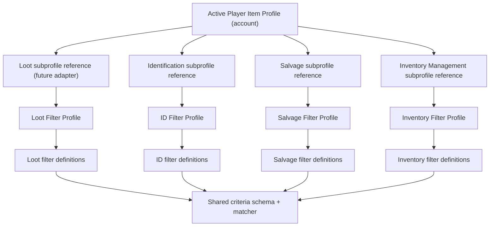

# Inventory+ to System Settings Migration

Status: proposed
Scope: Inventory+ item features, System Settings integration, and retirement of the combined automatic handler
Authority: current source under `Widgets/`, `Py4GWCoreLib/`, and `Settings`; runtime behavior remains to be validated in an injected client
Last reviewed: 2026-08-08

## Objective

Move Inventory+ item-management controls into the `items` category of System
Settings. The target surface has one independently enabled feature section for
each of these capabilities:

1. Colorize
2. Identification
3. Salvage
4. Deposit Items

The features share one right-click context menu. The interaction host monitors
the normal bags frame and the regular inventory frame as two peer frame
sources, using the same item resolution and action pipeline for both. If both
are visible, both are monitored. System Settings owns configuration and
automatic runtime scheduling; it does not create one competing context menu per
feature.

Each feature owns its persisted state, runtime controller, callback registration,
and scheduling timer. The old combined Auto Handler is deprecated as a feature
and trigger loop. Its reusable item-operation routines remain available until
their callers have been migrated.

This is a migration plan, not permission to remove Inventory+ or
`AutoInventoryHandler` in one change.

## Current ownership map

| Capability | Current owner | Current execution path | Target disposition |
|---|---|---|---|
| Colorize inventory slots | `Widgets/Guild Wars/Items & Loot/InventoryPlus.py` (`_draw_colorized_inventory_slots`) | Inventory+ runs from `main()` and paints detected inventory/storage slot frames through `FrameTree`/`UIManager` | Migrate to a System Settings item feature with its own draw callback and context-refresh timer; keep its toggle in the shared menu |
| Identification | Inventory+ settings plus `Py4GWCoreLib/py4gwcorelib_src/AutoInventoryHandler.py` | Inventory+ queues `IdentifyItems`; the Auto Handler periodically triggers it | Migrate settings and trigger ownership; keep the routine as execution plumbing initially |
| Salvage | Inventory+ salvage helpers plus `AutoInventoryHandler` | Inventory+ queues salvage routines; `ActionQueueManager` and `Environment Upkeeper` drain the work | Migrate settings, filters, dialog policy, and trigger ownership; preserve the existing safety state machine |
| Deposit Items | `AutoInventoryHandler.DepositItemsAuto` plus Inventory+ context-menu Ctrl-click deposit | Automatic deposit runs only through the combined Auto Handler; manual deposit is event-driven from Inventory+ | Migrate automatic deposit as its own feature; decide separately where manual context-menu behavior belongs |
| Combined Auto Handler | `InventoryPlusWidget.update_auto_handler()` and `AutoManager` settings | One lookup timer triggers identify + salvage, and outpost handling adds identify + salvage + deposit | Deprecate the combined setting, lookup interval, and trigger loop; do not remove reusable routines yet |
| Item operation queues | `Widgets/System/Environment Upkeeper.py` and `ActionQueueManager` | Shared queue draining for `IDENTIFY`, `SALVAGE`, `MERCHANT`, and other queues | Keep as infrastructure; feature timers decide when work starts, while Upkeeper continues to drain queues |
| Shared inventory interaction | Inventory+ `DetectInventoryAction`, `_resolve_inventory_hit`, and `SlotContextMenu` | Monitors `InventoryBagsWindow`, the regular `InventoryWindow`, and storage; resolves the selected item and dispatches one shared right-click popup | Keep one shared menu host; bags and inventory are peer frame sources. Remove the legacy `I` option and its special slot-discovery path |
| Merchant UI | Inventory+ plus `Sources/ApoSource/InvPlus` legacy merchant modules | Inventory+ lazily loads legacy merchant code and renders a bulk material trader | Out of scope for the first item-feature migration; track as a later System/merchant migration |
| Xunlai sorting | Inventory+ bridge to `Xunlaimanager.py` | Inventory+ displays the sort button and advances the sort task | Out of scope for the first item-feature migration; retain until it has an explicit owner |

The current System Settings host is
`Widgets/System/System Settings.py`. Its `items` category is defined in
`Py4GWCoreLib/py4gwcorelib_src/system_settings/catalog.py` and currently holds
native listener options, so the migration must add custom item sections without
replacing those existing listeners.

## Shared frame and context-menu contract

The frame monitor and context menu are interaction boundaries, not settings
boundaries. They should remain one pipeline with one selection model:

- the host monitors the normal bags frame and the regular inventory frame using
  the same detection rules;
- the host also monitors storage when the Xunlai window is usable;
- both inventory sources remain active when both are visible;
- the host resolves the item, if any, and opens `SlotContextMenu` once;
- the feature modules provide menu entries and callbacks for identification,
  salvage, deposit, and colorize toggling;
- the host keeps common actions such as destroy confirmation and opening the
  Xunlai vault;
- feature callbacks enqueue work or update feature state; they do not perform
  independent hit-testing, maintain a second selection model, or open another
  popup.

`Open Xunlai Vault` is an explicit shared menu action. It should be available
from a detected bags or inventory-frame context when storage is closed, even
when no item is selected. It calls the existing
`GLOBAL_CACHE.Inventory.OpenXunlaiWindow` surface and remains independent from
automatic Deposit Items scheduling.

There is no `I` feature in the target design. The regular inventory frame is
just another monitored frame alongside the bags frame. Do not copy the legacy
`enable_i_window` behavior, force/restore the native window, or create a second
menu path. Do not copy the legacy nested child-prefix probing in
`_iter_i_slot_offset_prefixes`, `_resolve_i_regular_bag_prefix`, or
`_resolve_i_slot_frame_id`; it is specifically associated with the reported
performance problem. Any cleanup of the old `InventoryWindow.enable_i_window`
setting and legacy mapping helpers belongs to the migration's retirement work,
not to the new feature contract.

## Profile and filter framework reset

Status: proposed; supersedes the earlier `Profile model` and all future
filter/profile work in this plan. Existing Colorize/Xunlai and Identification
code is migration scaffolding, not the final profile framework contract.

### Problem statement

The current code has three incompatible shapes: Loot Filters selects a Loot
Filter Factory profile directly, Item Profiles have only partial CRUD, and the
new ID code has separately copied stores and UI. They look similar but do not
share a lifecycle or a contract. Adding Salvage and Inventory Handling on that
foundation would make four more copies of the same mistake.

### Target ownership



There are exactly three layers:

1. **Player Item Profiles** are the user-facing top-level profiles. They hold
   references to one subprofile for Loot, Identification, Salvage, and
   Inventory Management (and later Colorize when it is converted to the same
   lifecycle). The profile definitions themselves are global; an account only
   records which global Player Item Profile it is currently using.
2. **Feature Filter Profiles** are named collections of filter definitions for
   one feature only. They own their policy slots, such as ID's `always` and
   `never` lists. A Loot Filter Profile is never an ID Filter Profile.
3. **Feature Filter Definitions** are independently persisted definitions.
   They use a common criterion schema and matcher implementation, but an ID
   filter is not a Loot filter and neither feature may silently edit or select
   the other's definitions.

The common matcher is infrastructure only. It evaluates a definition and
returns an explainable match result. It does not persist definitions, select a
profile, or decide an operation's polarity.

### CRUD contract

Both profile layers must have complete, uniform CRUD before more runtime work:

| Surface | Required operations | Referential rule |
|---|---|---|
| Player Item Profiles | create, rename, duplicate, delete, select active; assign, replace, or clear each feature subprofile | The active profile cannot disappear. Deletion selects another profile first. |
| Feature Filter Definitions | create, rename, edit every criterion, enable/disable, duplicate, reorder, delete, preview/explain | Deleting a definition removes its reference from every same-feature Filter Profile. |
| Feature Filter Profiles | create, rename, duplicate, delete; add/remove/reorder definitions in each policy slot | Deleting a referenced subprofile requires explicit reassignment or clears only the affected parent reference. |

The profile UI must show the account's active Player Item Profile and which
global parent profiles currently reference each subprofile. A user must never
need to infer which hidden selection is running.

### Persistence scope (decided)

All framework data is **global**:

- Player Item Profiles;
- Loot, ID, Salvage, and Inventory Management subprofiles;
- every feature's filter definitions and Filter Profiles;
- feature policy that describes what a subprofile means, such as ID's Always
  and Never filter membership.
- Loot policy: enabled state, rarity choices, catalog/model/dye/material
  selections, Nicholas selections, explicit blacklists, and loot-lock policy.

Account-local configuration is operational, so each account remains
independently manageable:

- the active global Player Item Profile selection;
- the active global Loot Filter Profile selection;
- each migrated feature's automatic enabled state and interval/timer settings;
- transient timer/coroutine/operation state (never persisted as profile data).

Use `JsonFactory(..., "global")` for structured global profile libraries and
`Settings(..., "account")` for each account's operational selection and
automatic-handling controls. A global profile must never start, stop, or alter
the automatic timer of another account.

The existing `loot_filters` and `loot_filter_factory` are now in scope for a
**persistence/profile-scope migration only**. Their current filtering and
runtime behavior is the parity baseline and must not be redesigned while this
scope move is made.

The current `LootConfig` incorrectly combines three lifetimes: global policy,
account-local selected profile, and session-only script/runtime overrides. The
Loot migration must split those values before changing storage:

| Lifetime | Loot examples | Target owner |
|---|---|---|
| Global policy | enabled, lock policy, rarities, catalog/model/dye/material selections, Nicholas dates, model/type blacklists | global Loot Policy document/subprofile |
| Account-local selection | selected Loot Filter Profile | account `Settings` selection only |
| Session-only runtime | script-added models/items, failed-drop suppression, live copy/diff, map-reset item IDs | `LootFilters` in-memory state; never persisted |

Quick-access window/layout state is also global under the current rule that
everything except the selected profile is global. It is presentation state, but
it remains part of the shared Loot configuration rather than silently becoming
an account-specific exception.

### Feature policy contract

The criterion evaluator is shared; the consumer policy is not:

| Feature | Match meaning | Required policy shape |
|---|---|---|
| Loot | positive allow reason | `allow` filter list plus Loot's explicit blacklist veto |
| Identification | action policy | `always` inclusion override and `never` hard veto; Never wins |
| Salvage | action policy | independent exclusion/veto policy; kit/dialog strategy remains feature state |
| Inventory Management | handling policy | independent keep/deposit/ignore policy, defined when Deposit migration starts |

Rarity controls are feature settings, not filter definitions. For
Identification, an Always match overrides automatic rarity selection; a Never
match vetoes manual and automatic action. The automatic master toggle remains
separate from every filter result.

### Framework modules

Build one reusable System Settings item-filter framework rather than copying
feature packages:

```text
system_settings/item_filters/
  criteria.py          # shared rule value schema and matcher/explain contract
  definitions.py       # generic definition CRUD/store service, parameterized by feature namespace
  profiles.py          # generic feature-filter-profile CRUD/store service and reference cleanup
  config_ui.py         # shared immediate-mode rule/profile editor components
  references.py        # parent/subprofile assignment, deletion validation, reverse-reference lookup
  categories.py        # Loot, ID, Salvage, Inventory policy-slot specifications
system_settings/item_profiles/
  model.py             # PlayerItemProfile: references only
  store.py             # active selection + parent-profile CRUD
  config_ui.py         # Player Item Profile CRUD and subprofile assignment
```

Each category supplies labels, namespace, policy slots, and match polarity to
the framework. It does not copy the matcher, serialization, editor, IDs, or
reference cleanup. Existing `loot_filters` and the current `identification_*`
packages become consumers/adapters during migration, then their duplicate
profile/filter code is removed in a later, isolated cleanup change.

### Implementation order and exit gates

1. **Freeze and audit:** list every persisted source and current direct
   profile/rule owner; add characterization tests for Loot selection and ID
   Always/Never behavior. No new feature migration in this phase.
2. **Framework core:** implement criteria, definitions, filter-profile CRUD,
   reverse references, and deterministic deletion/reassignment behavior with
   persistence tests.
3. **Player Item Profiles:** replace partial Inventory Profile CRUD with full
   parent-profile CRUD and subprofile assignment controls. Migrate current
   active Loot and ID selections without changing runtime behavior.
4. **Loot scope adapter:** split global Loot Policy from account-local active
   Loot Filter Profile selection while retaining the current `LootFilters`
   matcher, blacklist-veto behavior, and session-only live overrides. Migrate
   existing account policy values to the global library once, with an explicit
   collision rule for multiple accounts.
5. **Identification adapter:** make Identification consume the ID subprofile
   reference; preserve Never veto and Always automatic inclusion. Remove the
   current copied ID store/UI only after migration tests prove no lost rules.
6. **Salvage and Inventory Management:** add category policy specifications
   and feature controllers one at a time. No controller may create its own
   filter/profile model or persistence store.
7. **Retire compatibility code:** remove one-time translators and duplicate
   owners only after an injected-client acceptance pass and a saved-data
   migration test for each prior document.

### Acceptance evidence

- A Player Item Profile can be created, renamed, duplicated, deleted, and
  selected; each category reference is independently changed and persisted.
- Loot policy is shared globally while two accounts can select different global
  Loot Filter Profiles; script/live overrides remain local and map-resettable.
- A user can create/edit/delete definitions and profiles within Loot and ID
  without either category showing or mutating the other's definitions.
- An ID subprofile can be assigned to an Item Profile; Always and Never match
  behavior is explainable and Never wins.
- Delete/rename/reassignment operations preserve referential integrity and
  surface affected parent profiles in the UI.
- Strict Pyright, focused persistence/migration tests, `git diff --check`, and
  injected-client CRUD/runtime acceptance all pass before Salvage starts.

## Target architecture

Each migrated feature should follow the existing System Settings module shape:

```text
Py4GWCoreLib/py4gwcorelib_src/system_settings/<feature>/
  __init__.py
  model.py
  persistence.py
  controller.py
  config_ui.py
```

The controller is the runtime owner. It should:

- load account-scoped state through `Settings`, using the System Settings
  document rather than a new persistence wrapper;
- expose the feature section to `system_settings.config_ui` under the existing
  `items` category;
- register one idempotent profiled callback from the System Settings boot path;
- own its `ThrottledTimer` or equivalent scheduling state;
- stop starting work when disabled, the map is invalid, the client is loading,
  or the feature already has an active coroutine;
- reset transient state on map changes and widget reloads;
- report callback and operation failures without disabling unrelated features.

### Profile model

The unit of user configuration is one named `ItemProfile`. A user selects one
active profile, and that profile owns four independent subprofiles:

```text
ItemProfile: "Profile name"
  identification: IdentificationProfile
  salvage:        SalvageProfile
  inventory:      InventoryProfile
  colorize:       ColorizeProfile
```

The four subprofiles are separate filter collections and separate settings.
They are edited, persisted, migrated, and evaluated independently. A change
to Salvage never changes Identification; a change to Identification never
changes Inventory Handling; Colorize never reads an action filter.

Initial implementation should store the subprofiles inside the parent profile.
If later we need to reuse one Identification or Salvage configuration across
several parent profiles, the storage can evolve to named subprofile references
without changing the runtime contract. Do not introduce sharing before that
need exists; hidden sharing is how configuration becomes haunted.

Subprofile responsibilities:

- `IdentificationProfile`: identification enablement, negative exclusion
  filters, kit/action options, and its feature timer settings.
- `SalvageProfile`: salvage enablement, negative exclusion filters, kit and
  dialog strategy, and its feature timer settings.
- `InventoryProfile`: inventory-handling enablement, deposit/keep/exclusion
  filters, manual handling options, and its feature timer settings. Deposit
  Items is the first consumer of this subprofile.
- `ColorizeProfile`: rarity checkboxes, rarity colors, and the four
  independent render switches: ImGui frame, ImGui outline, native frame, and
  native outline.

`system_settings/loot_filters` is the positive Loot category of the framework.
Its `LootFilters.wants()` result means “allow this drop to be picked up” and
retains its blacklist veto. Its global policy persistence and account-local
selected Factory profile must remain separated from ID/Salvage/Inventory policy
and from session-only script overrides.

The target inventory package should provide the profile and runtime seams:

```text
inventory/
  identity.py       # canonical item/slot/frame snapshot
  rules.py          # reusable criteria and matcher infrastructure
  profiles/         # ItemProfile and the four subprofile models/stores
  runtime.py        # active-profile selection and feature access
  monitor.py        # bags, inventory, and storage sources
  context_menu.py   # one shared item interaction surface
  colorize/         # ImGui/native rendering consumers
  xunlai.py         # shared vault-opening action
```

The ownership rules are fixed even if module names change:

- `ItemSnapshot` is the common input. It contains item ID, model ID, item
  type, rarity, quantity, bag/slot, source frame, and runtime frame identity
  where available. Runtime IDs and native frame IDs are never persisted.
- The shared matcher evaluates the filter set supplied by the active
  subprofile and returns matches plus explainable reasons. It does not own
  filter data and does not produce one universal action decision.
- Identification and Salvage interpret their own matching rules negatively:
  a matching exclusion blocks that operation.
- Inventory Handling defines its own handling semantics inside
  `InventoryProfile`; it does not inherit Identification or Salvage rules.
- Colorize evaluates only its own rarity/display settings and never blocks an
  item operation.
- Every feature controller reads only its corresponding subprofile from the
  active `ItemProfile`. Manual context actions and automatic timers for one
  feature use that same subprofile.
- New criteria belong in the shared matcher infrastructure; new filter data
  belongs in the owning subprofile model and persistence namespace.
- Decisions retain reasons so the context menu and diagnostics can explain
  why a particular feature will or will not handle an item.

### Frame-monitoring rule

The monitor must treat `InventoryBagsWindow` and `InventoryWindow` uniformly:

- use the same item snapshot and bag/slot identity for both sources;
- apply Colorize to both visible sources when enabled;
- route right-click, Ctrl-click deposit, and common actions through the same
  menu/action dispatcher;
- do not prioritize one source merely because it is the regular inventory
  window;
- do not run expensive layout discovery every frame. Use existing stable frame
  accessors or a narrowly measured mapping mechanism, and validate performance
  in the injected client.

The callback must be registered from the always-on System Settings widget, not
from the settings window's draw path. Opening the window is a UI action; it must
not be required for item automation to run.

### Timer ownership rule

There are two different kinds of timing and they must not be conflated:

- Feature timers decide when a feature scans or starts a coroutine. These belong
  to Colorize, Identification, Salvage, and Deposit Items respectively.
- Queue-drain timers decide when queued native actions are processed. These
  remain Environment Upkeeper infrastructure unless later evidence shows that
  a queue itself has the wrong owner.

Identification and Salvage cannot safely perform conflicting item operations at
the same time. Their timers remain independent, but their execution path needs
an explicit shared-operation guard or equivalent queue reservation before either
feature starts work. That guard is coordination infrastructure, not a shared
replacement for the feature timers.

## Legacy settings and migration policy

Inventory+ currently reads and writes the global document
`Inventory/InventoryPlus/InventoryPlus.ini`. System Settings persists account
state in `Widgets/System/System Settings.ini`. The migration must use the
concrete `Settings` API for both documents and must not introduce a third
persistence layer.

The legacy inputs are not one-to-one:

| Target feature | Legacy manual settings | Legacy automatic settings | Migration concern |
|---|---|---|---|
| Colorize | `Colorize.enable_colorize`, `color_*`, `*_color` | None | Straightforward value move; preserve ARGB/RGBA conversion and slot coverage |
| Identification | `Identification.identify_*`, `show_identify_all`, `identify_all_*` | `AutoIdentify.id_*`, `id_model_blacklist` | Decide whether manual rarity buttons and automatic rarity selection share one canonical model |
| Salvage | `Salvage.salvage_*`, `show_salvage_all`, `salvage_all_*` | `AutoSalvage.salvage_*`, dialog flags, strategy, type/model blacklists | Preserve advanced-kit dialog handling, manual-choice timeouts, and blacklist semantics before removing old reads |
| Deposit Items | `Deposit.use_ctrl_click` | `AutoDeposit.deposit_*`, `keep_gold`, deposit blacklists | Separate automatic storage deposit from manual Ctrl-click and from material-storage deposit in `Xunlaimanager.py` |
| Combined Auto Handler | `AutoManager.module_active`, `AutoManager.lookup_time` | N/A | Replace one global enable/interval with four feature enables and feature-owned schedules |
| Legacy I option | `InventoryWindow.enable_i_window` | N/A | Do not migrate; retire the option and its force/restore behavior after the uniform frame monitor is validated |

The migration reader should be one-time and idempotent:

1. On first feature initialization, read the legacy values through `Settings`.
2. Resolve conflicts using a documented precedence rule. Proposed default:
   preserve automatic values for automatic behavior and manual values for
   manual controls; do not silently use `AutoManager.module_active` to enable
   every new feature.
3. Write the translated values to the System Settings document.
4. Record a per-feature migration marker in the System Settings document.
5. Keep the legacy document untouched until the feature has passed runtime
   validation and all known callers are migrated.
6. After retirement, leave the old values readable as historical data or add a
   separately reviewed cleanup change; do not delete them as part of a feature
   migration.

The final key names are intentionally not fixed here. They must be chosen with
the existing System Settings naming convention and documented in each feature's
`persistence.py` when that feature is implemented.

### Profile lifecycle

- Profiles are account-scoped and stored in the System Settings document.
- One profile is active at a time. The runtime reads the active profile once
  and passes only the corresponding subprofile to each feature controller.
- Creating a profile creates four independent subprofiles. Duplicating a
  profile deep-copies all four; it must not create shared mutable references.
- Deleting the active profile first selects another existing profile. The
  system must always have a valid active profile while the item runtime is
  running.
- The first migration creates a named default profile and imports legacy
  Colorize, Identification, Salvage, and Deposit/Inventory Handling values
  into their corresponding subprofiles. It does not merge those values into
  one filter list.
- A later profile switch changes the configuration consumed by future scans;
  active runtime work finishes or is cancelled according to the owning
  feature's existing safety rules. Profile switching must not mutate another
  profile's persisted values.

## Migration phases

### Phase 0 - Contract freeze and inventory

Record the current behavior before moving code:

- list every Inventory+ setting, popup, context-menu action, timer, coroutine,
  blacklist, and external caller;
- distinguish manual actions from automatic actions;
- capture current defaults and the exact legacy INI sections;
- identify bot/script callers of `AutoInventoryHandler` and callers that write
  Inventory+ INI values directly;
- define the `ItemProfile` schema, its four subprofiles, active-profile
  selection, persistence namespaces, and migration markers;
- define the shared `ItemSnapshot` and matcher contract, plus each subprofile's
  filter precedence, polarity, decision shape, and runtime-ID lifetime rules;
- define runtime acceptance cases for normal maps, outposts, map loading,
  missing kits, full storage, advanced salvage dialogs, and disabled features.

Exit gate: this plan's matrix is updated with any newly discovered caller or
behavior, and the profile schema is approved before feature-specific filters
or runtime controllers are migrated.

### Phase 1 - ItemProfile foundation

Implement the `ItemProfile` model with a reference to each feature's separately
owned filter profile (Identification, Salvage, and Inventory) plus its Colorize
settings; active-profile selection; persistence; profile creation/duplication/
deletion; and migration markers. Rules and filter-profile collections remain
separate owners. Implement the canonical item snapshot and reusable matcher
adapter without connecting feature actions yet. Keep profile evaluation
independent from walking, targeting, rendering, and timers.

Exit gate: a user can select an active `ItemProfile`; it persists independent
references to Identification, Salvage, and Inventory filter profiles plus its
Colorize settings; duplicating a profile copies references and Colorize values
without embedding another filter collection; and runtime IDs are cleared on
map changes.

### Phase 2 - System Settings item-feature scaffolding

Add the `items` custom-section integration and profile editor to System
Settings. Register the always-on runtime host, load the active profile, and
add the shared item monitor/context-menu seam with disabled/no-op feature
controllers. Do not move business logic yet.

Exit gate: System Settings still renders its current native item listeners,
each new section loads account state, callbacks register exactly once, and no
feature starts work while disabled. The runtime host exposes the correct
subprofile to each feature, and no feature reads another feature's filters.

### Phase 3 - Shared frame monitor and Colorize

Move the shared frame-monitor and menu seam, then connect Colorize to the
active profile's `ColorizeProfile`. Colorize is isolated from item-operation
coroutines, so it is the first feature to prove the new ownership. Preserve
the normal bags frame and regular inventory frame as equal sources, plus
storage coverage, the per-rarity enable flags, four independent render
switches, and color editing. Do not port the legacy `I` mapping algorithm.

Exit gate: visual parity is confirmed in each supported detected frame context,
including a clean reload and a disabled state; Inventory+ no longer paints the
same slots; when both inventory sources are visible both are handled; the
single shared menu still exposes Colorize and `Open Xunlai Vault` correctly;
frame monitoring does not reproduce the legacy performance regression.

### Phase 4 - Identification

Move automatic identification configuration and scheduling. Keep the timer and
manual actions in the standalone Identification owner. The active Item Profile
selects a named ID Filter Profile, and that profile references shared Loot
Filter Factory rules. Matching rules are a negative decision: do not identify.
Rarity choices remain action selection, not blacklist state.

Exit gate: only the Identification timer starts identification, it does not
run in outposts or during loading, it handles missing kits without a hot loop,
and its migrated defaults match a legacy profile.

### Phase 5 - Salvage

Move salvage settings, kit selection, and automatic scheduling. Connect both
automatic and manual salvage to the active profile's `SalvageProfile`.
Salvage blacklists and exclusions remain independent from Identification or
Loot filter state. The existing advanced salvage state machine and dialog
handling remain until the new controller has equivalent runtime evidence.
Salvage must not start while a conflicting identification operation is active.

Exit gate: lesser, expert, and superior kit paths; purple/gold confirmation;
manual-choice timeout; blacklist filtering; partial failure; and map reload all
behave safely and visibly.

### Phase 6 - Deposit Items

Move automatic deposit flags and keep-gold behavior into a dedicated feature.
Connect automatic and manual deposit to the active profile's
`InventoryProfile`. Deposit blacklists and keep rules belong to that
independent filter set. Define
whether the feature means only `DepositItemsAuto`, or
also material-storage deposit from `Xunlaimanager.py`; these are currently
different implementations and must not be merged by naming convenience.

Exit gate: deposit never moves blacklisted items, respects full storage and
failed salvage outcomes, does not fight manual Ctrl-click, and does not depend
on the Auto Handler timer.

### Phase 7 - Deprecate the combined Auto Handler

After the four features have independent runtime ownership:

- stop calling `InventoryPlusWidget.update_auto_handler()`;
- stop reading `AutoManager.module_active` and `AutoManager.lookup_time` for
  migrated behavior;
- remove the Auto Handler configuration tab and replace it with a migration
  notice or release note;
- keep `AutoInventoryHandler.IdentifyItems`, `SalvageItems`, and
  `DepositItemsAuto` as reusable routines until callers no longer need them;
- update direct bot/config writers that still assume `AutoManager` controls all
  item behavior.

Exit gate: no production path starts a combined identify/salvage/deposit run,
and a repository search finds only documented compatibility references.

### Phase 8 - Inventory+ shell disposition

Only after the item features are stable, decide whether to retire, narrow, or
split Inventory+. The merchant UI, Xunlai sort integration, and cleanup of the
legacy `I` option and nested slot-mapping helpers require their own acceptance
checks. The shared frame monitor and context-menu host must have an owner before
Inventory+ is narrowed or removed. Do not delete the widget merely because its
first four settings moved.

## Verification gates

For each phase, record evidence separately:

- Offline: import/compile checks, strict Pyright for changed Python, focused
  persistence tests, callback-registration checks, and `git diff --check`.
- Injected client: feature enabled/disabled transitions, callback duplication
  after reload, timer behavior, map loading/outpost behavior, and actual item
  state changes.
- Regression: bot callers, bridge/Messaging commands, manual context-menu
  actions, and queue draining through Environment Upkeeper.

No phase is complete when only the settings panel renders. The acceptance
criterion is that the feature still performs its operation at the correct
runtime boundary without relying on the old widget's `main()` loop.

## Risks and controls

| Risk | Control |
|---|---|
| Two legacy setting groups disagree | Preserve manual and automatic semantics explicitly; log the chosen import result once |
| Duplicate callbacks after widget reload | Remove callbacks by stable name before registering, matching existing System Settings modules |
| Identify and salvage race each other | Add an explicit shared-operation guard/reservation; do not rely on timer intervals |
| Queue infrastructure mistaken for feature ownership | Keep Environment Upkeeper as a queue drainer and move only scan/start scheduling |
| Advanced salvage dialogs regress | Migrate the existing state machine before simplifying it; validate in-client |
| Bot scripts break when AutoManager disappears | Search direct INI writers and provide a compatibility period for reusable routines |
| Legacy I-window performance regression returns | Do not port nested frame-prefix probing; measure both monitored sources with the same callback path |
| Inventory+ is removed too early | Treat merchant, Xunlai sorting, shared frame-monitor ownership, and legacy setting cleanup as separate disposition items |
| Persistence paths drift | Use `Settings` directly, account scope for new System Settings values, and no private wrapper |

## Open decisions before implementation

1. Does “Deposit Items” include material-storage deposit, or only the current
   `AutoInventoryHandler.DepositItemsAuto` storage deposit?
2. Should manual identify/salvage/deposit actions remain in Inventory+ context
   menus while automatic settings move, or should System Settings also become
   their command surface?
3. Which component becomes the long-term owner of the shared right-click menu if
   Inventory+ is eventually narrowed or removed?
4. What is the desired precedence when a user's `Identification`/`Salvage`
   manual values differ from `AutoIdentify`/`AutoSalvage` automatic values?
5. Which external bot/config writers are supported during the compatibility
   period, and when may legacy `AutoManager` writes be removed?

## Migration journal

### 2026-08-09 - Loot persistence-scope correction

Status: in progress

The prior Loot implementation persisted all policy in account-scoped
`LootFilters.ini` and `LootFiltersSelections.json`, while only Factory rules
and profiles were global. This contradicted the global-profile policy.

Successes:

- Moved persisted Loot policy to the same document names at global scope:
  enabled/lock settings, rarity choices, model/dye/material selections,
  Nicholas selections, blacklists, quick-access configuration, and layouts.
- Added account-scoped `LootFilterProfileSelection.ini`, containing only the
  selected global Loot Filter Factory profile.
- Preserved the existing live/persisted split: script additions, per-item
  suppressions, and map-reset runtime IDs remain in memory only and are never
  written to either global or account documents.
- Added one-time migration: the first account to run the new code imports its
  former account policy into the global policy store; every account separately
  imports its old selected profile into its local selection document.
- Focused compilation, strict Pyright, and `git diff --check` passed.

Failures and unresolved runtime evidence:

- The first-account global import intentionally establishes one shared policy.
  If existing accounts had conflicting old policies, later accounts retain only
  their local selected-profile import; their former policy does not overwrite
  the new global policy. Confirm the intended global policy after the first
  injected-client load.
- Injected-client acceptance must verify a policy edit made by one account is
  visible to another, while each account retains its own selected Factory
  profile and session-only script overrides still reset on map change.

### 2026-08-08 - First System Settings slice

Status: in progress
Scope: `Open Xunlai Vault` and `Colorize` under `System Settings > Items & Merchants`

Successes:

- Added `system_settings/inventory` with an account-scoped `ItemProfile` containing independent
  Identification, Salvage, Inventory, and Colorize subprofiles.
- Added active-profile selection, new-profile creation, and duplication. The three future operation
  filters are represented but remain inactive until their own migrations are implemented.
- Migrated legacy Colorize booleans and tuple colors from `Inventory/InventoryPlus/InventoryPlus.ini`
  into `Widgets/System/InventoryProfiles.json` on first load, preserving the legacy rarity defaults
  and both ImGui frame/outline targets.
- Added the Xunlai-opening command using `GLOBAL_CACHE.Inventory.OpenXunlaiWindow`; it reports queued,
  already-open, and failure states in the settings section.
- Added one shared monitor for `InventoryBagsWindow` and `InventoryWindow`. Both are peers; if both
  are visible, both receive the same Colorize result. The legacy `I` enable flag and nested prefix
  probing are not used. Inventory scans are throttled to 250 ms.
- Added ImGui frame/outline switches, native frame switch, native outline switch, and per-rarity
  checkboxes/color pickers. Native frame reconciliation uses the existing frame-id binding and only
  sends changed targets.
- Added an always-on System Settings item context-menu host with the same click trigger shape as
  Inventory+ (`right click -> inventory-frame hit -> open popup`). Both actions have persisted
  menu-visibility toggles, and Colorize can be enabled or disabled directly from that popup. The new
  host has no Inventory+ import or lifecycle dependency.
- The Colorize monitor resolves regular inventory with direct `Frame.inventory_bag_slot` access. Bags
  and regular inventory remain peer sources when Colorize is enabled; the popup itself only needs the
  two parent inventory frames, so an empty slot can still open it.
- The popup host (`SystemItemsContextMenuCallback`) and Colorize
  (`SystemItemsColorize`) are independent `PyCallback` draw-context callbacks. Colorize exclusively
  owns its 250 ms monitor cache, overlay drawing, and native tint reconciliation; the popup callback
  only performs the right-click hit test and draws its menu. Future item features must register their
  own callback and feature timer rather than being folded into either of these.
- Corrected color packing by using the repository `Color` and `ColorPalette` owners: FrameTree overlay
  drawing uses `Color.to_color()` (ABGR), native tint uses `Color.to_dx_color()` (ARGB), and the palette
  defaults come from `GW_White`, `GW_Blue`, `GW_Green`, `GW_Purple`, and `GW_Gold`.
- Offline verification succeeded: focused `compileall`, strict Pyright, and `git diff --check`.

Failures and unresolved runtime evidence:

- Live injected-client verification has not yet been run for Xunlai opening, profile persistence,
  regular-inventory frame discovery, or Colorize redraw behavior.
- A normal host-Python package import cannot run offline because the injected-only `PySystem` module
  is absent. The pure profile model round-trip passed when loaded independently; runtime imports must
  be verified in the injected client.
- The current native UI owner exposes item-frame tinting but does not expose a distinct native outline
  target. The native-outline option is therefore persisted and visibly warned as unavailable; it does
  not call the native frame tint API as a fake substitute.
- Storage-slot Colorize remains out of this first slice; Xunlai opening is migrated, but Xunlai sorting
  and storage highlighting still belong to later migration work.

Resume point:

Run the first in-client acceptance pass with the new Items category: confirm both bag sources while
open, compare ImGui frame/outline colors against the migrated legacy settings, exercise native frame
tinting only when its hook is installed, open the System Settings item popup over each source, toggle
Colorize and Xunlai visibility from System Settings, and confirm the Xunlai request drains through
the existing queue. Then fix any live-client findings before migrating identification, salvage, or
deposit.

The next code phase is the Colorize acceptance/fix pass, not Auto Handler removal. The combined handler
must remain intact until every feature has an independent owner and timer.

### 2026-08-08 - Shared menu and color contract correction

Status: in progress

The first implementation had no always-on context-menu trigger and used ARGB packing for FrameTree
overlay drawing. This correction copied Inventory+'s trigger semantics into the System Settings Items
owner and moved all runtime color conversion through the repository `Color`/`ColorPalette` owners.

Successes:

- `Open Xunlai Vault` and the Colorize enable/disable action are drawn by the always-on System
  Settings Items popup for both bags and regular inventory hits.
- System Settings controls whether each of those migrated entries appears in the popup.
- Inventory+ was returned to its original state; the migration host has no code path through that
  retiring widget.
- Focused compilation, new-package strict Pyright, the repository color packing assertion, and
  `git diff --check` passed.

Failure/baseline:

- Full-file Pyright for Inventory+ still reports eight pre-existing diagnostics: five missing
  `PySystem` definitions and three undocumented native salvage methods. No new diagnostics were
  introduced by the changed context path.
- Live popup input, both frame sources, persistence, and native rendering remain unverified until an
  injected-client acceptance run.

### 2026-08-08 - Identification runtime migration

Status: in progress

Identification is now an independent System Settings item feature. It does not call or configure
`AutoInventoryHandler`: `SystemItemsIdentification` owns its own toggleable interval, map-state
guard, operation guard, and verified identification coroutine. Its non-visual timer pass runs in the
update data context and starts on every map-ready state (outposts included), never during loading or
while an existing item operation is active.

Successes:

- Migrated legacy `Identification` menu visibility/rarity settings and `AutoIdentify` rarity flags,
  model blacklist, and legacy lookup interval into the active item-profile Identification subprofile.
  Existing first-slice profiles receive this one-time schema migration rather than silently keeping
  their prior placeholder data.
- Automatic rarity choices are positive selection criteria: they decide which unidentified items the
  automatic pass considers. They are not blacklist state.
- Identification acquires the shared exclusive item-operation gate before it queues work and releases
  it only when its coroutine ends. Salvage must acquire that same gate when it is migrated, so neither
  feature can mutate inventory while the other is running.
- Item Profiles now store only a named `identification_profile` reference. The separately owned
  `Items > ID Filters` section owns complete ID rule definitions and ID Filter Profiles. It uses the
  same criterion and matcher scheme as Loot Filters, but never shares either feature's persisted
  rules or profiles. The Item Profiles section chooses the reference; the standalone Identification
  section owns only automatic/manual behavior and its timer. A matching rule is interpreted only by
  Identification as **do not identify**. The legacy model blacklist migrates into an independent ID
  rule rather than remaining a hidden private list. Renaming or deleting an ID Filter Profile
  updates or clears every Item Profile reference that used it.
- The shared item popup resolves the right-clicked item independently of the Colorize monitor. An
  identification kit offers configured per-rarity and all-configured identification actions; an
  unidentified non-kit item offers `Identify this item`. When a negative exclusion matches the
  right-clicked item, the popup renders a red warning instead of an actionable identify entry.
- Per-rarity Identification-kit menu actions use the repository `ColorPalette` rarity colours, so
  the action label visibly matches the target rarity without introducing a separate color source.
- System Settings displays the automatic ID state and countdown to the next pass, including disabled,
  loading, operation-blocked, running, callback-registration failure, and no-rarity states. The prior
  implementation gave the user no way to distinguish a timer wait from an inactive feature.
- Focused compilation, strict Pyright for the inventory and shared criteria owners, and
  `git diff --check` passed.

Failures and unresolved runtime evidence:

- Live injected-client verification remains required for the update-context callback registration,
  outpost and explorable scheduling, displayed countdown, coroutine completion, kit exhaustion,
  right-click slot resolution, red exclusion warning, shared-filter profile persistence, and
  legacy-profile migration persistence.
- The context menu preserves Inventory+'s proven trigger semantics: identification-kit actions are
  on an identification kit, while `Identify this item` is for an **unidentified** non-kit item.
  The earlier wording that requested identification on an already identified item conflicts with
  the available operation and has not been implemented.

Correction from source review and user-reported runtime behavior: the first automatic-ID pass was
restricted to `Map.IsExplorable()`. That made it appear inert in outposts, where inventory cleanup
normally happens. The restriction was removed; it now requires only `Map.IsMapReady()` and reports
its wait reason/countdown instead of silently doing nothing.

### 2026-08-08 - ID filter ownership correction

Status: in progress

The initial Identification slice incorrectly left an embedded Identification profile model and
legacy migration path inside the Item Profile owner. That was removed before acceptance: an Item
Profile is a consumer reference, not a second ID-filter database.

Current ownership graph:

`Item Profile (account) -> ID Filter Profile (global) -> ID filter definitions (global)`

- `Widgets/System/InventoryProfiles.json` persists the active Item Profile and its selected
  `identification_profile` name only.
- `Widgets/System/IdentificationFilterProfiles.json` persists independent ID filter definitions and
  named ID Filter Profiles that reference those definitions.
- `Widgets/System/Identification.ini` persists automatic-ID timing, rarity selection, and
  context-menu visibility only; it has no profile selector and no embedded filters.
- ID Filter creation/editing, profile attachment, rename, duplication, and deletion are available in
  `System Settings > Items > ID Filters`; Item Profiles select the ID Filter Profile under
  `System Settings > Items > Item Profiles`.
- The migration copies references created by the earlier incorrect Factory-sharing slice into the
  independent ID rule store once, so existing ID-profile exclusions continue to resolve.
- The `Items > ID Filters` section now mirrors the working Loot Filter workflow: its `Filters` tab is
  the actual ID-rule editor, while its `Profiles` tab composes those rules into ID Filter
  Profiles and can assign one directly to the active Item Profile. The older attachment-only panel
  made creating an ID filter impossible from the exposed workflow and was replaced.
- Each ID Filter Profile now has two non-overlapping rule areas: **Always ID these filters** and
  **Never ID these filters**. During automatic identification, an Always match includes an item even
  when its rarity is not selected; a Never match is a hard veto for both automatic and manual ID.
  The automatic master toggle still controls whether an automatic pass can start. Earlier single-list
  ID profiles migrate that list to Never ID to preserve their safety meaning.

Failures and unresolved runtime evidence:

- This correction has offline ownership and persistence coverage only. The live client must still
  confirm the three Items sections render, an Item Profile selection takes effect immediately, an
  exclusion rule prevents identification, and the timer starts an eligible identification pass in
  an outpost and an explorable map.
